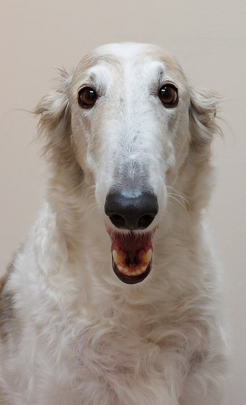
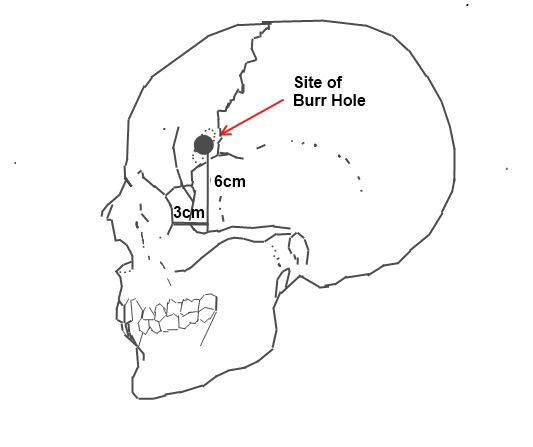

## Alternative title:

**M**ake
**I**t
**S**tupid
**S**imple,
**T**o
**E**xperience
**R**evenue 

=  **M.I.S.S.T.E.R.** 

It's so much fun to build things by taking a huge solution to a problem, and then  making it dumber and dumber, till it does only one simple thing. 

One of the obvious benefits of that is focus: it's easier to talk about it, to explain its value to users. It's easier to fit it in your head and still have space for other parts of work besides coding and design. That's why I generally look for excuses to work this way. (I also like that it feels naughty and subversive, and I'm a very mature individual, it's not a phase, mom.)

## Here are some examples of things I built by taking a powerful piece of tech and making it dumber:

[Ensō](https://enso.sonnet.io) — Ensō is the least capable text editor I know. You can't select text, editing is hard, you can't even see more than the past 4-5 lines of text. Most of the work with Ensō involved taking a \<textarea\> element and finding ways to disable its features. It was actually quite hard and almost weird to work with.

For instance, I was recently messing with a bug in Safari, where hitting the shift key would suddenly trigger a pointer event and display the UI, since the app assumed the user moved their mouse cursor and they want to interact with the navigation. One of the earlier bugs let some people edit much faster because of a missing `e.preventDefault()` call. Not on my watch!

[Sit.](https://sit.sonnet.io), — My baby is *beautiful* and I love it the way it is, but let's face it: it's a dumb alarm clock, it's a glorified gong. It's the borzoi of my apps. ^b2eef4

*You beautiful, majestic, sweet summer child. CC by [Deb](https://www.flickr.com/photos/ferlinka/51819368370/)*

The hardest technical bit involved preventing the device from falling asleep. I love the way it looks and thanks to its simplicity I could focus on making it look and feel the way I wanted to. 

[Uncolouring book](https://lines.potato.horse) – it's a colouring book but without the outlines.

[Night Reader](https://testflight.apple.com/join/jn7XlV3M) — a focused reading web browser, sort of. It's much *less* than that ([context](<../Heart of Dorkness>)). The main goal: firing as few photons as possible to give you a pleasant reading experience. Not a single wave/particle more than necessary, Mr Heisenberg. The only colours allowed: black, dark red, even darker red. 

The difficulty here is to prevent the WKWebView from doing its job: giving you a smooth, interactive web browsing experience, showing you the content as soon as its available (sometimes [too soon](https://en.wikipedia.org/wiki/Flash_of_unstyled_content) for *our* use-case). 

*Lobotomy–the fuck around and find out of medical science*

These problems are fun constraints to deal with, and work in this manner can be both frustrating and incredibly rewarding. 

### It's frustrating because:

- **These APIs/SDKs are not built with the use-cases I had in mind and they're immensely complex.** This means that I'm often working against the grain.
- Occasionally you'll hear someone telling you that what you're doing is trivial and they could do it in 5 minutes and 100 LOC. 

### It's rewarding because:

- **These APIs/SDKs are not built with the use-cases I had in mind and they're immensely complex.** And this reminds me that the main reason I can play with my  toys is that someone climbed the shoulders of giants and built a little sandbox for me.
- Taking something complex and finding simplicity in it, then being able to communicate it and solve a problem feels so damn good!

I wanted to wrap this up with a quote by the second greatest teenage mutant ninja turtle:

> I saw the angel in the marble and carved until I set him free.

But Luna recommended a better one:

> “I'd rather have a bottle in front of me than a frontal lobotomy.”
> – Tom Waits
