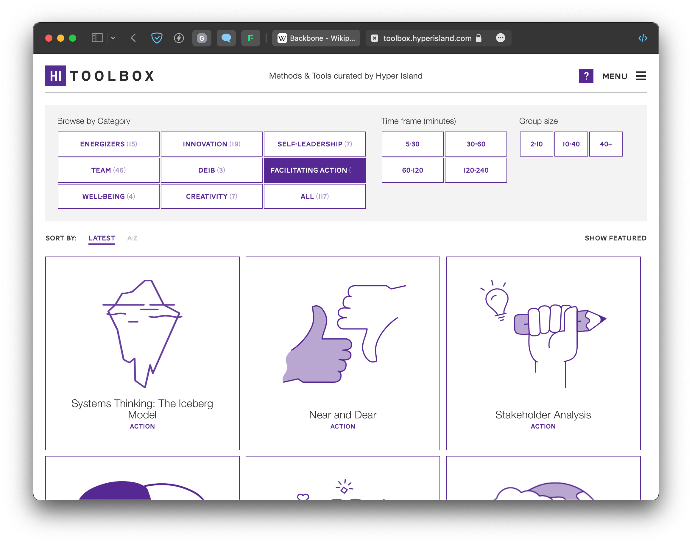

## What is it?

### Rules of the game:

1. You're feeling down, distracted, anxious, name it.
2. You pick a card from the toolbox.
3. You do what the card says.

The toolbox is app with a list of tools you can reach out to when you need an anchor. The idea is to help you notice your triggers and find constructive ways to account for them. It's highly personalised and co-created together with the user, so details will vary.

**It's very low-tech.** In fact you can imagine it as a deck of Pokemon/MtG cards, where each card is a thing you can *do* or *think of* to get out of your head and respond to whatever challenge lies ahead of you, constructively.

Examples: 

- when I feel stressed or that I'm rushing, I draw a card telling me to pet my dog. 
- when I'm distracted and noticed that I'm wasting my time on HN, I read a random Wikipedia page, or someone's digital garden (both are beautiful rabbit holes)
- when I'm feeling down, I give my partner a hug

In a sense this is a deck building game, where instead of cards you collect (or create) new tools to work with and shape yourself.

Inspirations:

- [Hyper Island Toolbox](https://toolbox.hyperisland.com) (problem-based discovery, ignore the rest)
- Card games (classic or collectible/deck building)
- Tinder (card swiping UX)
- CBT
- cigarettes (especially nicotine addiction and how it implants itself as a trigger)

