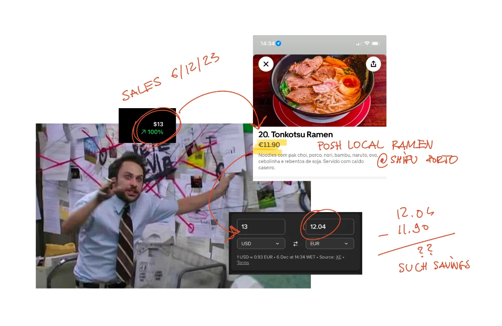
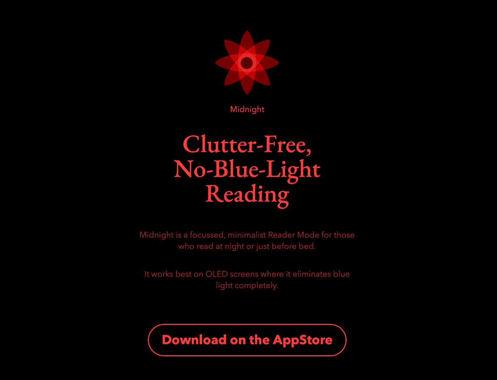

In the spirit of working with the [garage door up](<../Work on my notes with the garage door up>) I thought I'd share a quick progress update on Midnight (f.k.a. Night Reader). This is not a retrospective, but rather a digital version of a dog leaning his head through the window of a riding car and staring in the side mirror. (fast-paced, might get messy)

## Tonkotsu profitable

Achievement unlocked: Midnight paid for a bowl of a "posh" locally sourced ramen!
 
*Now imagine I could get a **second** order of ramen, this time for Mango, so he wouldn't give us [his Kubrick stare](<../poorly-drawn-mango-kubrick-stare.webp>) while Luna and I are eating the first bowl, sitting in a dark corner, ashamed of our selfishness.*

**Buy Midnight [here](https://apps.apple.com/gb/app/midnight-no-blue-light-reader/id6472076217).**

> Tonkotsu achieved 
> Silky broth, AppStore dreams
> Winter warmth in bowls.
> 
> – Chat GPT (*massaged* by a human)

## We have a website now

I've set up [midnight.sonnet.io](https://midnight.sonnet.io) as a main entry point for anything marketing related. 

I'm exercising a lot of impulse control when working on this: I have a few ideas on how to illustrate how Midnight works by making the page more interactive. But still, I don't think this is the most important thing to do at the moment.

## Choosing a good name

A couple weeks back, when I was still calling it Night Reader, I realised that a [book reading app](http://nightreader.org) with a similar colour mode, and *exactly the same name* was published to the AppStore, several years ago. 

I chose *Moonlight* as the new name because:
- A good name should be:
	- short and memorable,
	- easy to mention in a conversation
	- easy to pronounce by non-native English speakers.
	- not associated with a different category of apps (e.g. writing tools or period trackers)
- I didn't want to spend more than 1 hour overthinking this (that's a big risk in my case)

Previous contenders: *Ink*, *Night Mode*, *Moonlit*, *Lunar*, *Midnight*
Tools used: doodles, asking friends via messaging apps, Chat GPT

## How I use it

Midnight is designed with a very narrow use case in mind, but I noticed that I use it much more frequently than I had expected. I consider it a good sign ([Projects and apps I built for my own well-being](<../Projects and apps I built for my own well-being>)).

One of my favourite things to do on Saturday mornings (especially if I wake up before Luna) is to:

1. have a cup of coffee in bed
2. hit a random page on Wikipedia and keep following the links ([Wikipedia Rabbit Holes](<../Wikipedia Rabbit Holes>)).
3. do that for an hour or so, in a perfect, blessed silence (besides Mango snoring)

Our bedroom has big wooden shutters, so it stays dark till 9-10 am or till whenever the last person or canine leaves the room (usually the canine). Midnight handles Wikipedia content pretty well and allows me to read without the gymnastics required to ensure that I don't wake my partner up by accidentally shoving a big shiny rectangle in her face.

## How do I share it?

- Twitter threads
- HN threads
- LinkedIn 
- ProductHunt (time boxed to 1h hour – it's just not worth spending more time)

## Next

- [ ] Make a list of sites and communities to approach
- [ ] Write on how I use Midnight
- [ ] Update project links on sonnet.io/projects (people actually read those)
- [ ] If time permits, publish some little experiments I built when working on Midnight ([Share Bite-sized chunks of your work](<../Share Bite-sized chunks of your work>)). For instance, I wanted to add a delicate *satin sheets shading* effect to the product page, so I spent this morning learning about generating perlin noise using WebGL, then moved on to playing with [Shader Park](https://shaderpark.com) ([Shader Park is Kinda Neat](<../Shader Park is Kinda Neat>)). Many of the people I try to learn from follow this approach and I think it might help me kill two birds with one stone: instead of playing with little experiments and avoiding working on marketing, I could use them to spread the message about the project.

