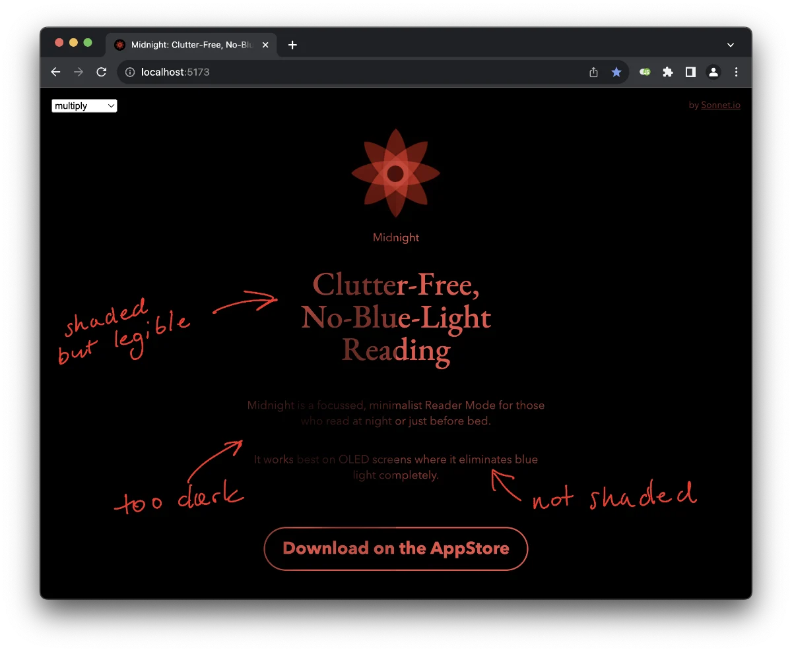
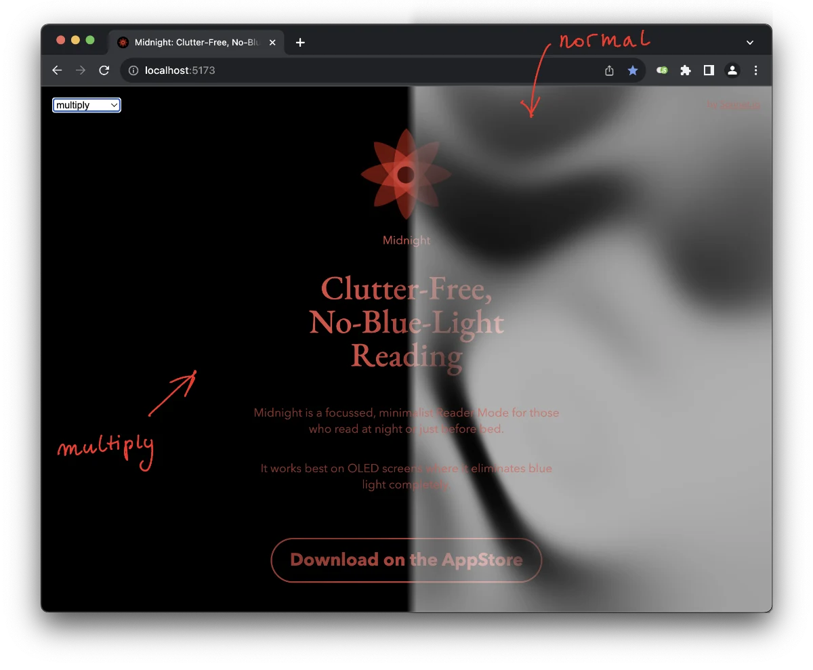
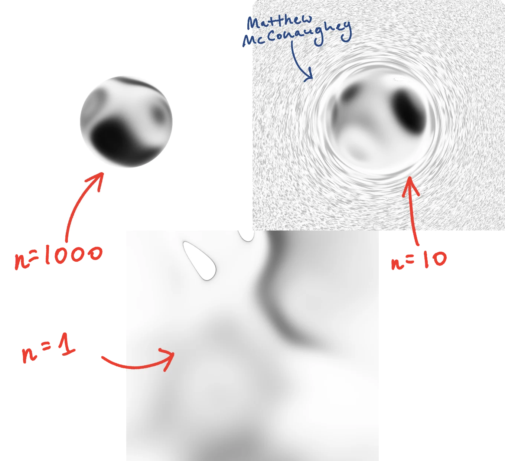
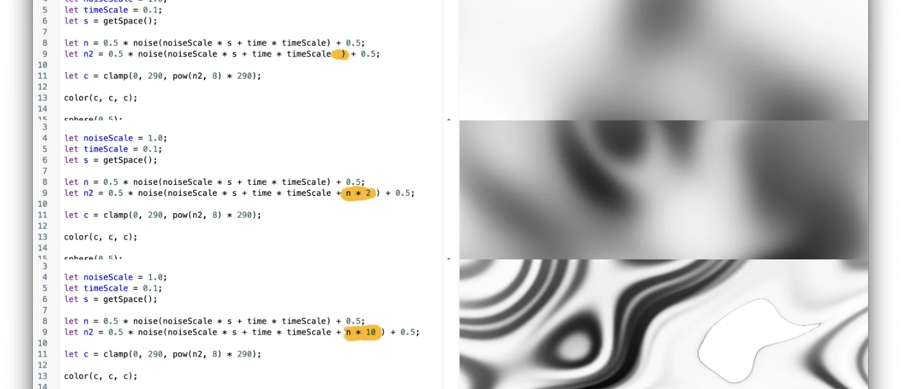
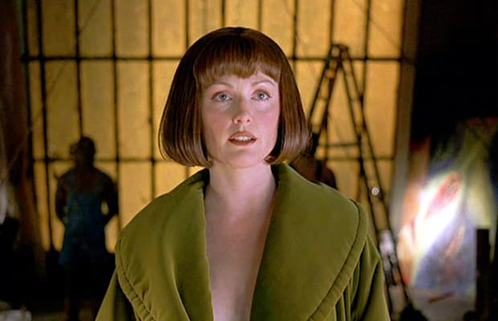

The design of the [Midnight](https://midnight.sonnet.io) page is really, really simple and I like it that way. Stupid simple (or [MISS – Make It Stupid, Simple](<../MISS – Make It Stupid, Simple>))  means fewer moving parts to break, both code- and design-wise.

So, a few days ago I tried to add a simple background animation with an organic shade overlayed on top of the text, almost like a *smooth satin [sheet](https://mrr.sonnet.io)*. 

**You can check the demo [here](https://night-reader-site-git-feat-shader-park-sonnet.vercel.app).**


<span style="color: red">Missing embed: midnight-shader-demo-video-intro.mp4</span>
## How it works:

### Constraints

I wanted something that:

1. looks nice, but
2. doesn't get in the way of the user (think: accessibility, loading times, performance),
3. degrades gracefully,
4. is cheap and fun to make, because I'm cheap, and busy (but mostly, cheap)/

I don't like turning iPhones into frying pans, so performance will matter a *little* bit.

### Approach

I went for a mixture of CSS and WebGL animations:

1. fade in page content (CSS)
2. fade in the WebGL noise animation (shaders)

### 1\. Fade in page content (this one will be quick)

```css
header,
main * {
  --delay: 0s; 
  animation: fade-in 1.2s var(--delay) ease-in both;
}

header { --delay: 0.2s; }

main p {
	--delay: 0.4s;
	position: relative;
	z-index: 10;
}

main .cta {--delay: 0.6s; }
/* ... */
```

We could replace `--delay` with `animation-duration`, but CSS  variables offer more flexibility and better encapsulation, e.g. what if I want to control the delay *scale/multiplier* instead?

`position: relative` ensures that some text is rendered *in front* of the shaded animation. Those elements are already dimmed so darkening them even further would make them hard to read.



### 2. fade in the WebGL noise animation (shaders)

The WebGL animation has two main parts:

- render an animated greyscale noise texture
- blend it using the *multiply* blend mode via CSS blend modes

**[You can check out the interactive demo here.](https://night-reader-site-git-feat-shader-park-sonnet.vercel.app)** Use the dropdown in the top-left corner to toggle between *normal* and *multiply* blend modes.


Tech-wise, I'm using [ShaderPark](https://shaderpark.com) because:

- it offers a good balance between ease of use (a simple JS-like DSL with the power of shaders)
- It's fun! ([Shader Park is Kinda Neat](<../Shader Park is Kinda Neat>))

Here's the complete ShaderPark code:

```javascript
setMaxIterations(1);
backgroundColor(1, 1, 1);

let noiseScale = 1.0;
let timeScale = 0.1;
let s = getSpace();

let n = 0.5 * noise(noiseScale * s + time * timeScale) + 0.5;
let n2 = 0.5 * noise(noiseScale * s + time * timeScale + n * 1.5) + 0.5;

let c = clamp(0, 20, pow(n2, 8) * 290);

color(c, c, c);

sphere(0.5);

```

Let's break it down:

```js
setMaxIterations(1);
```

`setMaxIterations` reduces the number of iterations of the SDF algorithm. In our case, we're not rendering any *precise* 3d shapes. Effectively, we're just projecting a noise texture on the screen. This means that we can keep this value as low as possible to reduce battery impact of the animation. Here's the same code rendered with `setMaxIterations(1);` and `setMaxIterations(1000);`:



Let's move on to the noise itself. Shader Park uses simplex noise, which generates values between -1 and 1:

```js
let noiseScale = 1.0;
let timeScale = 0.1;
let s = getSpace();
let n = 0.5 * noise(noiseScale * s + time * timeScale) + 0.5;
```

In order to calculate colours we sample a simplex noise value based on: 
- the coordinate space (`getSpace`)
- `time`

Using time as a parameter allows us to animate the noise and maintain continuity.

`timeScale` allows us to control how quickly the animation progresses.
`noiseScale` controls the 'roughness' of the noise. To put it simply, if we zoom in very close, simplex noise will look a bit like a series of clouds with some structure, if we zoom out, the noise will feel more random:


```js
let n2 = 0.5 * noise(noiseScale * s + time * timeScale + n * 1.5) + 0.5;
	//                                                    !!! ⤴ 
```

Here's a neat trick: we can make the texture more complex and create "creases" in the fabric by computing a noise with the previous noise `n` as one of the parameters.



Finally, let's turn that noise into colours we can render on the screen. I've split the colour calculation code into smaller steps. Also, it'll make more sense to read them backwards!

```js
let c = clamp( // 3.
	0,
	20,
	pow(n2, 8) * 290 // 2.
);

color(c, c, c); // 1.
```

1\. `c` is the computed colour. 

`color`  accepts RGB values between 0 and 1, so `1,0,0` = red, `1,1,1` = white, `0,0,0` = black. So, by saying `color(val, val, val)` we're just generating a grey pixel with `val` as the level of brightness.

2\. we take the colour value from our noise to the power of 8 (`pow(a,b)`) and multiply it by 290 (a magic number).

Why these numbers? The short answer: trial and error, laziness and my adventurous, devil-may-care attitude. The slightly longer answer: `pow` is just a quick and dirty way of increasing the contrast towards the darker noise values (*0.2 × 0.2 = 0.04* but 0.9 × 0.9 = .81). The resulting numbers will be **very** low, so we multiply them by this high magic number. The number is high enough to make the shades look good without introducing colour clipping.

This is not the ideal solution and I'd go with a [Sigmoid function](<../Sigmoid function>) or trigonometry to have more control over the contrast.



*Does the sound of a sigmoid function make you uncomfortable Mr Lebowski? Well, my art has been commented as strongly hacky, which bothers some 10x engineers, the word sss..sigmoid itself makes some 10x engineers uncomfortable.* 

3\. We're using clamp to keep the value between 0 and 20 for each point. 
Earlier I said that colour channels take values between 0 and 1, so 1 should mean white, right? So what's the point of allowing for values higher than 1? The simple answer is that we're still are rendering the noise within a lit 3d space. This means that a white cube is not perfectly white, but slightly shaded. And that's important because we're using the multiply blend mode: any non-white colour would darken the background.

%% image multiply %%

Now, the final step:

```js
sphere(0.5);
```

Just allows us to render the texture on the screen. The shape doesn't matter since the number of iteration steps is so low.

## Alternative approaches:

#### Render a series of animated conic gradients.

1. Render 2-3 conic gradients and rotate them
2. Ensure that each of the animation durations are distinct prime numbers

Pros:
- no library needed
- almost no file size impact

Cons: 
- takes some effort to look good

#### Render a series of animated circular gradients.

1. Render 2-3 circular gradients and make them orbit
2. Ensure that each orbit has duration specified using a prime number

Pros:
- same as above

Cons: 
- same as above

Use SVG filters

This approach is similar to the animated circular gradients, but with SVG circles and a blur filter to achieve the same effect.

Pros: 
- simple to implement
- no file size impact
- no dependencies

Cons: 
- noticeable performance drop on older devices


Use an image file instead:

The image is a tiled noise texture with animated background position.

Pros:

- simple
- no dependencies

Cons:

- the animation is pre-baked, so it can't be controlled programmatically


Use Canvas + a noise library instead of shaders:

In this approach we use a noise library (can be pulled from p5.js) and render a simple noise on canvas.

Pros:

- almost no dependencies
- relatively easy

Cons:

- I wanted to learn something new


Summary:

I like how this looks. I'm not sure if it's worth adding to the main site.
[What do you think](mailto:hello@sonnet.io)?

