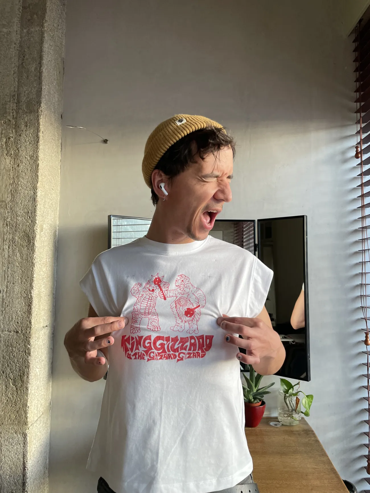
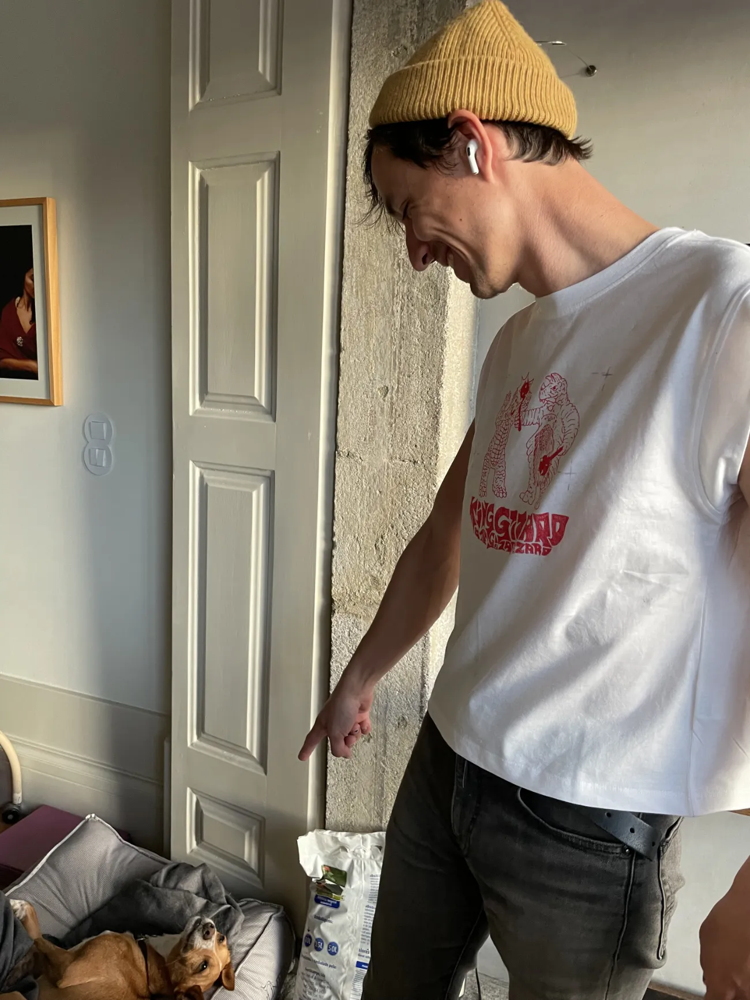
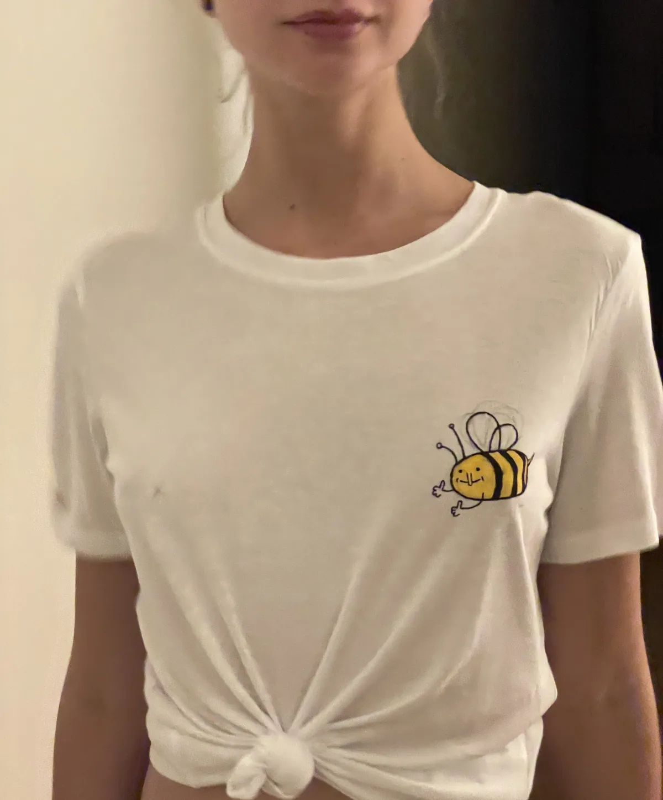
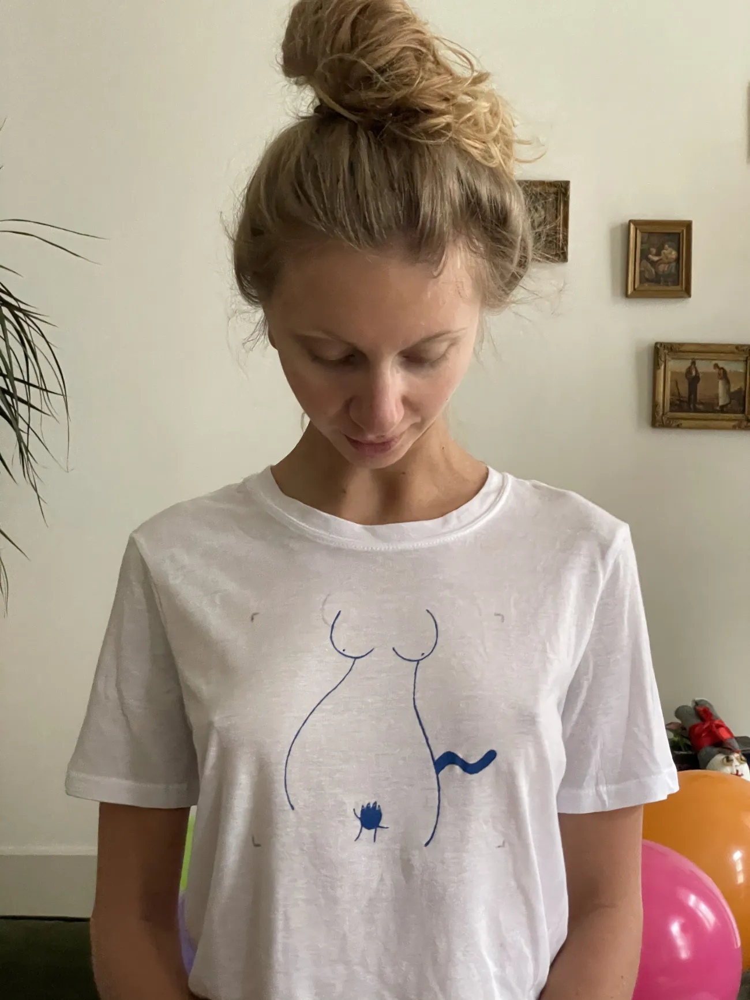
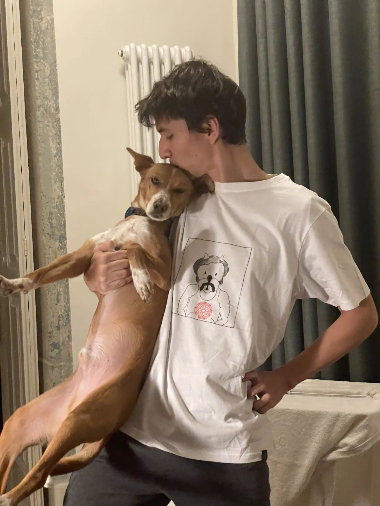

Sometimes I make hand-drawn bootleg band t-shirts for my friends.

This is a draft and an evergreen note, so I'll start with just a few pictures, plus some short descriptions. Stay tuned for a full post and a tutorial! ([How I Make My Bootleg T-shirts](<../How I Make My Bootleg T-shirts>))

Setup: acrylic markers, foil and iPad in guided access mode.

Note that the shirt says King Gizzard and the _Gizzard_ Gizzard. Checkmate copyright lawyers.

The t-shirt was so good, my dog woke up.

and

Two older designs, based on a drawing from potato.horse

King Gizzard and the Lizard Wizard × [Achewood](https://www.achewood.com/random.php) mashup

[Embed](<../Bootleg T-Shirts - December Batch>){data-embed, data-target="#Update"}

