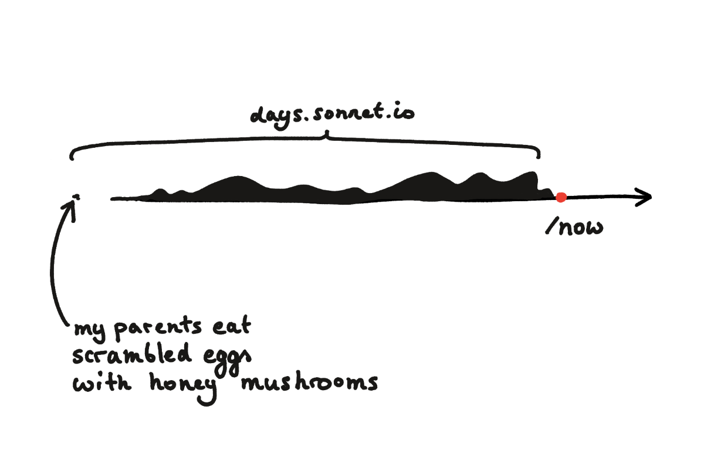

I have a now page, now!  You can check it out [here](https://sonnet.io/now).

What's a now page? Just like an `/about` page describes who you are, a /now page describes what you're focussed on *right now*. You can learn about now pages [here](https://nownownow.com/about).

#### Here's a description of a now page that works for me:

You meet a friend you haven't seen for a couple of years. They ask: *what are you up to*?

## How it's build

I used the `/now` page as an excuse to try out `.webc` support in [11ty](https://11ty.dev). I'll post a longer write-up next year when I'll be rewriting untested and sonnet.io.

## Examples

Two examples of now pages I used to establish the basic content structure:

- [linear, chronologic](https://ignorethis.page/now/)
- [breakdown based on the type of media](https://lkj.li/now/)

## What's next?

I'll let it sit for a couple of months. I can already see that some parts (e.g. things I'm reading about / learning) change too often to keep this up to date. I might need to change the format a bit.

It *feels* uncomfortable that it looks a bit messy. But I can live with that discomfort, the point of this site is to [get better at it](<../111>).

See you tomorrow!
