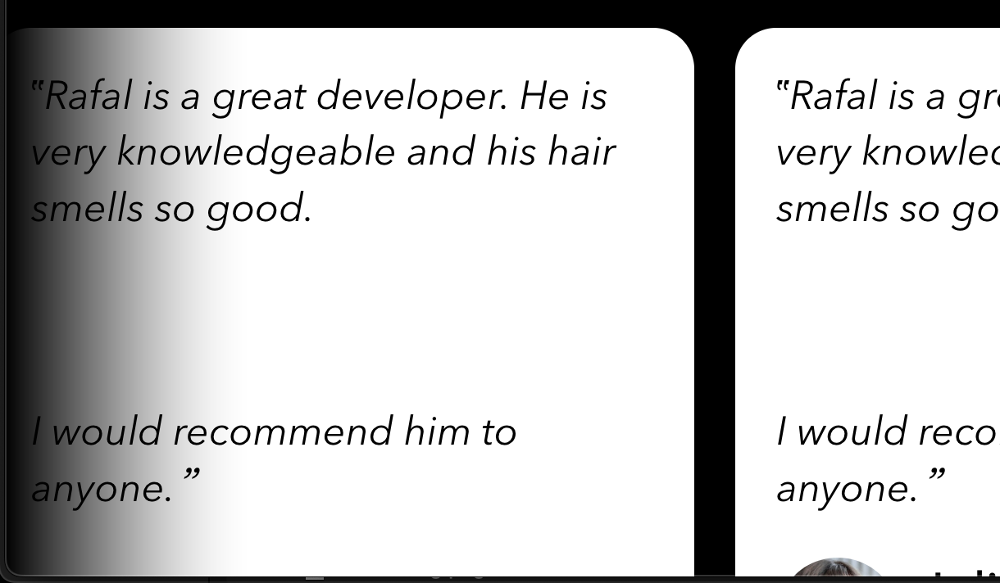

I want to talk about two cheap and relatively simple changes you can add to your CSS to make gradients look much better: easing linear gradients and colour spaces.

## Use easing

Let's start with a real-world problem. Last week I was working on my new and shiny [Consulting Page](https://consulting.sonnet.io). I wanted to add a slider similar to the one one the site of [Gabriel Valdivia](https://www.gabrielvaldivia.com), but more aligned with the style of my own site (example [here](https://consulting.sonnet.io/#testimonials)):


What bugs me about this screenshot is that the gradient cuts off sharply, it doesn't blend with the element behind it.

The effect is more obvious when you compare these two gradients:

<div  class='strip' style='width: 70%;padding: .5rem; color: white; font-weight: bold;height: 4rem; background: linear-gradient(to right, black, white)'>
A </div>

<div  class='strip' style='width: 70%;padding: .5rem; color: white; font-weight: bold; height: 4rem; background: linear-gradient(
			to right,
			hsl(0deg, 0%, 0%) 0%,
			hsla(0deg, 0%, 0%, 0.738) 19%,
			hsla(0deg, 0%, 0%, 0.541) 34%,
			hsla(0deg, 0%, 0%, 0.382) 47%,
			hsla(0deg, 0%, 0%, 0.278) 56.5%,
			hsla(0deg, 0%, 0%, 0.194) 65%,
			hsla(0deg, 0%, 0%, 0.126) 73%,
			hsla(0deg, 0%, 0%, 0.075) 80.2%,
			hsla(0deg, 0%, 0%, 0.042) 86.1%,
			hsla(0deg, 0%, 0%, 0.021) 91%,
			hsla(0deg, 0%, 0%, 0.008) 95.2%,
			hsla(0deg, 0%, 0%, 0.002) 98.2%,
			hsla(0deg, 0%, 0%, 0) 100%
		)'>B</div>


Note how **B** more blends with the background more naturally.

The solution here was to *ease* the transition between colours by specifying more stops:

```css
--gradient: linear-gradient(
	to right,
	hsl(var(--bg-h), var(--bg-s), var(--bg-l)) 0%,
	hsla(var(--bg-h), var(--bg-s), var(--bg-l), 0.738) 19%,
	hsla(var(--bg-h), var(--bg-s), var(--bg-l), 0.541) 34%,
	hsla(var(--bg-h), var(--bg-s), var(--bg-l), 0.382) 47%,
	hsla(var(--bg-h), var(--bg-s), var(--bg-l), 0.278) 56.5%,
	hsla(var(--bg-h), var(--bg-s), var(--bg-l), 0.194) 65%,
	hsla(var(--bg-h), var(--bg-s), var(--bg-l), 0.126) 73%,
	hsla(var(--bg-h), var(--bg-s), var(--bg-l), 0.075) 80.2%,
	hsla(var(--bg-h), var(--bg-s), var(--bg-l), 0.042) 86.1%,
	hsla(var(--bg-h), var(--bg-s), var(--bg-l), 0.021) 91%,
	hsla(var(--bg-h), var(--bg-s), var(--bg-l), 0.008) 95.2%,
	hsla(var(--bg-h), var(--bg-s), var(--bg-l), 0.002) 98.2%,
	hsla(var(--bg-h), var(--bg-s), var(--bg-l), 0) 100%
);
```

This is ridiculously verbose and of course I didn't generate these stops manually! I used [this tool](https://larsenwork.com/easing-gradients/) by Andreas Larsen.

### Here's the result:


Narrator: *Smooth, sophisticated, mysterious - nothing says "I'm looking for a job" better than a perfectly eased gradient.*

## Colour spaces:

Another thing you ~~could~~ should do to achieve more natural colour transitions is to specify the colour space for your gradient. Here's the same transition in *rgb* and *oklch*:

<div  class='strip' style='padding: .5rem; color: white; font-weight: bold;height: 4rem; background: linear-gradient(to right, black, white)'>
rgb</div>
<div  class='strip' style='padding: .5rem; color: white; font-weight: bold;height: 4rem; background: linear-gradient(to right in oklch, black, white)'>
oklch</div>
<div  class='strip' style='padding: .5rem; color: white; font-weight: bold; height: 4rem; background: linear-gradient(
			to right in oklch,
			hsl(0deg, 0%, 0%) 0%,
			hsla(0deg, 0%, 0%, 0.738) 19%,
			hsla(0deg, 0%, 0%, 0.541) 34%,
			hsla(0deg, 0%, 0%, 0.382) 47%,
			hsla(0deg, 0%, 0%, 0.278) 56.5%,
			hsla(0deg, 0%, 0%, 0.194) 65%,
			hsla(0deg, 0%, 0%, 0.126) 73%,
			hsla(0deg, 0%, 0%, 0.075) 80.2%,
			hsla(0deg, 0%, 0%, 0.042) 86.1%,
			hsla(0deg, 0%, 0%, 0.021) 91%,
			hsla(0deg, 0%, 0%, 0.008) 95.2%,
			hsla(0deg, 0%, 0%, 0.002) 98.2%,
			hsla(0deg, 0%, 0%, 0) 100%
		)'>oklch with multiple steps</div>
		
<div class='strip' style='padding: .5rem; color: white; font-weight: bold; height: 4rem; background: linear-gradient(to right, red, yellow, blue)'>rgb</div>
<div class='strip' style='padding: .5rem; color: white; font-weight: bold; height: 4rem; background: linear-gradient(to right in oklch, red, yellow, blue)'>oklch</div>

*Here's a [really good description of why you should use oklch](https://evilmartians.com/chronicles/oklch-in-css-why-quit-rgb-hsl).*

Notice how nicely *oklch with multiple steps* blends with the background of this page. 

See [this demo](https://codepen.io/argyleink/pen/OJObWEW) for more examples.

## Summary

Now, now. I'm not suggesting that you should drop everything and start updating your CSS right this minute. But, if you're starting a new project, or are looking for a small piece of work because your brain is mush, give it a go. 

PS. Do you remember when CSS gradient generators were a thing? Seems they're [still a thing](https://non-boring-gradients.netlify.app).

## References:


- [useRainbow() · Rafał Pastuszak](https://sonnet.io/posts/use-rainbow/)- a (very rudimentary) intro to colour theory in CSS, plus perceptually-uniform colour spaces
- [Color Spaces for More Interesting Gradients | CSS-Tricks - CSS-Tricks](https://css-tricks.com/color-spaces-for-more-interesting-css-gradients/)
- [Non-Boring Gradients - A non linear CSS gradient generator](https://non-boring-gradients.netlify.app)
- [Easing Gradients](https://larsenwork.com/easing-gradients/)
- [OKLCH in CSS: why we moved from RGB and HSL—Martian Chronicles, Evil Martians’ team blog](https://evilmartians.com/chronicles/oklch-in-css-why-quit-rgb-hsl)
- [OKLCH Color Picker & Converter](https://oklch.com/#70,0.1,133,100)
- [CSS](<../CSS>)
