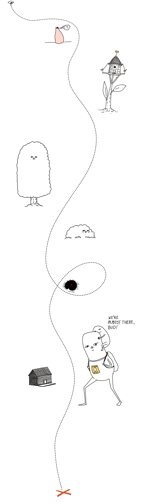
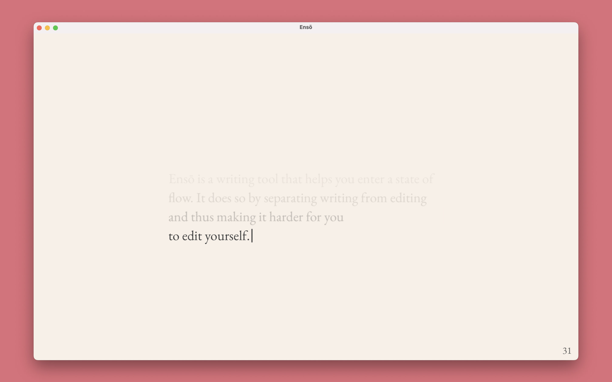
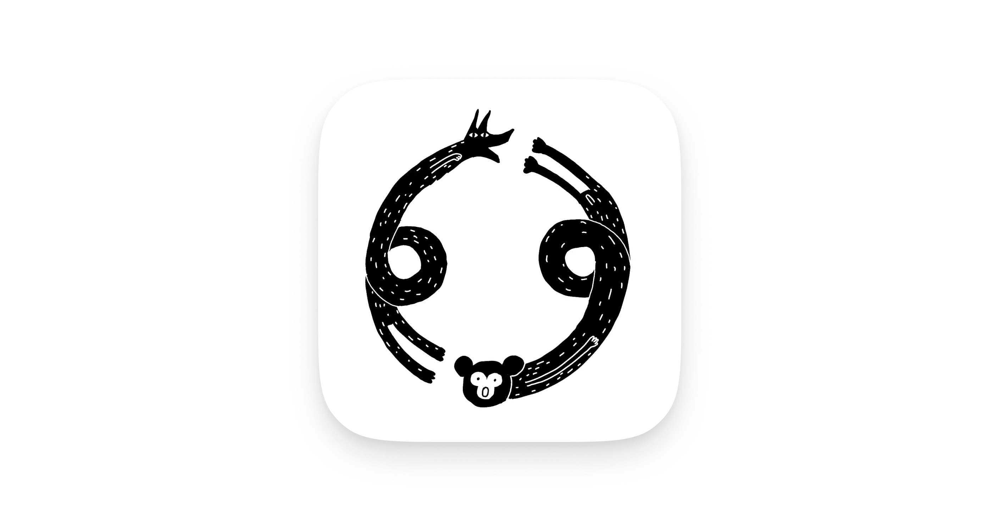
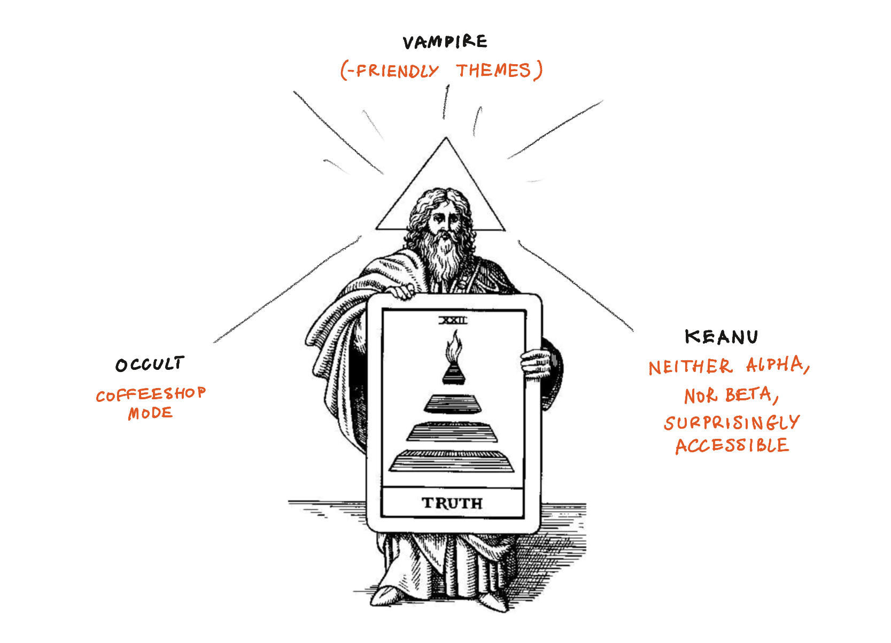
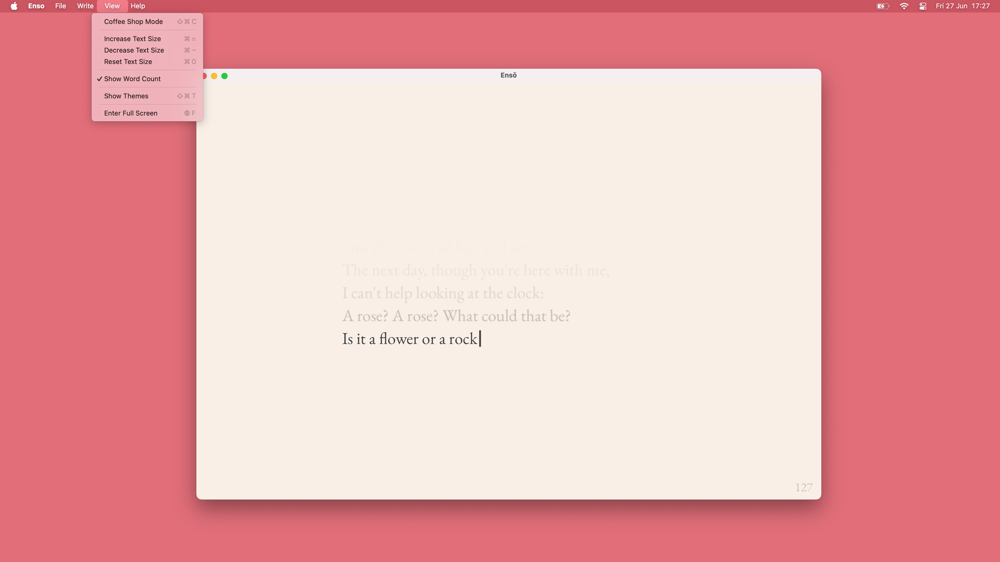
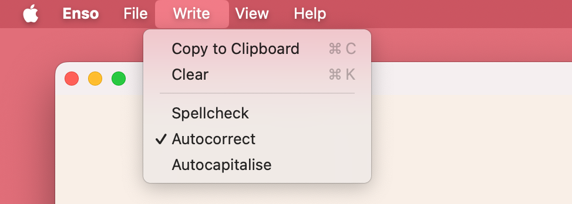
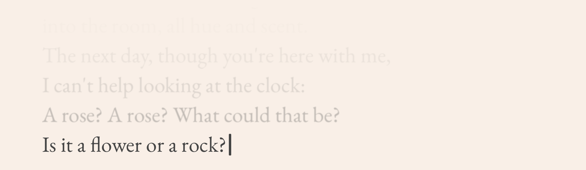
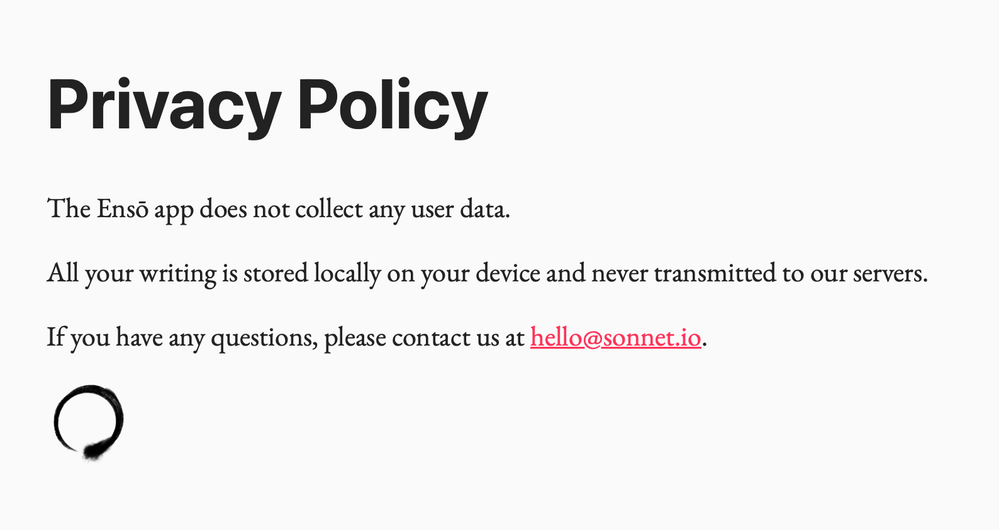
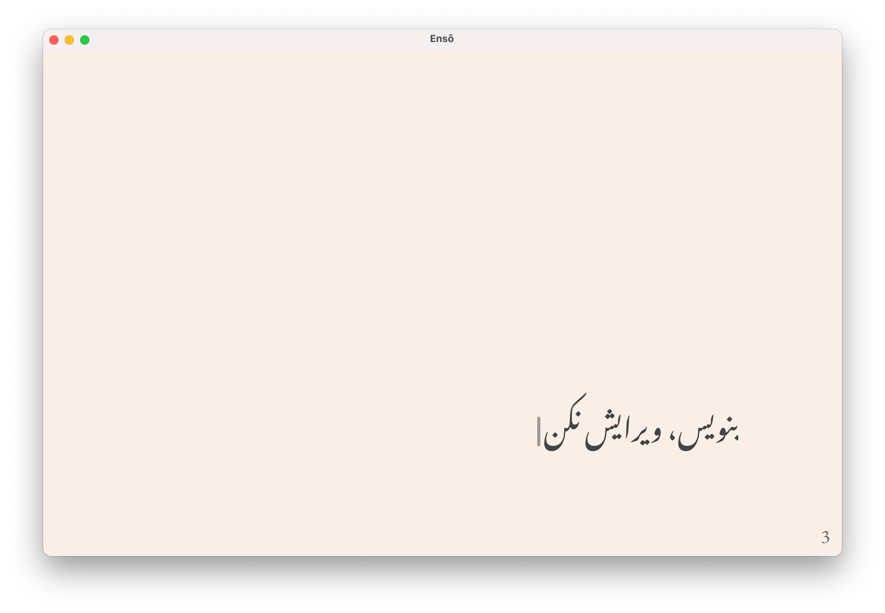
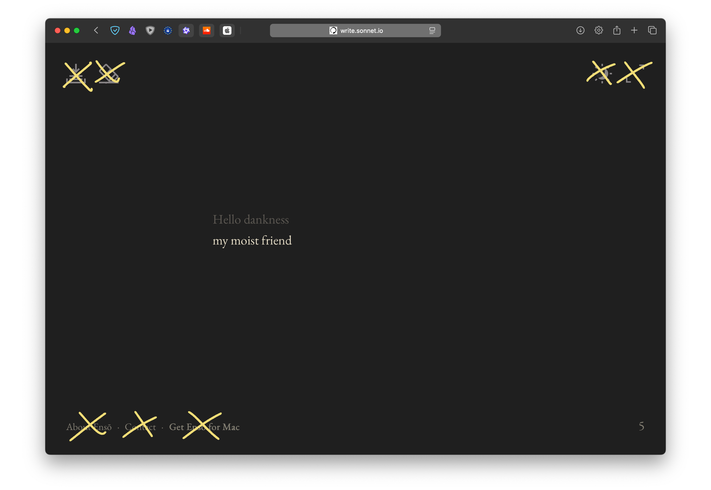

Hi there,

Look!

The new version of Ensō (codename: Occult Vampire Keanu) is available for public testing!

[Download it here](https://testflight.apple.com/join/6Jxjv3Up){.download-cta}

---

This is a temporary icon I used for testing. I am considering creating a simplified version of it. PS. here's the [original image](https://www.potato.horse/p/MVrXRp0XziSuakcrMGzO8) (on [potato.horse](https://potato.horse), of course)

## What's included

Following [MISS](<../MISS – Make It Stupid, Simple>), my focus is on removing distractions over adding new features. This can be surprisingly challenging (e.g. how do I tell users about feature X or Y without breaking their flow?) but also gives me time to focus on polishing the app. 

(we will discuss these in more detail in future posts)

### Short version (as explained by Hermes Trismegistus)

 
 
- [x] Simplified, more accessible UI
- [x] Accessible themes
- [x] Coffeeshop Mode 
- [x] Privacy improvements

 
 

#### **Slightly longer version:**

### An even more simple, streamlined UI, following the [MISS](<../MISS – Make It Stupid, Simple>) philosophy. 

Most of the UI has been moved to the application menu bar for easier discoverability and shortcut access. So far no one has missed the old inline UI, but you can read more about it towards the end of this note.
### 5½ Accessibility-friendly themes to choose from

<video src="https://res.cloudinary.com/dlve3inen/video/upload/v1751044261/enso-themes-overview-sigma_mxuslc.mp4" loop controls muted playsinline autoplay></video>

We have ~~6~~ 5½ predefined themes focussed on accessibility and specific use patterns based on feedback I've collected over the years. 

- writing during the day in regular light conditions
- writing in bright light
- writing in low light 
- writing in low light for devices with OLED screens
	- allows for perfect black
- writing in extremely low light conditions, with reduced light exposure  (See [Midnight](<../Midnight>), [Obsidian for Vampires](<../Obsidian for Vampires>))
	- designed for OLED screens
	- the main use case here is writing at night, to put myself to sleep.  

5½ and not 6 because one theme still needs some work. Is there a specific use case or theme you'd like to see in Enso? Let me know!

### Coffeeshop Mode™

<video src="https://res.cloudinary.com/dlve3inen/video/upload/v1751044938/enso-coffeeshop-sigma_j1xi1d.mp4" loop controls muted playsinline autoplay></video>

This is one of the few truly new features in Enso. Coffeeshop mode allows you to stop worrying that someone standing behind you might see what you're typing. The text itself is concealed but you still know what you're writing.  Use `⌘-C` to toggle on and off at any time.

I've been using it for a couple of months and found it super helpful, especially for journaling in public places, but not only (read more here: [Sketch - Ensō Coffeeshop Mode](<../Sketch - Ensō Coffeeshop Mode>)).

### A few smaller accessibility improvements

Note: if you remove the *Edit* menu and call it *Write*, MacOs won't add its AI crap to your settings.

- [x] toggle autocorrect, autocapitalise, spelling
- [x] control text size (previously not possible in the native version)

### A new, polished text rendering engine

The new text rendering engine allows for better control over typography settings, supports alternative display modes like Coffeeshop, and uses a custom caret. 

I don't know how to describe it objectively (and I obviously lack the distance to) but writing in the new UI feels different, more fluid. The text is easy to read, but also somewhat softer (though not blurry). 

Less is more, so why do I care about it? *Because* less is more. I want Enso to feel familiar and high-quality, like a good Moleskine notebook. I want people to feel comfortable paying $10 for a typing app without text selection. I want them to enjoy it as much as I do. Fewer features allow me to focus more on what *is* there.

### AppStore by default (but standalone versions are still coming)

Enso will be published via the AppStore by default. We will keep the old version on Gumroad, but there's no reason to maintain it, since the new version is better in every possible way and functionally the same by default.

The reasons I decided to [skip the AppStore and use Gumroad](<../skip the AppStore and use Gumroad>), plus what I learned from that are beyond the scope of this note (you can click the link to request that particular write-up).

Why? 

- several users complained that Gumroad payment looked, for the lack of a better word, shady, especially at the step with a PayPal payment screen. The ones who messaged me still bought the app, but I imagine there were many who turned back. 
- AppStore with all its flaws makes delivering apps... slow and annoying, but also relatively easy without much code.
- I can add OTA updates and re-publish Enso via Gumroad later, which makes sense as an iterative improvement. 

The Gumroad version of Enso will stay as a backup, but will not be maintained.
(NOTE: consider using bold here as it's important for existing users.)

## What's not included
### Analytics

I've been using Enso daily for 6 years. I've also received a ton of high-quality feedback, not via analytics but from users who were kind enough to reach out to me. I like to think that I have a fairly good idea of how and why people use Enso.

The previous version of Enso would pass an anonymous impression event on load. Now, by design, no network traffic is made at all. Here's our new Privacy Page.

Current version of our Privacy page ([source](https://enso.sonnet.io/app-privacy))

Related [How I Use Analytics With My Indie Projects](<../How I Use Analytics With My Indie Projects>) and [Defaults Matter, Don't Assume Consent](<../Defaults Matter, Don't Assume Consent>)

### Personalisation

It will come, but the new version is already so much better than the previous, that I feel like waiting for more features would be a wasted opportunity. 

I'm working on a UX that balances discoverability with staying focussed. Each option, each new choice is a chance for you to get distracted, so the key is to do this thoughtfully and with respect towards my users' time.

### RTL (or non-LTR) language support

**This one will be included in the next test build.** Many Enso users speak languages written in non-Latin alphabets (to my knowledge, mainly Persian, Arabic and Hebrew).

It makes me both grateful and somewhat sad that one (non-techie) user went as far as even sharing a code sample with me when asking for fixing the issue. Adding rudimentary RTL support can be as simple as a one-line change in your code. Even if it's not perfect - it's still a huge improvement that your non-Latin script users will notice, believe me.

### More inline editor UI 

The previous version of Enso displayed the UI in the same space as the text. That's not the case any more.

I'm still considering adding a hamburger menu in the main app canvas, however only two (less frequent) users of Enso have brought it up so far. 

What I care about more:

1. ease of use, reducing distractions
	1. the software should get out of your way ([Kind software](<../Kind software>))
2. discoverability
3. familiarity

There's tension between 1. and 2. as every new feature implies more choices on the user's part; every new choice is an opportunity for distraction. This might seem pedantic, but small, seemingly insignificant changes do add up. 

Removing things is harder than adding them (see 3.). Perhaps that's why commits with negative LoC count feel so good. 

## What's next

Where to go from here?

1. Collect the test feedback and respond to it
2. Prepare basic marketing materials
	- I might put an ad on social media, trying to get people off it ([Sit.](https://sonnet.io/posts/sit/)) but what I call marketing is mostly talking about Enso and related subjects here, plus engaging with communities I already know, such as forums
3. Add RTL writing support
4. Launch

## Ideas I'm considering

- [ ] Quick Save - hitting `⌘+S` would automatically save a snapshot of your notes to a predefined directory with a time-stamped file name, e.g. `note-27-06-2025.txt` 
- [ ] Toybox - an optional menu feature with experimental tools released episodically, such as:
	- [ ] writing prompts
	- [ ] writing timer
	- [ ] visual experiments (e.g. different typography styles or letters and words turning into vines that grow as you type)

If Toybox becomes a reality, it'll be buried in the menus to avoid distractions and will act mainly as my platform for experimentation and play with users. If there's a chance it might introduce more distractions - it'll become a separate app. ([Kind software](<../Kind software>))

## How I worked on this

Every day in small chunks and some days in longer stretches.

I'm approaching this just like [My Recent Art Exhibition](<../Exhibition in Porto - Janusz enters the Fashion Industry - draft 1>) - working on different things simultaneously, focussing on their interplay rather than looking at each feature in isolation.

While I believe you should [Share your unfinished, scrappy work](<../Share your unfinished, scrappy work>), I know Enso well enough that I can allow myself more flexibility. This style of work gives me a lot of joy and the end results have so far been better than expected. 

## What I've learned

**The new Enso is not the type of project I can share in small unfinished bits, feature by feature.** I will repeat this ad nauseam: I want to give you something that will get out of your way but also feel beautiful, polished, yours. 

This is akin to good typography or UX - when it's there, you don't notice it, but at a subconscious level, you feel more comfortable with the tool and want to spend more time using it. That has been my experience so far.

**Tauri is much more mature than when I released the first macOS version of Enso.** I spent weeks getting the previous version to build properly on Mac with notarisation, provisioning profiles and undocumented AppStore Connect APIs. Now, most of the things just work (sometimes with a bit of scripting, which is where Claude Code turned out to be indispensable).

I'm not an "IndieHacker", I'm not in a rush, I'm a wannabe-carpenter ([Brief History of Galician Carpentry](<../Projects and apps I built for my own well-being>)) and Enso happens to be made of stuff that can be worked in a carpentry-like manner. The small feature set means I can afford to take time to work on this with enough care, which I hope shows in the final product. 

**Building a theme switcher can be a weirdly complex problem** (if you complicate it well enough). The difficult part was letting users set themes for dark/light/sync with OS mode, with previews, making it obvious when changes are saved, all in a single piece of UI, with max 2-3 clicks. 

Most of my attempts at this resulted in something that looks more than the Dwarf Fortress GUI than a simple theme picker. I understand now why almost no one is doing this and why the few who do split the UI in several steps.

**I'm still happy with using a browser as the text rendering engine.** Especially with Safari, the amount of control over typography is just excellent (think: fluid typography, `text-box: cap alphabetic`).

I wish there was an easy way of getting the native accent colour from the OS, but that's not possible at the moment. `accent` can be customised, but not read.

**I'm not planning to remove the free web version of Enso.** I want to get paid for my work, but people reach out to me and buy it with virtually no marketing. I'm hopeful, even optimistic that the trust I've earned so far, as well as the quality of the final product, will be enough for it to grow slowly but steadily.

That's all for today. Thanks for reading!

