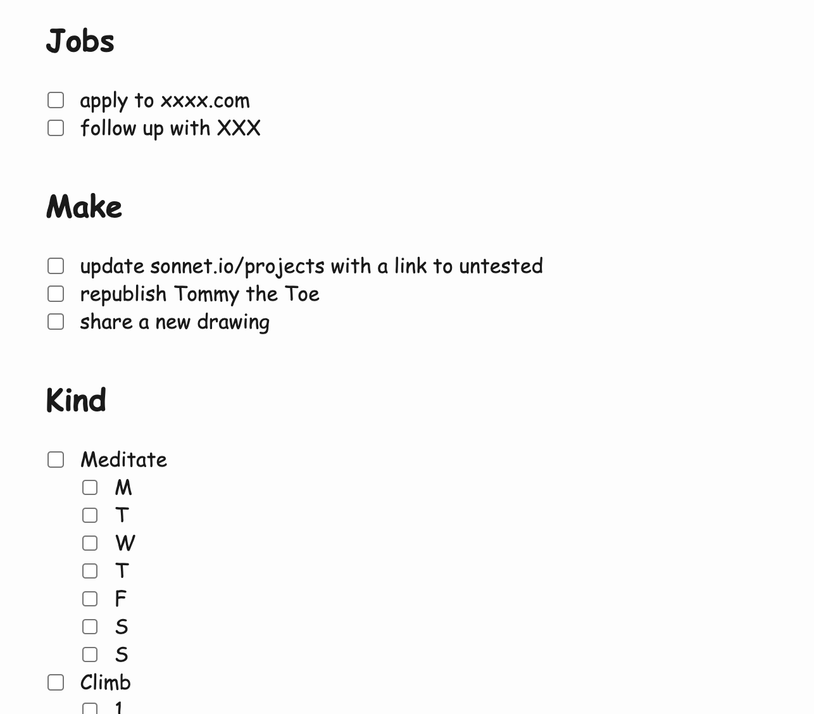

*I didn't have any drawings ready for this post, so please enjoy this contemplative baked potato instead.*

Obligatory: [This is not writing or productivity advice](<../This is not writing or productivity advice>). 

Every Monday morning I start my day by going to the local laundrette and planning the rest of my week. Over the years I've developed a little "weekly retro" template that seems to work for me. The entire thing takes me about 30 minutes.

## Why I am doing this

1. To stay focussed on my long-term goals, maintain a sense of direction.
	- (compare with daily [Stream of Consciousness Morning Notes](<../Stream of Consciousness Morning Notes>))
2. To spot patterns in my behaviour (e.g. rushing, missing/skipping tasks) and come up with actions.
3. To experience a sense of achievement when I get stuff done. I tend to just move on to the next thing once I'm done with a task ([Done? Take Time to Appreciate and Reflect](<../Done? Take Time to Appreciate and Reflect>)). 

1., and 3., are especially important now since I work for myself, I set my own schedule, and I thrive with immediate feedback ([Share your unfinished, scrappy work](<../Share your unfinished, scrappy work>)). It's easy to overlook progress when you work in relative isolation without the luxury of having a sense of cadence. Even a monthly invoice or a team meeting can act as a "motivational metronome". I need some routine or at least an excuse to sit down and reflect – otherwise I tend to lose perspective, start feeling directionless and panic.

(I love chaos, but in short bursts.)

## How I use it

**If you're using Obsidian, check out this  [Weekly Summary Template (gist)](https://gist.github.com/paprikka/2cb67e33b30f102492e81a516ba68519).** You'll need to install the [Obsidian.md Templater](https://silentvoid13.github.io/Templater/) plugin to run it.

The example below is based on an older entry (cleaned up and censored).
### Every Monday Morning:

1\. Review the previous week.

2\. Imagine it's the next Friday and you're just wrapping up the week. What have you done and how do you feel about it? Write 4-5 short sentences about it. No TODOs allowed.

3\. Based on that blurb, write down the tasks:

You can see the complete example here: [Template - Current Week](<../Template - Current Week>). 

P.S. some of the tasks are categorised based on my personal motto ([Be kind, be curious](<../Be kind, be curious>)).

