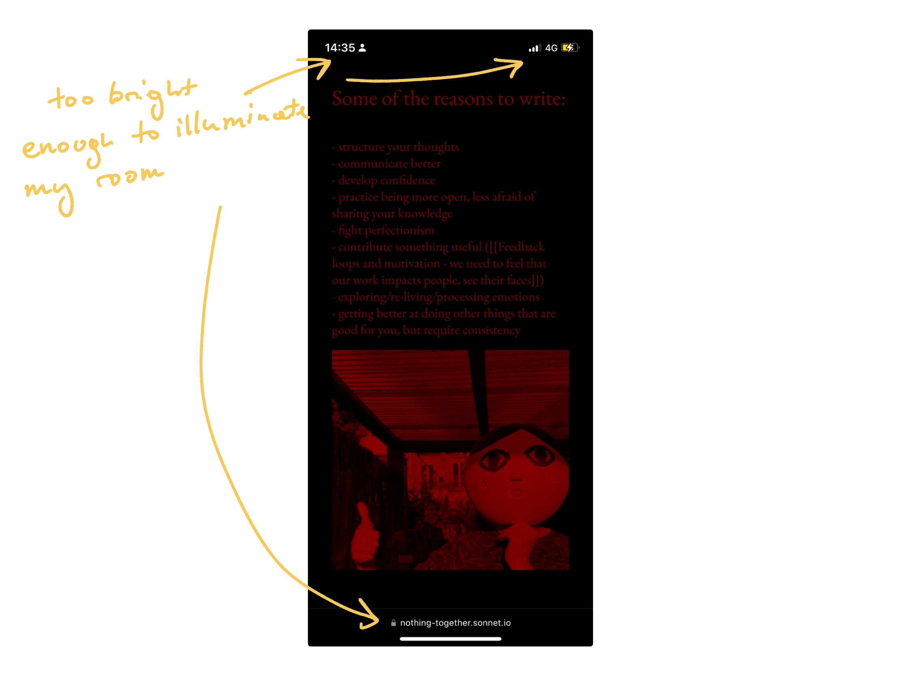
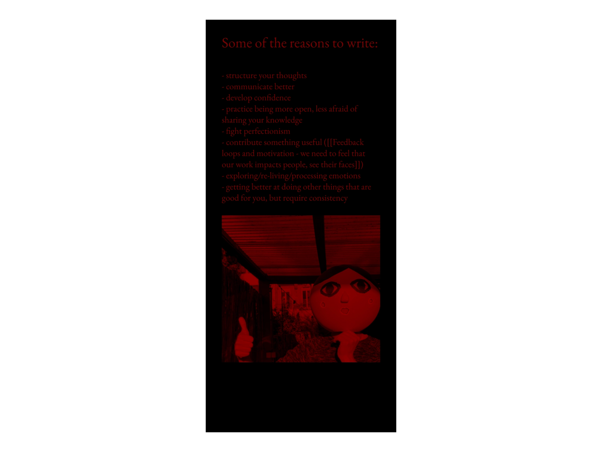
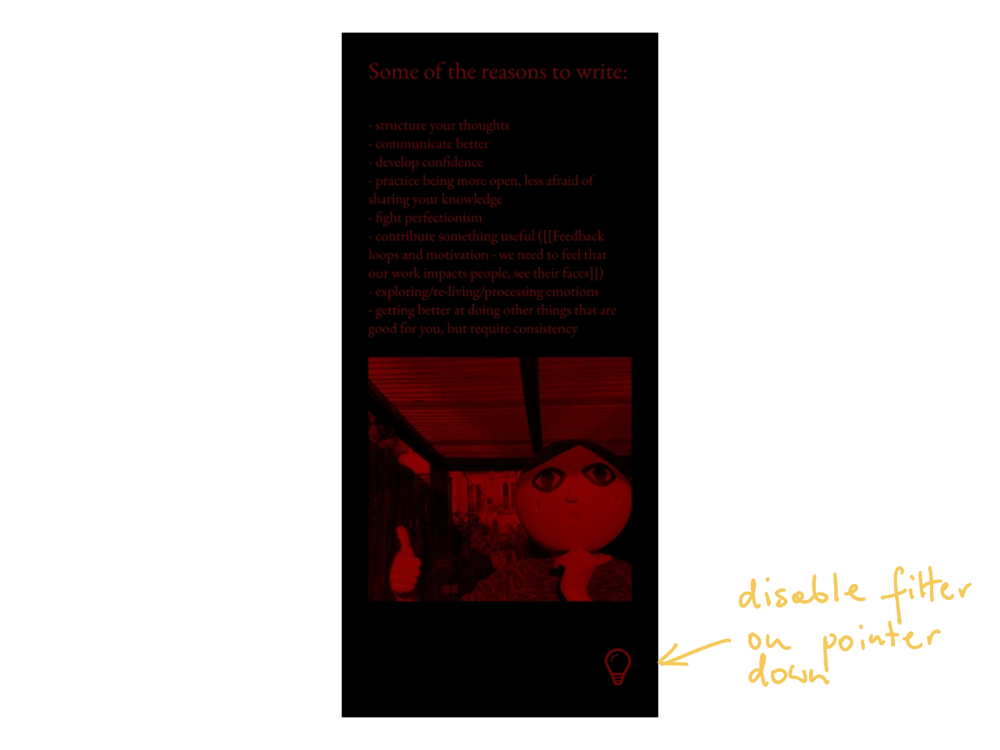

---
aliases:
  - Night Reader
publish: true
---
## Problem:

- I want to be able to read on my phone with lights off.
	- Example: I'm reading to fall asleep but I don't want to keep my partner awake. ([details](<../Obsidian for Vampires>))
- Apps using dark mode still generate much more light than needed (*night* mode ≠ dark mode.)

## Approach:

**Build an app or extension to convert sites into a night mode-friendly format.** 

**Use [readability](https://github.com/mozilla/readability) to clean up the page template.**

**Apply a colouring scheme reducing the amount of light as much as possible** without sacrificing legibility (see [Obsidian for Vampires](<../Obsidian for Vampires>)).

**Keep it private**, run everything client-side.

**Process images** so they generate as little light as possible but are still clear enough to see what they represent.

The browser chrome and the status bar still generates too much light. Hide it.

That's better:

### Implementation

I can think of 3 approaches:

1. as a bookmarklet (like [Tidy Reader](https://stephango.com/tidy) by Stephan Ango)
2. as a cross-browser Web Extension, or 
3. as an app.

Mobile Safari doesn't support fullscreen mode unless opening websites added to the home screen, so there's no easy way to hide the UI from JS. This means that we can't use the bookmarklet or the Web Extension. That's a shame because a bookmarklet would take only minutes to spike!

**Conclusion: write a small native app used mostly via the "Share to" button.**

### Other little details/nice-to-haves:

- let the user temporarily disable the night mode when holding down a little icon with a lamp (releasing the finger would re-enable the night mode)

## Why do this?

- seems like a fun and easy thing to code
- pretty quick to run and test
- I could refresh my memory when it comes to setting up and publishing iOS apps
- I could use this, although very, very rarely (I sleep quite well nowadays!)

## Why not?

- "I could use this, although **very rarely**"

## Next steps:

- let this idea sit in my head for a few days and see if I still find it interesting next week

Honestly, I'm not too convinced I should work on this, but writing down this stuff helped me organise my thoughts a bit. 

If this little tool sounds useful to you, please [let me know](mailto:hello@sonnet.io)!