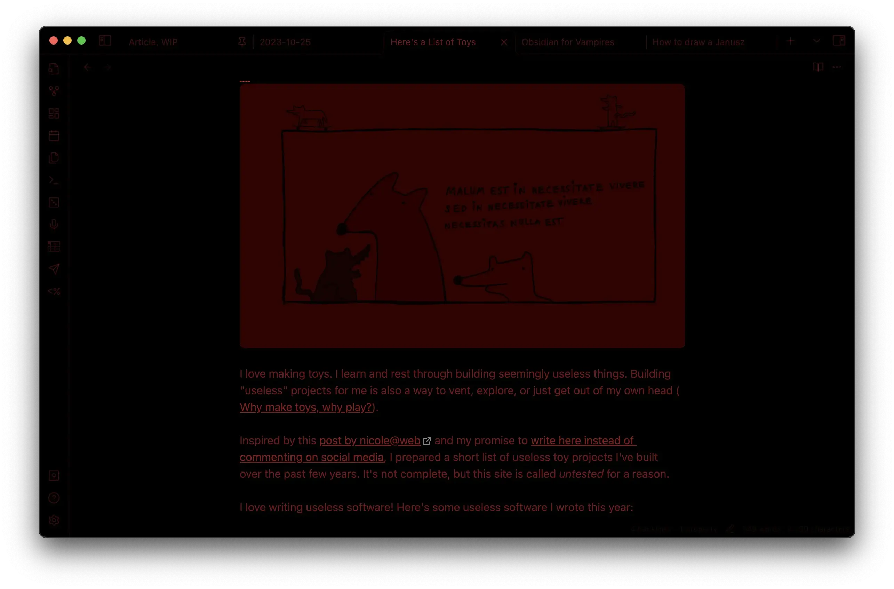
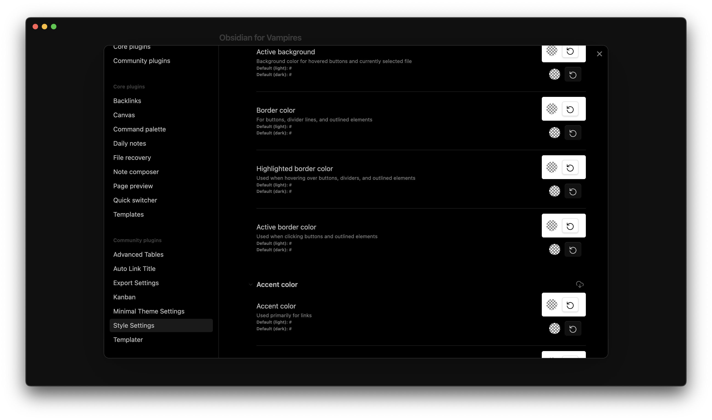
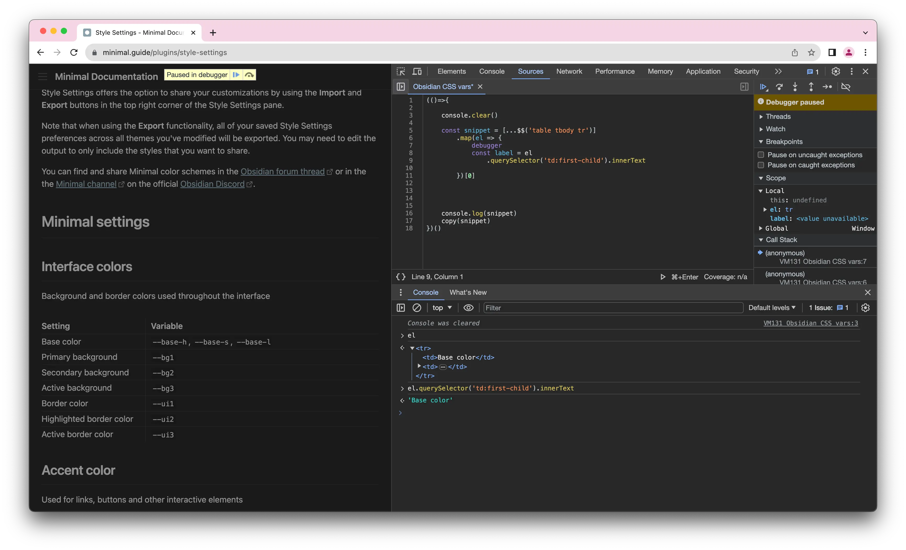
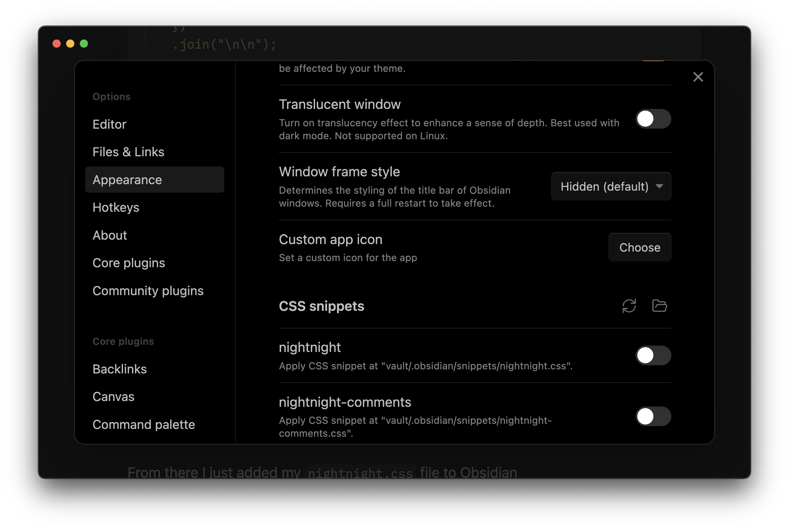
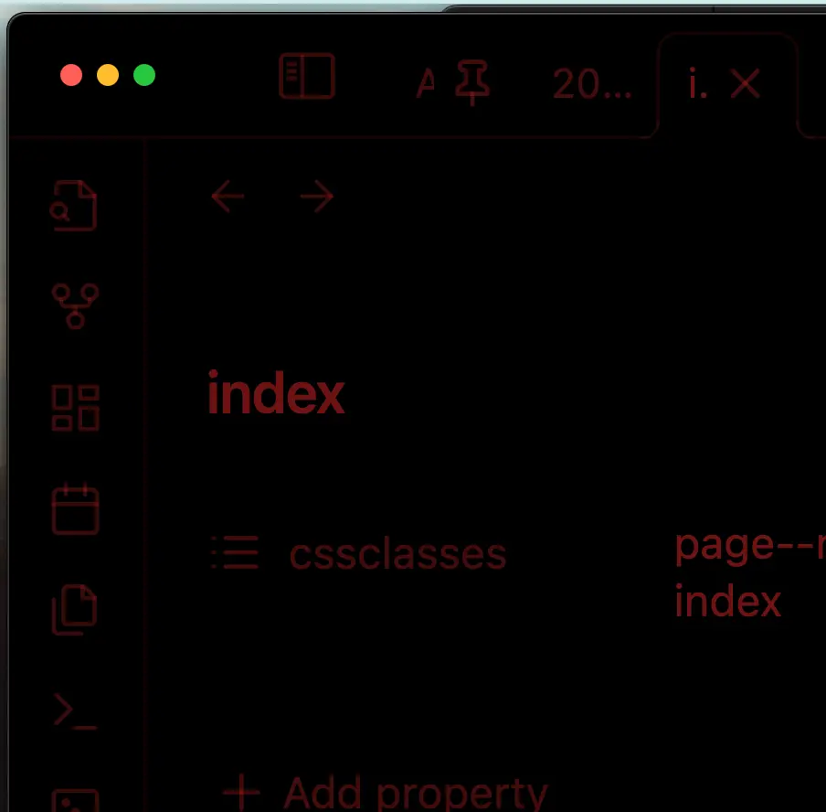
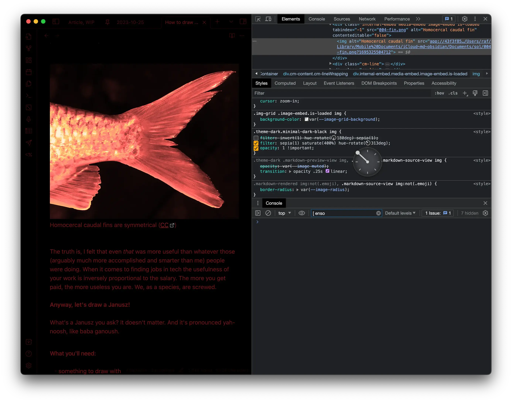
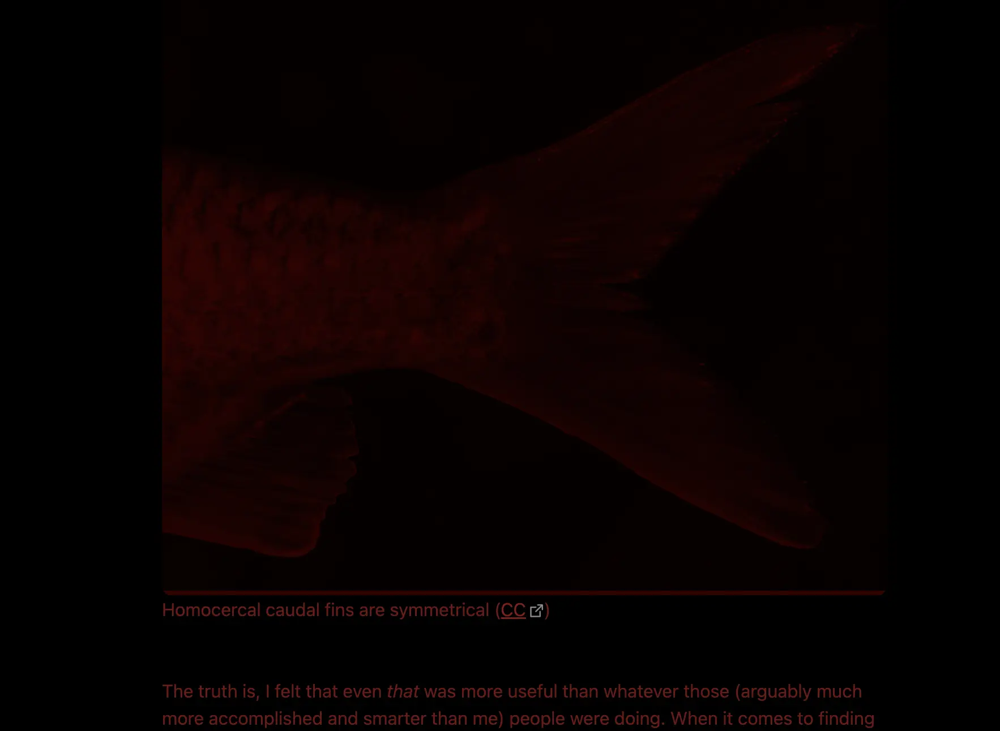
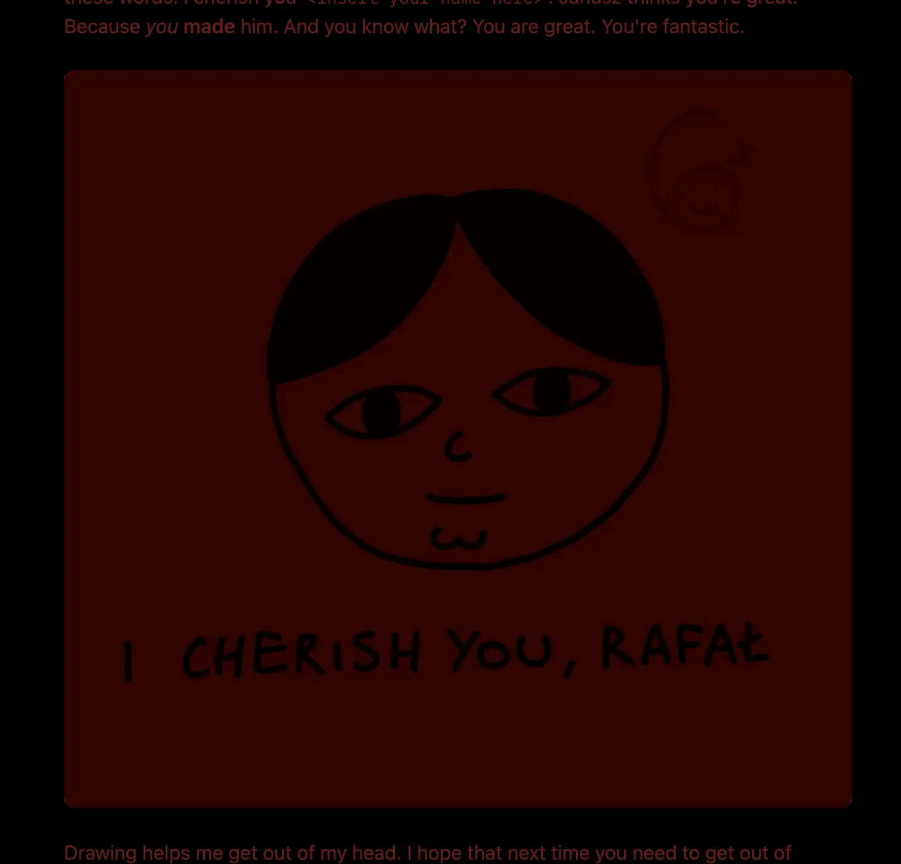
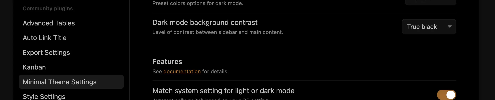
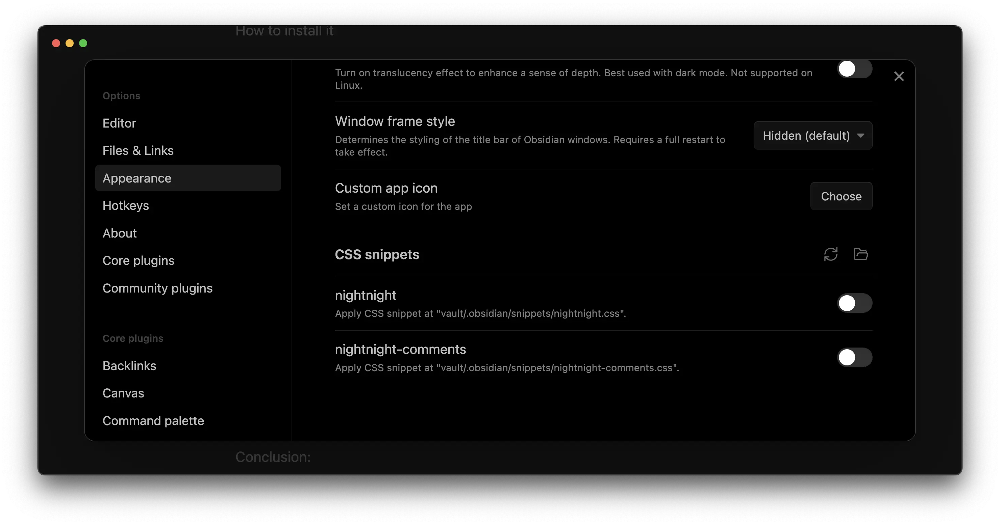

I felt a bit dark so made *nightnight* – an Obsidian theme which uses as little light as possible on OLED screens. 

Feel free to give it a go if you read in the dark, have a somewhat complicated relationship with a vampire, or live underground and share a bunk bed with a goblin. 

You can find the setup instructions at the bottom of this note.


Bear in mind that these screenshots are going to appear too dark on most screens as they're meant to be viewed using an OLED display, in a dark environment.

## How does this work?

To reduce the amount of light I'm relying on OLED screens and a colour palette from black to red.

OLED screens don't use a backlight, but instead illuminate individual pixels. This means that a screen displaying a black rectangle will emit no light. 

Why red? I'm using red since our eyes are much less sensitive towards it than to green. 

It is true that we have even fewer cones (photoreceptor cells responsible for colour vision) detecting blue light, but isolated blue light can become fuzzy due to chromatic aberration. My understanding is that our eyes are not even able to focus on blue light alone. 

I also like the way red looks. 

## How did I make it?


*(me working on nightnight)*


First, I wanted to get this done in 2 pomodoros, so needed to make some compromises. Luckily, customising Obsidian themes can be done pretty quickly with Obsidian [Minimal Theme](https://minimal.guide/home) and [Style Settings](https://minimal.guide/plugins/style-settings) plugins.

The Style Settings plugin provides a UI to override the CSS variables used to customise the appearance of Obsidian. 



However, I didn't like having to click through each colour picker to modify the settings. I'm also picky, so instead of reading the whole thing I extracted all the CSS vars from their documentation with a simple JS snippet.


Thank you RyanAir and DHL for teaching me to read the web through the WebInspector (*the \#1 Accessibility Tool™*).

```javascript
(() => { // wrap in IIFE so I can use const in my code
  console.clear(); // 10x developer mode enabled
  
  const snippet = [...$$("table tbody tr")]
    .map((el) => {
      const label = el.querySelector("td:first-child").innerText;
      const variables = [...el.querySelectorAll("code")].map(
        (_) => _.innerText
      );
      return `
/*${label}*/            
${variables.map((v) => `/* ${v}: */`).join("\n")}`.trim();
    })
    .join("\n\n");

  console.log(snippet);
  copy(snippet); // copy to the clipboard
})();

```

This gave me the CSS + inline docs in a format where I can just hit `CMD+SHIFT+/` and toggle different rules from the editor as if it was a list of check boxes, thus getting the best of both worlds:

```css
  /*Active line background*/
  /* --active-line-bg: */

  /*Blockquotes text color*/
  /* --blockquote-color: */

  /*Blockquotes background color*/
  /* --blockquote-background-color: */
```

I added my `nightnight.css` file to Obsidian...


And from there I could just play with the CSS variables and see the changes in realtime, since Obsidian live-reloads the CSS snippets.

I'm using CSS vars to give the UI some detail through shading:

```css
.theme-dark.minimal-dark-black {
  --base-h: 0deg;
  --base-s: 70%;
  --base-l: 50%;

  --red-100: hsl(var(--base-h) var(--base-s) var(--base-l) / 0.1);
  /*...*/
  --red-900: hsl(var(--base-h) var(--base-s) var(--base-l) / 0.9);
```

Note the uneven colouring of the icons below. That's because I'm (incorrectly) using opacity instead of luminosity to control how bright the details appear. 



I also improved the overall (really "loud" if I may say so) colour palette of Obsidian's Minimal Theme:

```css
  --orange: var(--red-500);
  --yellow: var(--red-500);
  --green: var(--red-500);
  --cyan: var(--red-500);
  --blue: var(--red-500);
  --purple: var(--red-500);
  --pink: var(--red-500);
```

I tried to make my theme as non-invasive as possible (e.g. don't change the layout-related properties), so I tried to (ab)use the sepia filter and hue-shift to make the images look nicer. 

However, my site has a tonne of line art drawings on white background which would look terrible with this approach.

So, I resorted to a dark red overlay and blending mode set to multiply:




Embrace the new, dark Janusz.

## Inspirations:

### Insomnia: reading

<span id="^bb0439" class="link-marker">^bb0439</span>

I suffered from insomnia between the ages of 10 and 29. Reading used to help me fall asleep, but not when staring at a glowing screen and accidentally waking up my partner. But a dimmed kindle worked just fine. 

### Insomnia: writing

Nowadays I just go to a different room, make tea and write with Ensō. I keep the screen as dim as possible (the lowest possible setting, sometimes even at 0%). An OLED screen without backlight would work perfectly here!


### Heads-up displays:

Most of the examples I could find here are green. 

Imagine *this* but in a movie where Sean Connery, *the Soviet Union's best submarine captain violates orders and heads for the U.S. in a new undetectable sub.* 

### Night Sky

Night Sky is a fantastic stargazing app. It has a secondary, dimmed mode which reduces the time my eyes need to adjust between glancing at the screen and looking at the sky.

<span style="color: red">Missing embed: night-sky.mp4</span>

## How to install nightnight:

1\. Install the Minimal Theme and Minimal Theme Settings in Obsidian.
2.\ Enable the *True Black* mode:


3\. Get the snippet from [here](https://gist.github.com/paprikka/47204f1ddddd29039b2b72880f548ff2) and add it to Obsidian.


## Possible applications:

- **Add an OLED/night mode to Ensō** – I am 100% sure I'll use it this way once I get my hands on an OLED laptop.
- **Create a Reader Mode CSS style/user script for reading at night**
	- perhaps this could work as a separate app?
- Can you think of any other use cases? [Let me know](mailto:hello@sonnet.io)!


Thanks for reading, see you tomorrow!
