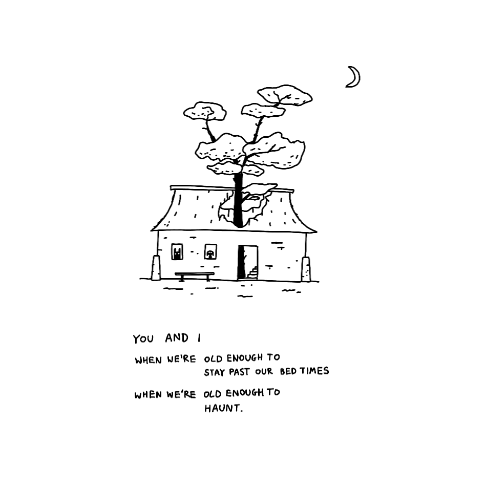

This has been a pretty busy week for me and in situations like this I end up getting an "idea diarrhoea": I start 5 different projects and end up finishing none. 

> This has its upsides, I'm not complaining: I have unexpected 2 article drafts, plus one small project to share next week (working title: *dog mode* or *goblin mode*–to be decided). 

So, in the spirit of:

a) being useful,
b) working with the [garage door up](https://notes.andymatuschak.org/zCMhncA1iSE74MKKYQS5PBZ),
c) keeping myself organised and accountable,

I thought it would be fun to share a few words about an idea I've been entertaining for the past few weeks: the physical, printed Uncolouring Book! I want this post to illustrate my thinking process about early stage ideas.  

If you haven't played with it, **do this now ([Uncolouring Book](https://lines.potato.horse))**. Just make sure you reach the end and don't share it with kids, please.

We'll start with an *imaginary, idealised version* of a printed Uncolouring Book, follow up with the reasons *why one should or should not make it*, and finish with a *quick sanity check*.

## How would it look?

My outlaw (ex-father-in-law) is a prolific playwright. Since the 90s his screenwriting process has been roughly like this:

1. come up with a preliminary idea of the play
2. write a fake, extremely positive newspaper review of said play
3. let it sit in the drawer for a month or two
4. dig it out and write the script over the course of 2-3 days, keep writing non-stop
5. start the rehearsals and make adjustments as you go

How agile. I'm happy to live in a world where a tiny private theatre, located in a forest, smack in the middle of the mountains on the Polish-German border, a place owned by **literal clowns** had better product people than [Amazon](https://www.amazon.com/Working-Backwards-Insights-Stories-Secrets/dp/1250267595), decades later. Always bet on clowns. 

Let's write our own review then!

Disclaimer: I'm not a native English speaker, and I REFUSE to put it in ChatGPT with a style prompt, so things will get cheesy, but more like a smoked Polish [mountain cheese](https://en.wikipedia.org/wiki/Oscypek). Just go with it.

> **The Porto Review**
> 
> I've never seen anything quite like the 7th edition of the already successful Uncolouring Book. It's weird, funny, bittersweet and sometimes surprisingly dark, but far from being cynical or nihilistic. It's an invitation for you to remind yourself what it means to be a child. Yet, it's by no means infantilising. If anything it expects you to play along, albeit in a slightly deceptive way.
> 
> The book/toy is only 23 pages long, yet it manages to trick you into from following a story to inadvertently becoming an author. Without spoiling much, it achieves that through a change in tone. The author's voice slowly blends with yours. It's not interactive fiction or a game, although it shares some tools borrowed from these media.
> 
> It's just you, a confusingly fragrant pencil and a few sheets of paper, covered with watercolour splatter, closer to a Rorschach test or a Cure album cover than I'd like to admit. It feels so fucking good when nothing else competes for your attention, no social media, no ads, your phone is dead. God, this pencil smells good. Did I say fucking? Shit! The idea that this is a physical object that can't be edited, nothing can be retouched, makes it surprisingly hard to draw the first lines (you don't want to mess it up). But then, towards the end, you become more comfortable with your mistakes. It's a freeing experience. You gravitate towards them, like a moth, enticed and captured by the light of a burning pencil, I mean a candle.
> 
> $29.99 at Narnes and Boble. Buy [here](https://rafal.ck.page/products/tip).

#### Let's summarise the review. Remember this is the *ideal*. Don't worry about feasibility now.

- it's a physical **continuation** (not a copy) of the Uncolouring Book
- it's beautifully printed, but it's not dry, it feels warm
- it's a toy, accessible for people of all ages, but aimed at adults
- it contains a story, ideally co-authored with the reader
	- this transition is gradual, hopefully surprising
- it's something that feels yours when you finish spending time with it
- editing is destructive
- it's interactive, but interactions are done cheaply, perhaps through cutouts, type of paper used
	- there's a mysterious mechanic involving the pencil

#### Things not mentioned in the review:
- pages could change over time using a dye that changes colour over time (a type of a photochromic/hydrochromic or solvent dye?)

#### Alternative approaches:
- manually bind a single book myself
	- cheaper to make, satisfies my own creativity
	- things are more fun when I can share them with people
- manually bind a few copies and give them to friends
	- I enjoyed making zines as a kid (I didn't have internet but I had a fork of Netscape with a HTML editor)
- manually bind a few copies and sell at a higher price
	- I like the idea of selling a premium, hand-made object like this, but this sounds VERY expensive to make

### Why?

Why do I want to make a physical version of a bittersweet, slightly deranged toy website for adult children/immature adults (pick one)?

1. People seemed to really, really like it. OK, app went mildly popular for a moment, but most importantly I received a tonne of positive and inspiring feedback, met a bunch of beautifully weird and creative people calling me via Say Hi. People seem to genuinely enjoy it. I want more of that.
2. **I** like it. I think that's even more important.
3. I miss playing with physical objects. I think you might too. 
4. I make toys in my spare time. I want the book to be a toy.
	1. My house was build on top of a carpentry workshop, and sometimes we'd make our own toys (like a bow and arrows, unfortunately the latter made from an insanely old and expensive bog wood, I still remember the haunted expression on my dad's face when he noticed that we tried to turn his samples into arrows)
5. I have print experience, but I've never designed a book from scratch. I also worked in publishing but as a vendor or artist, never as an author. This seems like a neatly-shaped gap to fill.
6. I think you'll like it. At least I think you won't hate it.

### Why not?

At this stage it's better to focus on what's possible, prioritise creativity over feasibility. It's better to have a good pool of ideas to choose from than limit yourself early. Separate divergent and convergent thinking modes. I will inject enough criticism into the idea. Trust me, I'm an engineer.

But let's give it a shot:

1. I might lose money and I'm not working full-time anymore
2. I learned from HackerNews that someone made an anti-colouring book.

I'll probably lose money in the short-term. The Anti-colouring book is lovely, but also completely different in its scope, style, and approach. I'm happy I didn't see it before making the Uncolouring Book.

### Why *I* should and can do this

- I can draw well *enough*
- I can write well *enough*
- I'm a child (my brain ages in leap years)
- It fills my heart with joy just to think about it
- I've done print design and people thought I was good enough that I should get paid for it
- The things I'd need to learn to do this:
	- sound interesting to me (e.g. book binding, publishing process)
	- sound useful, transferrable and scary (e.g. sales)

### What would I need to learn

- how to sell and market a physical product
- how to ask for money
- where to print a book (given the design constraints)
- (a tonne of things I don't know, since I don't know what I don't know)
- how to ask for help

### How I feel writing this?

Curious, filled with joy, scared.

---

OK, that's all for today. I hope you've learned something. 

Would you be interested in playing with a physical, printed Uncolouring Book? If so, how would you like it to look? [Let me know](mailto:hello@sonnet.io).

