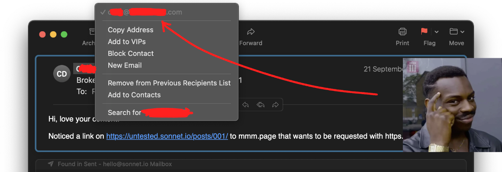

This time instead of sending a newsletter about the Indie Web, I thought I'd share some of the sources I rely on to put it together.

Happy Holidays! 

Disclaimer and probably the worst possible start of a post like this:

**This list is neither complete nor 100% focussed on the Indie Web.** Some of the people I follow often post stuff *unrelated* to Indie Web. But, when they *do* post Indie Web related content, it's usually something so good I want to let you know about it.

## How I use these resources

- find inspiration for new posts and project ideas
- write the weekly newsletter (like [this one](<../TIL/weekly/48>))
- escape the [Cable TV Web](<../Cable TV Web>)
- find more interesting people to follow

## Websites

- [marginalia.nu](https://marginalia.nu), especially the [Website Explorer](https://explore.marginalia.nu/)
- [B3TA : WE LOVE THE WEB](https://b3ta.com)
- [The Yesterweb - Reclaiming the Internet](https://yesterweb.org/)
- [webcurios](https://webcurios.co.uk)
- [ooh.directory](https://ooh.directory)
- [futureofcoding.org](https://futureofcoding.org)
- [Diagram Website – An internet map](https://diagram.website)
- [WMW: Well Made Web :: index](http://wmw.thran.uk)
- [Industrial Nation](https://industrialnation.co.uk)
- [R74n](https://r74n.com/ants/)
- [occasionally, humdrum](https://kinopio.club/-occasionally-humdrum-vol-003-zIo9Fu0uf2Y9L-idOGwB1)

## People and blogs

### Social media

- [XH](https://twitter.com/xhfloz) and their [newsletter](https://woolgather.sh)
- [Good Enough](https://twitter.com/goodenoughllc)
- [Matt Webb](https://mastodon.social/@genmon) and [his blog](https://interconnected.org/home/)
- [Alicia Guo](https://twitter.com/upcycledwords)
- [Greg Sadetsky](https://twitter.com/technology_greg)
- [Max Bittker](https://twitter.com/maxbittker)
- [Steve Ruiz](https://twitter.com/steveruizok)
- [Kev Quirk](https://kevquirk.com)

### Blogs/RSS

- [Max Böck](https://mxb.dev)
- [Zach Leatherman—zachleat.com](https://www.zachleat.com)
- [Blog @ tonsky.me](https://tonsky.me)
- [Ethan Marcotte](https://ethanmarcotte.com/wrote/let-a-website-be-a-worry-stone/)
- [Jim Nielsen’s Blog](https://blog.jim-nielsen.com)
- [Addy Osmani](https://addyosmani.com/blog/)
- [An understanding of time in the OS of the future](https://alexanderobenauer.com/weekly/20231021/)
- [Google Sheets on iPad? More like 'Google Shiits' 💩 - cri.dev](https://cri.dev/posts/2023-11-04-google-sheets-ipad-shit-slow/?utm_medium=rss&utm_source=rss&utm_campaign=rss)
- [Jack Franklin](https://www.jackfranklin.co.uk)
- [Kevin Lynagh](https://kevinlynagh.com)
- [Robin Rendle — Designer and writer.](https://robinrendle.com)
- [benneo](https://www.bneo.xyz/curius)

## Other

I often check the domain names associated with the email addresses of people who message me with feedback or contact me via [Say Hi](https://sonnet.io/posts/hi). 

### Niche and tech-specific sites or forums, e.g.:

- Svelte Discord
- Shader Park Discord
- Tauri Discord
- Next.js Discord (less so nowadays, too SaaS/grift heavy)
- [Kirbysites | Frontend/Backend Inspiration](https://www.kirbysites.com)

I'm not very active on those, reasons:

- I don't like that Discord is trying to build a closed forum ecosystem.
- They tend to have a low signal-noise ratio and a bias towards commercial content.

## Related

Is there a [HN for indie web](<../HN for indie web>)?
