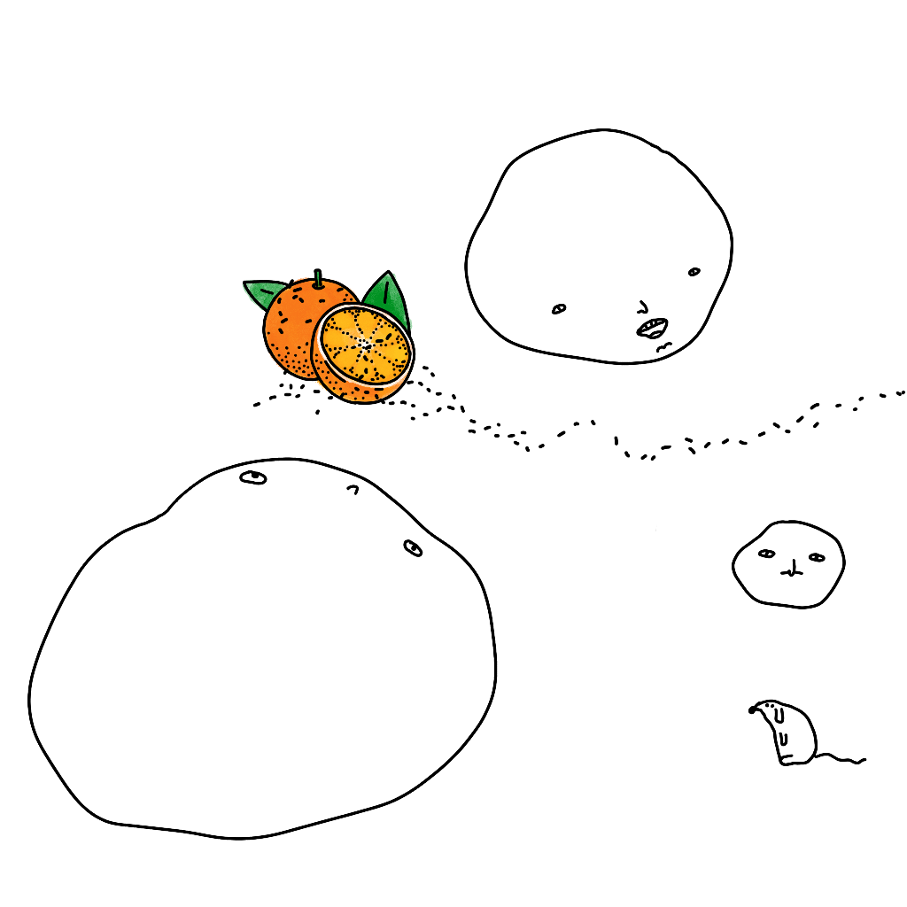
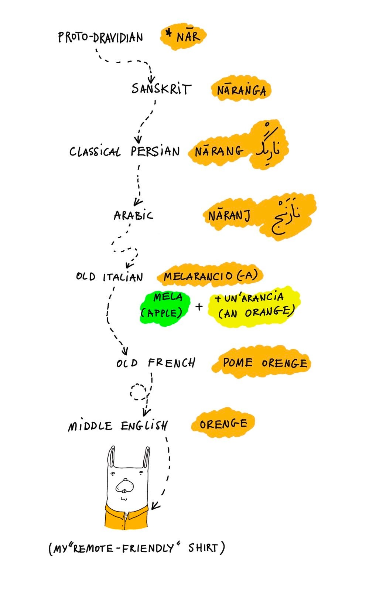
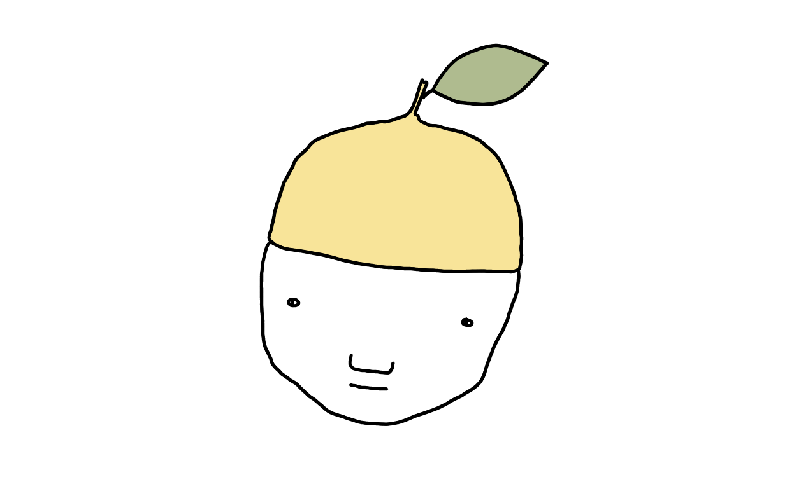

The word for *orange* and its cognates in several Indoeuropean languages arrived in Europe via Persian (نارنگ‎ *nārang* then, and نارنج *nārenj* nowadays).

At the same time, in Persian oranges are called پرتقال (porteqāl) which literally means... Portugal! Why is that?

Around the 11th century bitter (or *sour*) oranges were introduced to southern Europe via Italy. Let's add some context here: we're talking about the times just in the middle of the Islamic Golden Age, so a period of immense cultural, scientific and economic exchange. 

> Tssk, tssk! Are you a time traveller trapped in the 11th century, looking for a proper big city™ to hang out in? [It isn't Paris, it isn't London, move to Baghdad](https://www.youtube.com/watch?v=9PnOG67flRA)!

Persia had a huge impact on Islamic culture, including art, religion and language. So naturally a big chunk of the Arabic vocabulary is Persian, to the point where many modern Persian words are borrowings of older Persian words from Arabic! Most of the south and west of the Mediterranean coast was under control of the Ummayad and Fatimid Caliphates. This is more than half of the Mediterranean Sea — a huge trade hub since before the bronze age. It's a shame that our discourse about this time period is so reductive and xenophobic: everyone knows about the First Crusade, then if you're lucky, maaaybe you've heard a thing or two about Avicenna... but I digress.

Back to the oranges. In the 1400s Portuguese merchants brought a new variety into Europe. The new, *sweet* oranges quickly displaced the bitter variety to the point where European traders began planting them all along southern and westward ship routes to combat scurvy. Travelling in this way the sweet oranges eventually reached Persia, taking the name of the people who brought them there — the *Portuguese*. And that's, in short why one can say that the Portuguese *laranja* has a Persian pedigree, and the Persian orange is Portuguese (or !پرتقال ایرانی پرتغالی است).

*Lemon — the inferior citrus.*

A similar process happened with Polish and Persian: there was a period of time when steel cutlery was called ورشو (*varšo* Warsaw) since that particular good was produced and imported to Persia from Poland.

As far as food related vocab goes, English has Frankfurters, Burgers or China. And, Persian has Portugal!

---

PS. Burgers as food probably don't come from Hamburg, however Frankfurters deserve their name since Frankfurt has been famous for its meat sausages since the medieval period.

PPS. Speaking of sausages, if you visit [potato.horse](https://potato.horse) and hit the share button, you'll be greeted by a [pair of wonderful Sausage Angels](https://www.potato.horse/p/7dKwDiVdUXLvsTUIjGEmxD)!

PPS. Apologies for the messy/inconsistent transliteration of Arabic and Persian!

[Etymology](<../Etymology>)
