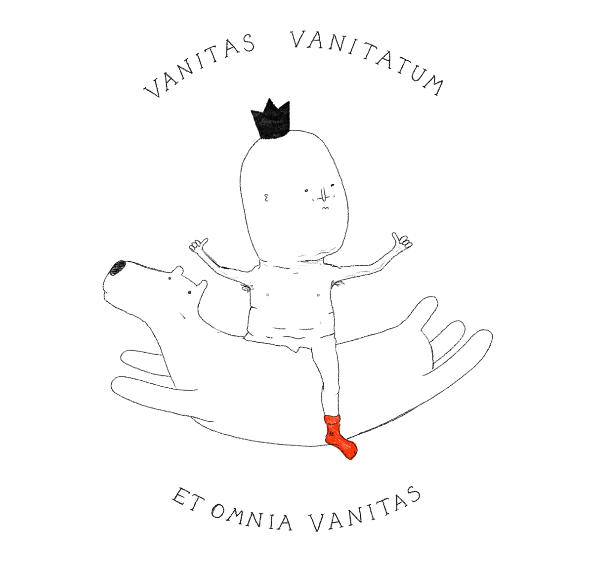

This will require some framing: as a kid I was afraid of ghosts, so I decided to challenge myself and started photographing cemeteries with my crappy digital camera. Twenty years later, I've visited dozens of necropolises across Europe, Africa and South East Asia and, more importantly, I somehow turned a fear into a source of calmness. This also means that to some readers my language might be confusing as where many see decay and ugliness, I see peace. (I'm not unique in this, but I've grown to realise I tend to overestimate the amount of people who share my perspective.)

**Cemeteries are alive and, like humans, they have their own personalities and idiosyncrasies. I'd argue that instead of building a portfolio or a digital garden, you should consider creating a project/idea cemetery. Here's a half-baked take on it.**

## What

My project cemetery could document the progress of some of my experiments. Most of them never reached a conclusion or made money (at least not directly), but all of them contributed to my progress on the next interesting thing.

### UX/navigation:

It would exist in two modes:

- epitaph list
- map

**The epitaph list is just a list of projects in a reverse chronological order.** Every project contains:

- name
- DOB, lifespan, or *time and scope of work*
- cause of death, or *why I stopped working on it*
- an inspiring quote, or *1-2 things I've learned from it*

**The map would be a jRPG style exploration game.** You'd walk a forest path and see: hills, meadows, monuments big and small. The more interesting monuments would have unique drawings riffing on the type of project buried there. Clicking on each monument would reveal its epitaph in a modal window. The paths might split and lead you to different areas corresponding to different *areas of interest*. Some paths will be dead ends, some paths will have secret passages to other sections of the cemetery park. There will be unfinished paths, not a construction site, but a never-ending forest with the sun setting above it.

*(no images yet, sorry, this post is still work in progress)*

Monuments could have different statuses:

- reserved plot (I'm thinking about it)
- dig-in-progress (I'm working on it)
- monument (I'm done with it)

These are partially inspired by the taxonomy used on [Maggie Appleton's digital garden](https://maggieappleton.com/garden-history): (🌱 _Seedlings_, 🌿 _Budding_ , 🌳 _Evergreen_).

## Why

- because it sounds fun
- because we need to celebrate "failure" or unfinished work more ([Kill your darlings, their bones are the best fertiliser](<../Kill your darlings, their bones are the best fertiliser>))
- because I feel like it's my responsibility to [take something seemingly ugly or scary and show beauty in it](<../Be kind, be curious>)

## How

(this is a rough draft of the next steps for *me*, so it'll be much more complicated of course!)

- draft the example UX (a mini jRPG-style map)
	- how to make it work on mobile?
- prototype with pixijs

If *you* wanted to build a little project cemetery, perhaps convert your existing work into one, how would it look?

## Inspirations:

- [Skogskyrkogården a.k.a. The Woodland Cemetery](https://en.wikipedia.org/wiki/Skogskyrkogården)
- [The Good Time Garden](https://thegoodtimegarden.com)
- [Days](https://days.sonnet.io)
- [Timeline Archive - Chris Coyier](https://chriscoyier.net/timeline/)

