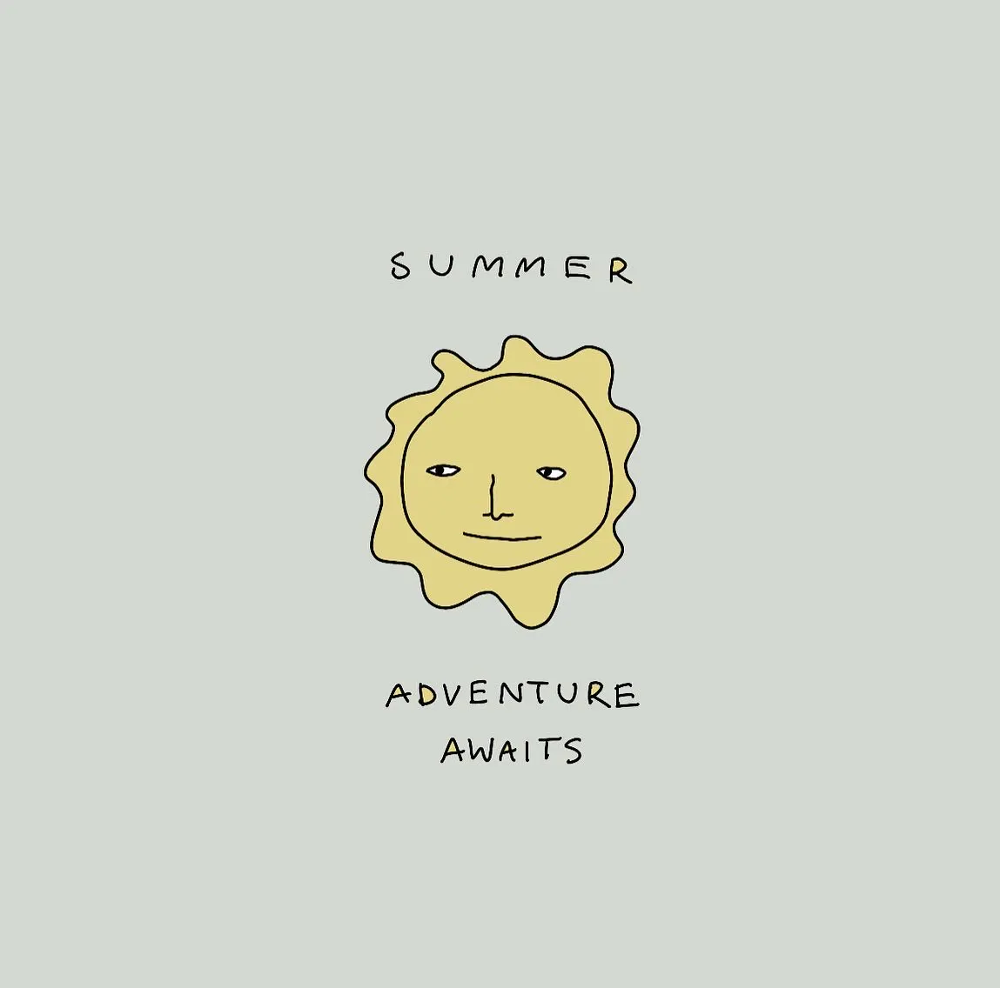
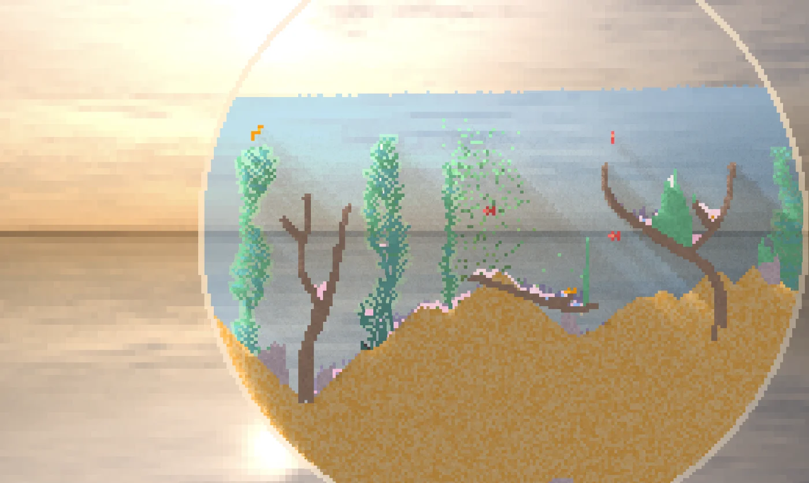
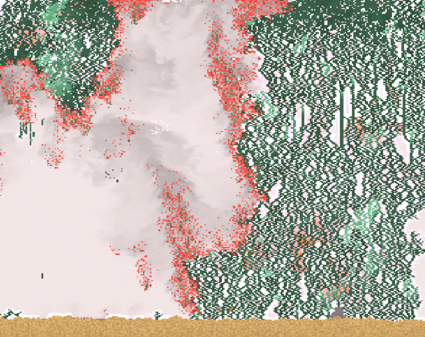
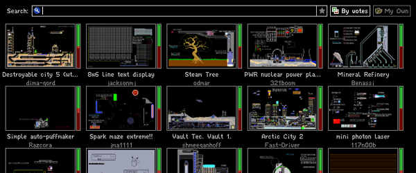
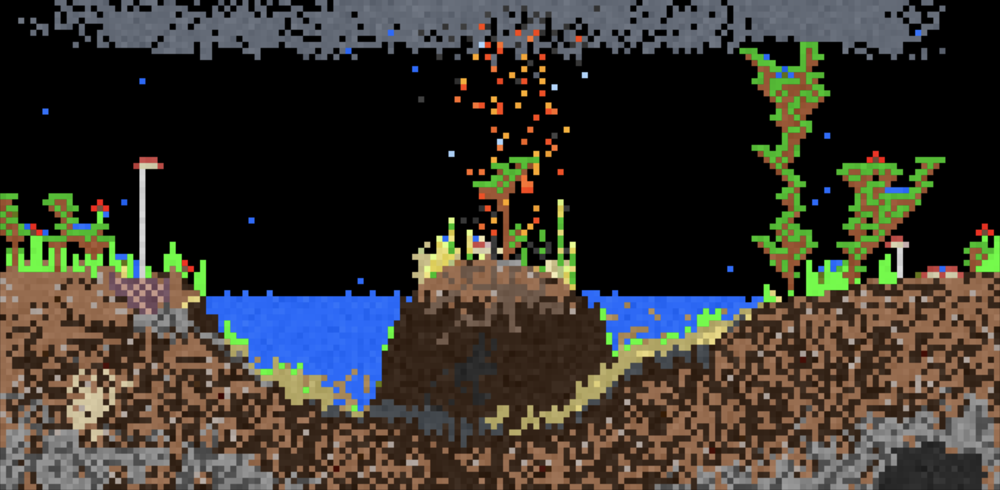
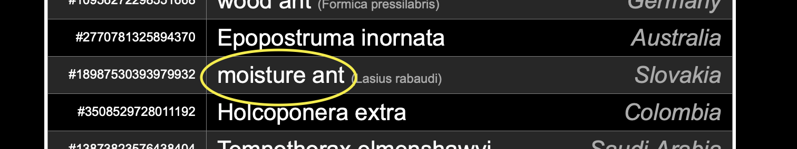
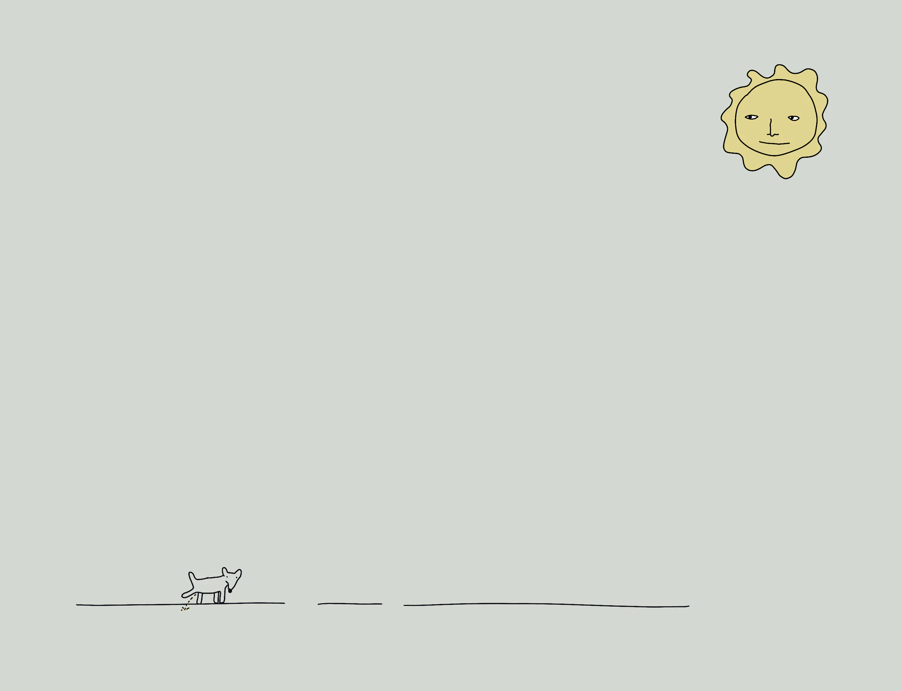

Sandspiel (*sand play*) recently became one of my favourite German words, (after *Schadenfreude*, *Weltschmerz* and *Eichhörnchen*). 

Here's a list of little apps, games, playthings, creative tools using a form of sandspiel I stumbled upon when working on [Fig](<../Fig>). I made an effort to avoid researching the subject too much when working on Fig for the reasons mentioned [earlier](<../Fig>), so the list is by no means comprehensive. It's only a small crack in the window leading to a world that's much bigger and richer than I expected. I just took a peek and now I'm telling you *hey, check this out!*

I'll keep this note as a bucket where I'll hoard bookmarks, notes and screenshots.  (I imagine it as a bucket filled with tiny, colourful crabs, different at a very basic level but weird, fun and perfect where it matters.)

## Orb.farm

Orb farm is an interactive, aquatic terrarium created by the author of [Sandspiel.club](<#^8ef331>), [Max Bittker](<../Max Bittker>). It's a purely browser-based, simulated ecosystem. It looks like a more specialised, trimmed down, themed version of Sandspiel.club. 

I'm planning to do something similar with Fig. That is: start with a broader app, and then [create smaller, more specialised toys](<../Fig>).

Also, I wrote about it earlier in [Weekly TIL 54](<../TIL/weekly/54>).

The other projects might seem more impressive from a technical point of view, but this one has been my favourite, one of the few uses of my tablet to wind down instead of getting wired up.

## Sandspiel.club

Picture taken from [Beauty of life in dynamical systems: an aesthetic viewpoint of life | ResearchGate](https://www.researchgate.net/figure/Screenshot-of-a-forest-fire-model-simulated-on-https-sandspielclub-The-simulation-is_fig8_360618706)o

[Max Bittker](<../Max Bittker>) calls it a falling sand game inspired by [The Powder Toy](<#^8ef331>). I see it slightly differently and unfortunately my stepmother tongue fails me here. That's mainly because in Polish the distinction between *game* and *play* is stronger:

  - zabawa /zabava/ – party, fun, play, game (esp. in a social context, not in the sense used in *computer game* or *game of \<insert a ball here>*)
  - zabawka /zabavka/ – toy, gadget
  
The Powder Toy fits the *zabawa* category more here. Playing with beetles or falling sand feels this way to me at least. There's no end goal, just messing with the environment, seeing how it responds, admiring its emergent, surprising beauty. It's play, not game. It's zabawa. 

## Sandspiel Studio

Sandspiel.Club and Orb.farm are closer to being ~~toys~~ playthings, then Sandspiel Studio which is more of a creative playground for creating and sharing falling sand elements.  

## [The Powder Toy](https://powdertoy.co.uk) 

Not the OG, but often mentioned as such falling sand/physics sandbox game. Created by Stanislaw K. Skowronek (a.k.a. Skylark). This project is very mature, featuring the ability to share levels, as well as playing together.

## [Sandboxels](https://sandboxels.r74n.com)

A **browser based** simulation with more than 500 elements, including the community-created ones. It feels incredibly intricate and flexible. It is developed by [R74n](https://r74n.com). Their website itself is a rabbit hole with a ton of projects like *Every Ant on Earth – browse every single individual ant!* 

Tangent, my a friend from [mossy.earth](https://mossy.earth)worked in Slovakian floodplain forests last year. I wonder if they met?

^8ef331

Three new questions arose when I was reviewing these notes:

- has anyone developed a taxonomy of Sandspiel-style games/toys I could access or follow like a rabbit hole [filled with crabs](https://en.wikipedia.org/wiki/Carcinisation)? 
- What can I learn from these games when it comes to remixing/scaling down my own ideas? Or, on the contrary - coming up with a more generic approach based on a simple prototype.
- What's the relationship between game/play/plaything/creative tools and how does it differ between those projects. My vocabulary is lacking here.

Thanks for reading, see you tomorrow!

Got anything interesting that would fit this list? [Let me know](mailto:hello@sonnet.io), give my crabs a new friend!
