Share a screenshot of your game each Saturday. That's all. 

[Don't doomscroll, brain surf!](<../Things I can do online instead of doomscrolling>) I made a quick experiment, typed \#ScreenshotSaturday on Twitter and dumped the results into Obsidian. What you see here is 30s of scrolling, with almost no editing (1-2 tweets removed). 

A Mickey Mouse inspired shooter. (somehow less sinister than the original character):

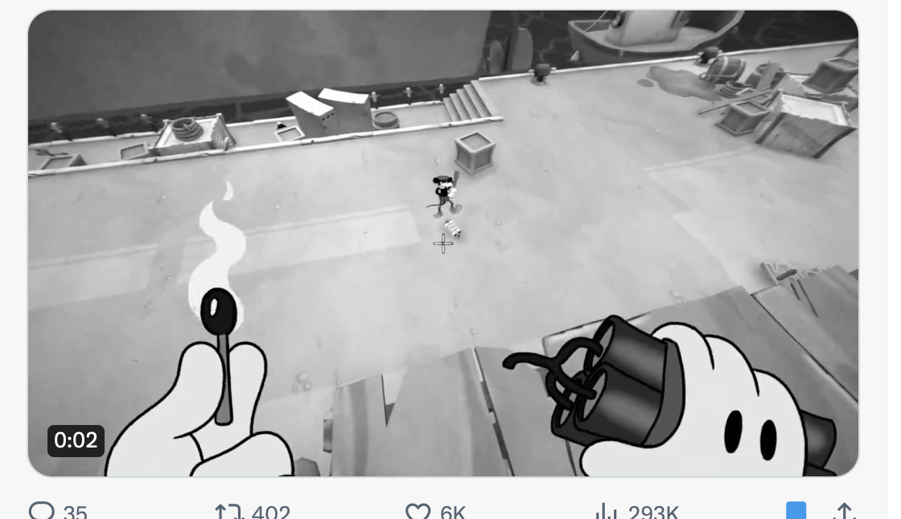

Underwater arcade/bullet hell shooter:

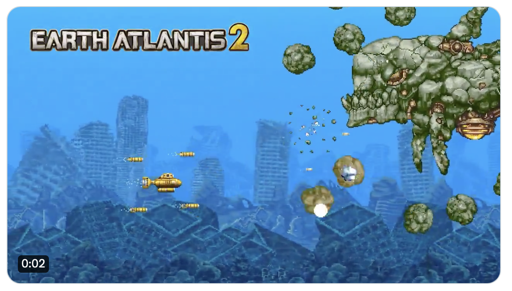

Someone sharing their dogfight AI demo:
(I don't care much about fight in games, but I know that the experience of building a game AI you can play with or against is very rewarding)

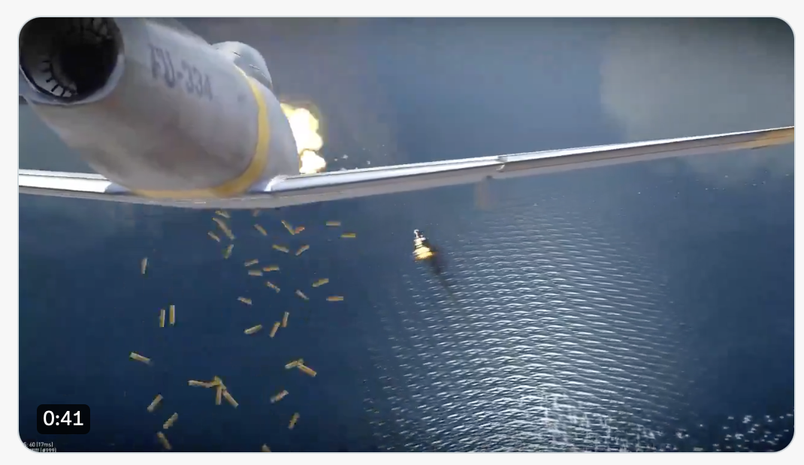

This cute, jRPG with sci-fi elements and dinosaurs!
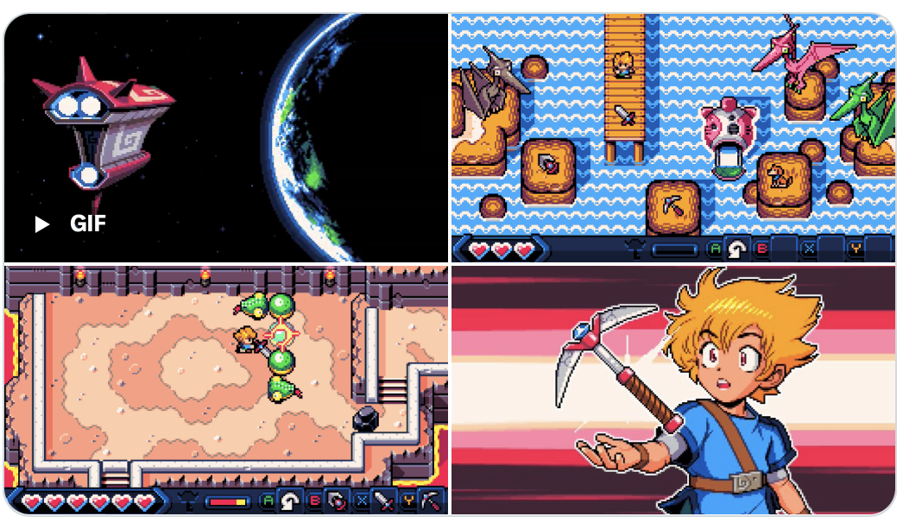

A classing Quake-inspired shooter
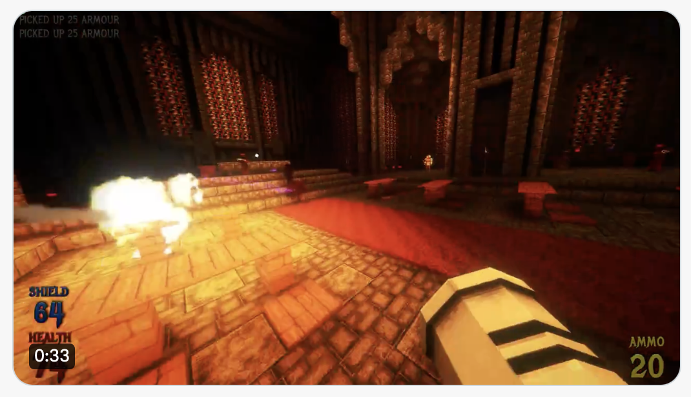

A trippy platformer (too fast to take a screenshot)
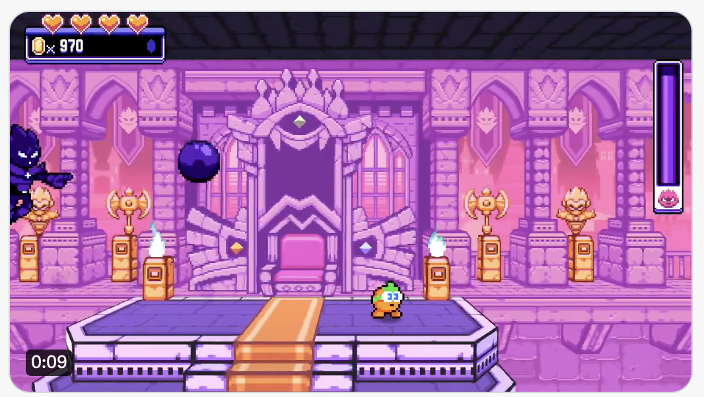

A cat in a hat, jumping on clouds.

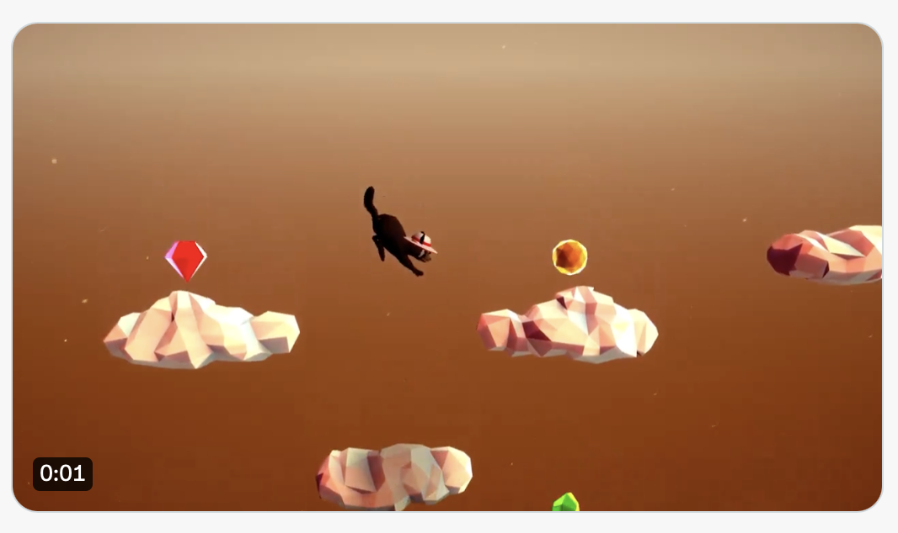

A Quake-like retro FPS/Victorian horror

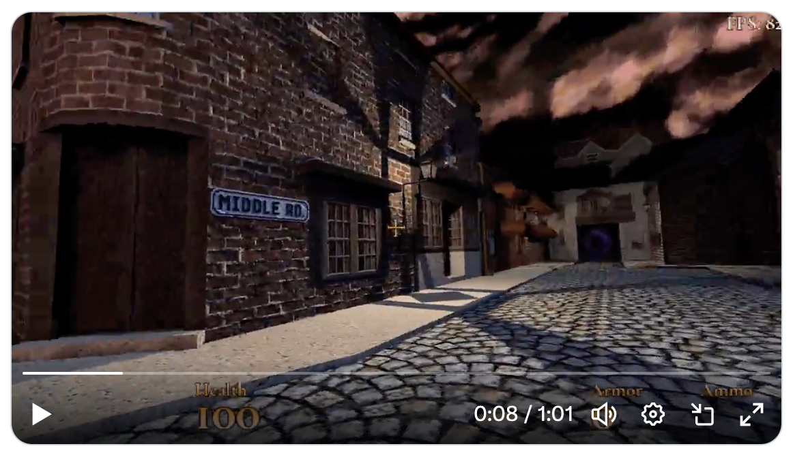

A VHS bodycam horror in the atmosphere of Soviet Backrooms.

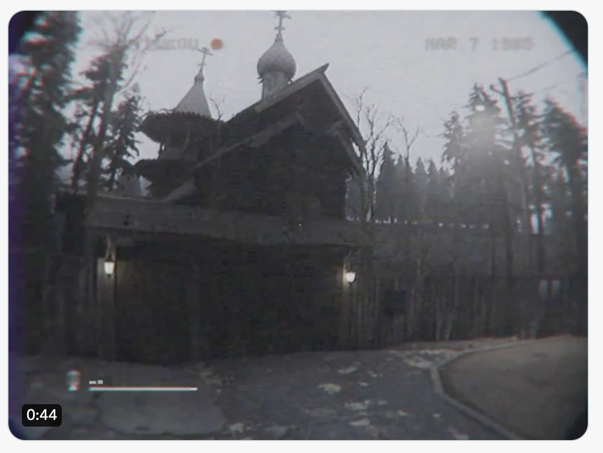

Another hat! This one's a wizard.
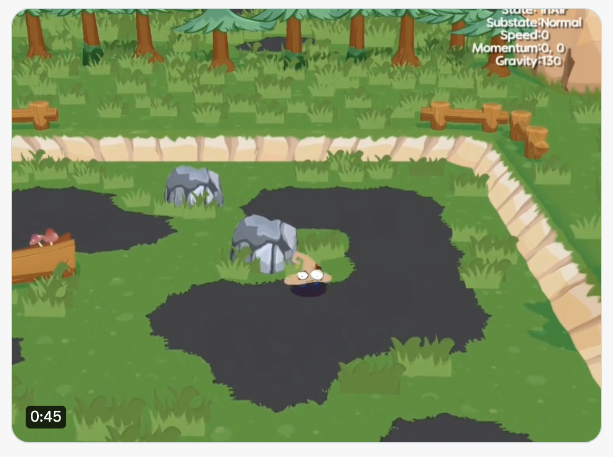

Peter Shorts.
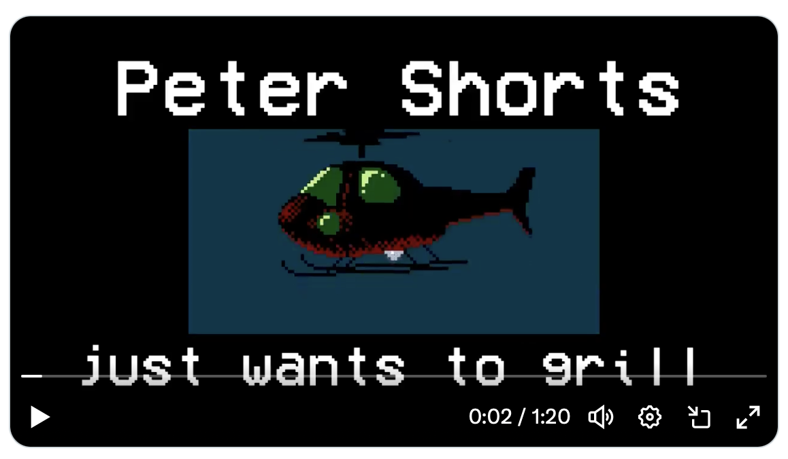

That's all. 

( #fleeting and very much wip)
