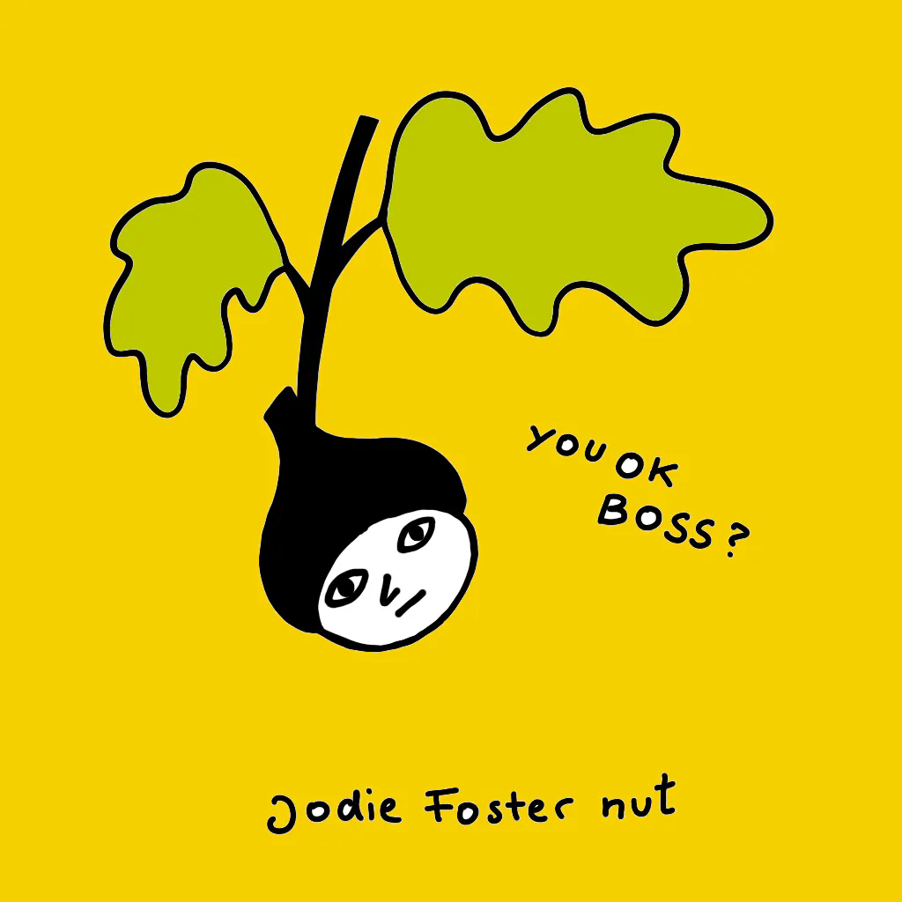

This is the same part of my garden. A few days ago someone came over and said "did you know the tree is dead?". The next morning the Chainsaw Man came over, cut it up and dug it out (revealing a hidden staircase under the roots, but that's another story.) The fig tree is gone.

A few years back Julia, already in her 90s, went to the orchard to pick plums. People used to say that this generation of people was just sturdier, but I'm starting to think my great-grandma was a fig tree. 

