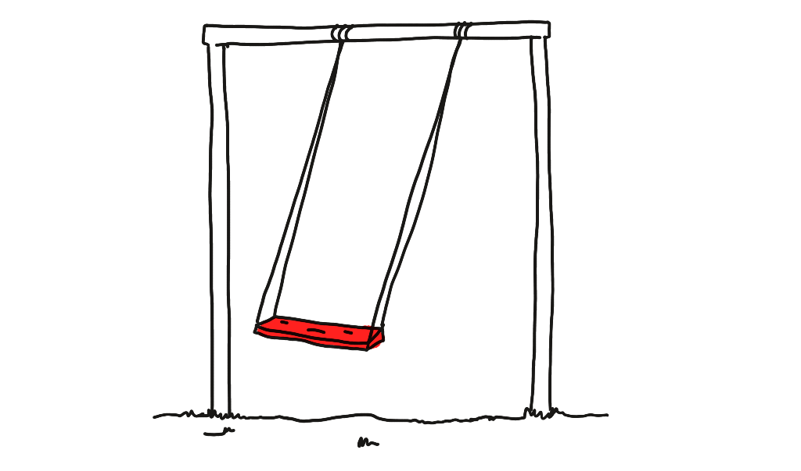

*The swing looks sad because everyone went to play in the Shader Park :(*

[Midnight](https://midnight.sonnet.io) **doubled** its weekly *posh ramen* revenue! I also had a chance to chat with the creators of my [favourite SDF plaything](https://shaderpark.com) who gave me a bunch of tips and code samples to learn from.

I thought I'd celebrate that with a gentle yak shave before I wrap up my experiments with Shader Park for now.

> Psst... You might want to read my previous notes on Shader Park before you continue: [Shader Park is Kinda Neat](<../Shader Park is Kinda Neat>) and [Midnight Shader](<../Midnight Shader>).

## Result ([live version](https://midnight.sonnet.io)):


## Implementation

```js
let noiseScale = 2;
let timeScale = 0.15;

let s = enable2D(); // 🐐!

let n = noise(noiseScale * s + time * timeScale);
let n2 = noise(noiseScale * s + time * timeScale * 0.1 + n * 0.8);

let c = pow(1 - n2, 12);

color(vec3(c, c, c));
```

And here's the generated noise (interactive example [here](https://night-reader-site-ibon38gj1-sonnet.vercel.app)):


## Using 2D mode 

ShaderPark uses a 3D mode by default. We're only interested in projecting a flat noise texture onto the screen so we can save ourselves from the unnecessary [Ray marching](https://en.wikipedia.org/wiki/Ray_marching) computation by enabling the 2D mode (kudos to [Torin](https://twitter.com/tBlankensmith) for mentioning this!). 

```js
let s = enable2D(); // 🐐!
```

Enabling 2D mode also requires tweaking some Three.js settings, mainly passing the canvas size to the shader.

```js
uniforms.resolution = {
	name: 'resolution',
	value: new Vector2(canvasEl.clientWidth, canvasEl.clientHeight),
	type: 'vec2'
};
```

Jargon: `uniforms` are the parameters passed from the JS world into shaders. An example uniform value would be `time` which can be used for animation:

```js
let render = () => {
	requestAnimationFrame(render);
	material.uniforms.time.value += getDeltaTime();
	renderer.render(scene, camera);
};

render();
```

## Performance tweaks

Three.js is ca. 70-100kb in increased bundle size. That's noticeable on lower-end devices with poor internet connection. But, I still want my [silk-smooth](https://www.youtube.com/watch?v=7s9VY9kqgfE) sheets animation to play on your fancy iPhone. We can solve this dilemma with progressive enhancement and dynamic imports. Here's an example in SvelteKit:

```html
<script>
	import { onMount } from 'svelte';
	
	let canvasEl;
	let isWebGLReady = false;

	//  called client-side as soon as the component is mounted in DOM
	onMount(async () => {
		const {  /* ... */ WebGLRenderer } = await import('three');
		const { default: generatedShader } = await import('./overlay.sp');
		// ... (yes, this could be Promise.all, have a cookie 🥠)
		render();
		isWebGLReady = true;
	});
</script>

<canvas class:is-ready={isWebGLReady} bind:this={canvasEl}></canvas>

<style>
	canvas {
		/* ... */
		opacity: 0;
	}

	canvas.is-ready {
		animation: fadeIn 3s 0s ease-in-out both;
	}
</style>
```

### Important bits:

Display the animation only when the modules have been imported and the Three.js scene set up:

```html
<canvas class:is-ready={isWebGLReady}>
```

And:

```css
canvas {
	/* ... */
	opacity: 0; /* 👈 */
}
```

Note that we're not using `display: none` to hide the `<canvas>` element as this would break the animation. That's because we need to pass the canvas dimensions to the shader as the `resolution` uniform, but `.clientWidth` and `.clientHeight` of elements with `display: none` is 0!


### Alternative — drop Three.js completely: 

I'm already [transpiling SP code into GLSL during build time](https://github.com/shader-park/shader-park-examples/blob/d4c1dce1a080205ba0ce7139e2ef64488996071e/es6-vite-prebuild-three-template/vite-plugin-prebuild-sp-three.js#L18) and I don't rely on many Three.js features so we could probably replace it with a single script. I'll leave that as an excuse to write another note (the yak is bald already).

## Summary

With this approach the page will still load fast on slower internet connection and gently fade in the animation *when it's ready*.

Loading Three.js via dynamic imports increased its bundle size to 170 kb, but from the user perspective the change is not noticeable.

This is just a reminder that:

- you shouldn't obsess with metrics, and always look at them in context
- practices such as A11y or Progressive Enhancement benefit everyone.

That's all for today. See you tomorrow!
