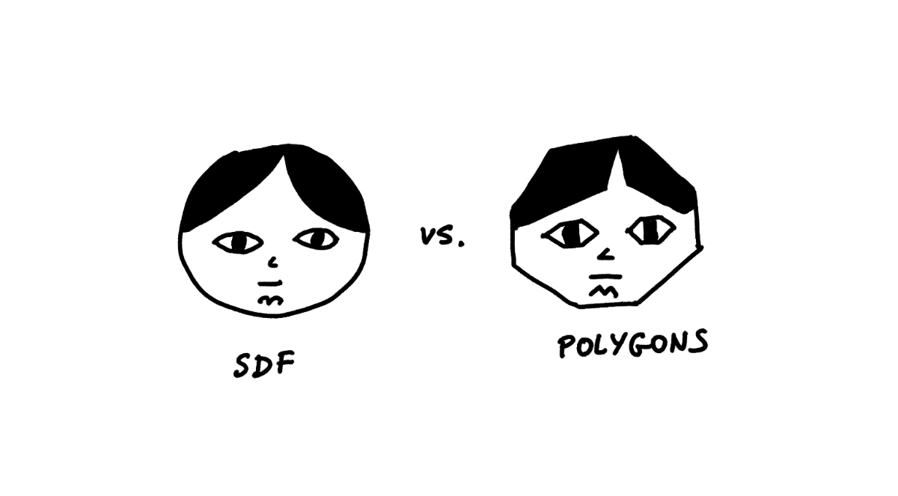
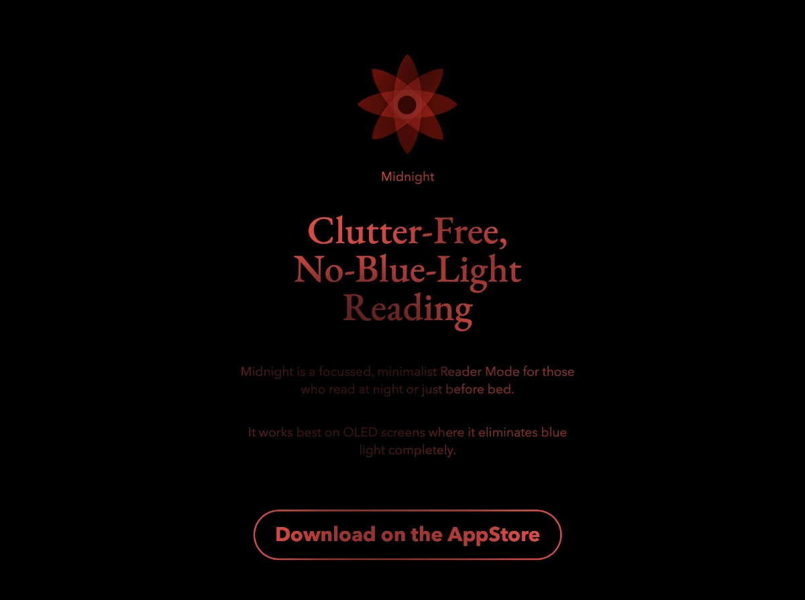

<p class='job-callout'>
Pssst... This post seems to be trending now. Got an idea worth building and looking for help? <a href='https://consulting.sonnet.io'>Hit me up</a>
</p>


*Alternative title: Shader Park I: Enter the Blob*

[Shader park](https://shaderpark.com) is a Javascript library that allows you to create interactive shaders. It's inspired by processing / p5.js, and provides a series of functions that make it much easier to use than working with plain GLSL code.

The project is still fairly new and rough around the edges, but it's so much fun to work with! I had to exercise a lot of willpower to stick to writing this note, as I kept coming back to it and sketching little animations.

In that sense it reminds me a bit of [tixy](https://tixy.land): it *feels* like a toy but can spit out something that looks really cool even with minimal effort. For instance, [look at this blob](https://www.youtube.com/watch?v=sz2mmM-kN1I):

<iframe src="https://shaderpark.com/embed/-Nl4jm_zJfCuBt4t2C9J" frameborder="0" style='aspect-ratio:4/3'></iframe>

This is the code required to generate it:

```javascript
let scale = 2.0;
let s = getSpace();
let n = 0.2 * noise(scale * s + time); 
	// generate a noise value based on the space coords, scale, 
	// and time (to create an animation)
	
color(1,.3,.7) // set the color in rgb space (0...1)

sphere(0.7 + n); // draw a sphere by adding noise to each point
```

And here's an even simpler example:

<iframe src="https://shaderpark.com/embed/-Nl4oPqg6gBLRIIlq8s1" frameborder="0" style='aspect-ratio: 4/3'></iframe>


```javascript
// move coords
displace(0, -.45, 0) 

// enable shape blending
blend(.5)    

// set the color to red        
color(1,0,0) 

// draw a small box
box(0.6, .1, .3) 

// move coords
displace(0, .9, 0) 

// draw another small sphere in the same coords
sphere(0.5 + sin(time) * .2) 
```

*Ignore the `sin(time)` bit for now. We're using it to create a looped animation. More on that next week ([Midnight Shader](<../Midnight Shader>)).*

So, how does this work?

## Signed Distance Field (SDF)

Instead of meshes and polygons Shader Park relies on an algorithm called Signed Distance Fields. 

[Alan Zucconi](https://www.alanzucconi.com) compares vertex based rendering and SDF to pixels and SVG: all vertex meshes representing curved shapes are just approximations. SDF represents entire shapes as mathematical functions, thus allowing for a much higher level of detail, whereas a 3D mesh will have a finite level of detail depending on its  polygon count. 


*SDF–a mathematical function describing the "[Januszness](<../How to draw a Janusz>)" vs. an approximation using polygons and vertices*

In practice this means that certain shapes are much easier to define and render using SDF, whereas in other cases using meshes will be more performant. This also allows for a slightly different coding style. 

For instance, when I saw this line in the first code example:

```js
sphere(0.7 + n); // draw a sphere by adding noise to each point
```

I was a bit lost. I mean, how come adding a noise value `n` to the sphere radius doesn't change the *entire* sphere, but *blobbifies* it so beautifully? The simple answer is that SDF calculates *how far a **given point in space** is from the **surface of the shape***. So, by adding noise, we're distorting the result of that function, for each pixel on your screen.

Now, I've been building games and messing with generative art for a relatively long time, long enough to know *how little I know* about graphics programming.  So, please take anything I say here with a bag of salt and check out some of these resources if you want to learn more:

- [Signed Distance Fields – Render Diagrams](https://renderdiagrams.org/2017/12/28/signed-distance-fields/). 
- [Volumetric Rendering: Signed Distance Functions - Alan Zucconi](https://www.alanzucconi.com/2016/07/01/signed-distance-functions/) – very in-depth (I'm still digging through it)
- [The Book of Shaders](https://thebookofshaders.com/)

## Midnight

Why am I playing with Shader Park? I want to add a simple background animation to [midnight.sonnet.io](https://midnight.sonnet.io). The animation I have in mind adds a bit of smooth, "silky" shading to the text. It's almost imperceptible, and looks a bit like a smooth satin sheet (how sensual and classy, I know).



Simplex noise rendered using WebGL seems like a perfect way of achieving the look I'm after, but the developer experience and amount of boilerplate required to set them up seems like overkill (at least to me).

Next week I'll post a note on noise, procedural generation and animated shaders. If you know me, you won't be surprised to learn that I tried to implement it using a bunch of hacks first, so expect also CSS custom props and gradients. 

~~For now, feel free to check out the experiment [here](https://night-reader-site-git-feat-shader-park-sonnet.vercel.app/). See you tomorrow!~~

OK, the follow-up with some more in-depth comments is ready here: [Midnight Shader](<../Midnight Shader>)!


