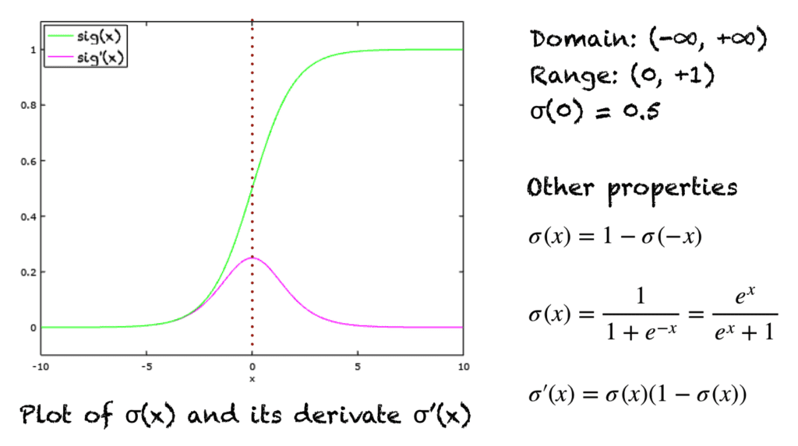

[A Gentle Introduction To Sigmoid Function](https://machinelearningmastery.com/a-gentle-introduction-to-sigmoid-function/)

[Sigma notation](<../Sigma notation>)

> [!note] Etymology
> **Sigmoid = *s shaped* (or *σ-shaped*)**

It's an `s` shaped function returning values between 1 and 0.
Its domain is $-\infty$ and $\infty$.

It makes it useful as a squashing function, compressing values between 0 and 1.

It's also used as an activation function in [Neural Network](<../Neural Network>)s
