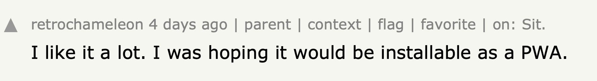
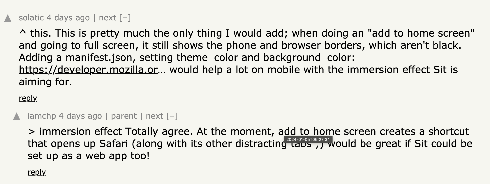
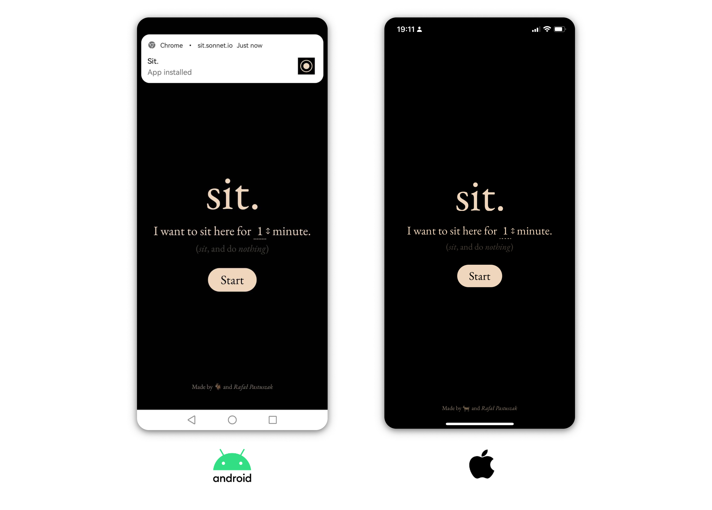
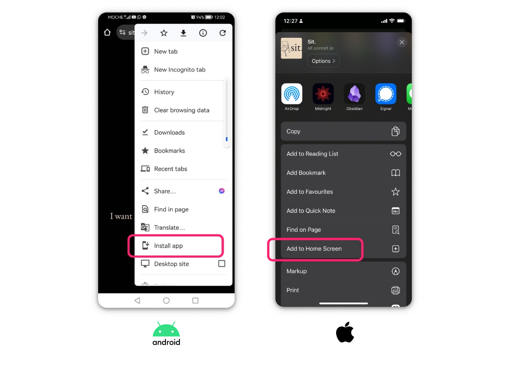
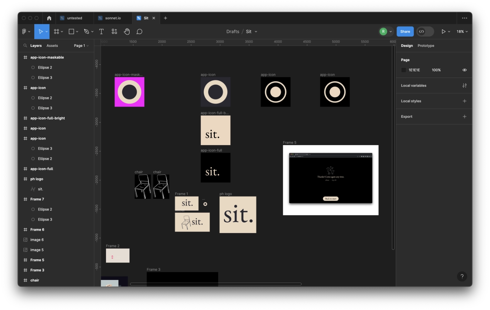
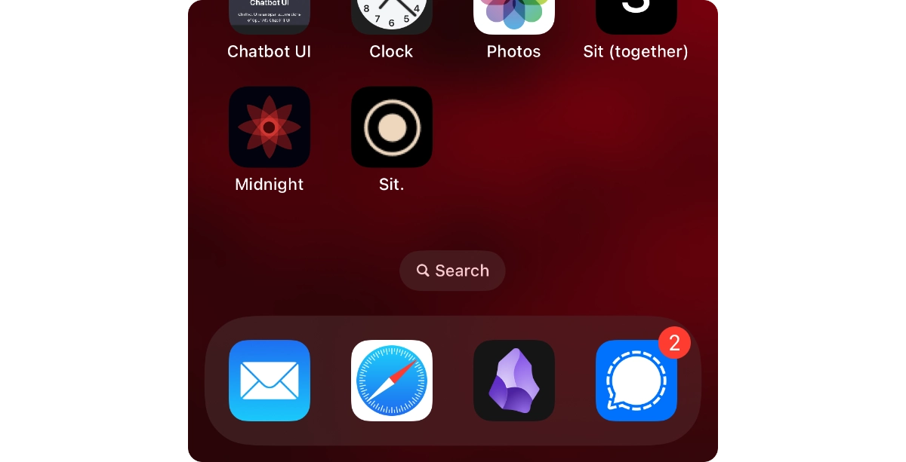

I posted Sit. on HN earlier this month and it blew up, with more than 50k people visiting the site in the space of a day or so. What the hell! The feedback has been overwhelmingly positive and so, so many people reached out to me via email/DMs or even text (someone even dug up my phone number). All of that just to say that they enjoyed it. I needed to hear that and I am grateful that I can still do this sort of work. 

As I was reading the comments on HN, one thing in particular stood out:





So, I shipped a change making Sit. a Progressive Web App (PWA) this morning.



To check it out go to [sit.sonnet.io](https://sit.sonnet.io) and hit *Install App (Android)* or *Add to Home Screen (iOS)*:



Now, the rest of this note will discuss a) the current progress, b) implementation, and c) the next steps in this process.

## Done

Most of the changes are pretty self-explanatory:

- **Offline mode:** the app works without internet connection
- **Seamless presentation:** the browser chrome is hidden

## Implementation

You can find the minimal requirements a site needs to fulfil to be considered a PWA [here](https://vite-pwa-org.netlify.app/guide/pwa-minimal-requirements.html#pwa-minimal-requirements). But in a nutshell, this boils down to:

- server config so we can support offline mode via Service Workers (mainly, HTTPS)
- metadata describing the app (using Web App Manifest)
- corresponding assets (icons, title, description)

Luckily, nowadays most of this work can be offloaded to platforms and libraries:

- managing domains, SSL → [Vercel](https://vercel.com)
- generating the manifest file and configuring the service worker → [Vite PWA](https://vite-pwa-org.netlify.app)

 I've burned myself so many times in build tool plugin dependency hell that I'm biased towards using my own delicious home cooked code for these sorts for things, but the Vite ecosystem keeps proving me wrong. 
 
 Things just worked™ and got me 99% of the way to where I wanted to be. 

### Vite PWA, Offline, Metadata

Install the [Vite PWA](https://github.com/vite-pwa/vite-plugin-pwa) extension and configure it:

```ts
// vite.config.mts

export default defineConfig({
  plugins: [
    /*...*/
    VitePWA({
      manifest: {
        start_url: "/",
        background_color: "#000000",
        description:
          "Share with a friend who needs to sit the fuck down or enjoy the experience yourself.",
        name: "Sit.",
        short_name: "Sit.",
        orientation: "portrait",
        theme_color: "#000000",
        icons: [
          {
            src: "pwa-64x64.png",
            sizes: "64x64",
            type: "image/png",
          }, /* ... */
        ],
      },
      registerType: "autoUpdate",
      devOptions: {
        enabled: process.env.SW_DEV === "true",
      },
      workbox: {
        globPatterns: ["**/*.{js,css,html,woff2,svg,mp3}"],
      },
    }),
  ],
```

### Cache non-standard asset types

[Workbox](https://developer.chrome.com/docs/workbox/) is a set of Service Worker related tools that power Vite PWA and enable its offline capabilities. By default only js/css/HTML files are cached in offline mode. Since Sit. relies on both audio assets and custom fonts, we needed to add those too:

```ts
workbox: {
	globPatterns: ["**/*.{js,css,html,woff2,svg,mp3}"],
},
```

### Icons



I'm using @vite-pwa/assets-generator to generate images in the right sizes and formats. 

```json
// package.json
"scripts": {
    /*. .. */
    "generate-assets": "pwa-assets-generator --preset minimal-2023 public/app-icon.svg",
```

### Adaptive/Maskable icons



Modern Android apps support maskable icons. In short, using a maskable icon allows you to tell the OS/User Agent to wrap your full-bleed icons in its own "chrome". This means you can decouple your icon design from a specific OS version. Neat! You can learn more about Maskable Icons [here](https://web.dev/articles/maskable-icon).

There were some rough edges, but nothing serious. For instance, the package would spit out icons with padding and an ugly white border on iOS. This could've been a configuration issue on my side. To solve the issue I just exported that particular icon from Figma instead of generating it in a script. If this bites me again, I'll fix it. But hey, we're talking about a [glorified gong](<../MISS – Make It Stupid, Simple>) here and something I update 1-2 times per year. I need to pick my battles.

### `name` vs.`short_name`

```ts
// vite.config.mts

export default defineConfig({
  plugins: [
    /*...*/
    VitePWA({
      manifest: {
      /*...*/
        name: "Sit.",
        short_name: "Sit.",
/*...*/
```
        
If `name`/`short_name` are not populated, the app will inherit the Home Screen icon title from the `package.json` file. `Sit.` is **not** a valid package name, so we need to specify it here.

Why am I mentioning this? This is the kind of mistake I'm likely to repeat in future and by writing it down here I have a better chance of committing this to memory (and perhaps saving some of the hair you'd pull out if you ended up in the same situation.)


## Next steps

1. Improve discoverability
2. Standalone app layout

### Improve discoverability

Sit. is an app now, fantastic! Now, we'll need to tell our users that they can use it. We can do so by adding app install banners on Android and iOS. Historically this has been always easier on Android than iOS ([Apple PWA support is (still) malicious compliance](<../Apple PWA support is (still) malicious compliance>)).

On Android, we can achieve that by adding a splash screen and handing the `beforeinstallprompt` event ([docs](https://web.dev/articles/customize-install)).

On iOS this is a bit trickier, but still solvable with custom work:

1. Check the current platform and device
2. Check if the app is already running in standalone mode
3. Check if the user has visited the site before
4. Display a custom install banner with platform-specific instructions

That's all for today. See you tomorrow!

## Related:

[What PWA Can Do Today](https://whatpwacando.today)
[Maskable.app](https://maskable.app)
