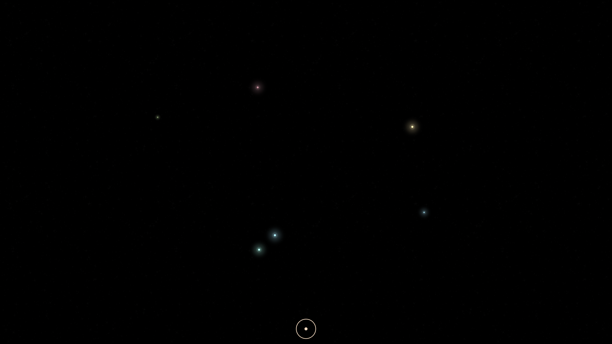
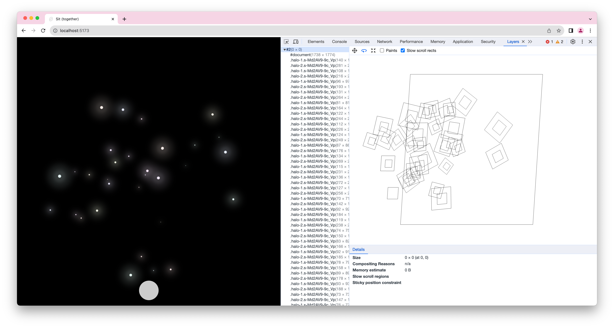
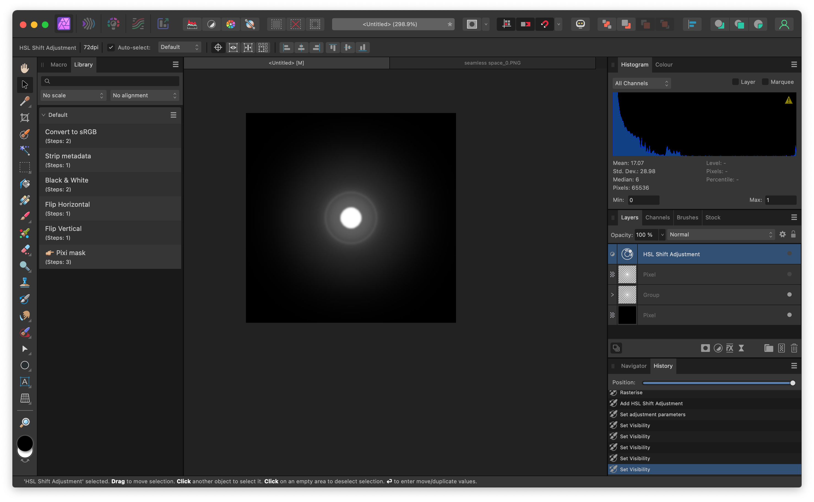

I had a few hours to work on the first part of [Sit., (together)](<../Sit., (together)>), so I thought that in the spirit of working with the garage door up (and fighting my own perfectionism) I could share my progress.

## What I've done so far

Feel free to play with it [here](https://sit-together-toy.vercel.app) or watch the video below (sorry, lost audio!):


<span style="color: red">Missing embed: sit-together full.mp4</span>
1. We have a single room filled with stars. Every star is a user.
2. A star appears when a user joins the room and shimmers and disappears when they leave.
3. Users **can** communicate although in a **limited** fashion: by hitting the sun (☉) button.

## Little details I like, places I want to explore

I strayed from the original idea for the toy, that is: only rendering the list of stars, but not having any interactions besides joining and leaving the room.

Reason: this was much easier to code than expected. This is a toy. This is the time to explore and mess around. I got carried away and prototyped a few little interactions.

First, the gong button has a cooldown effect. I turn it into a little animated sun during cooldown:

<span style="color: red">Missing embed: gong-click-1.mp4</span>

I'm also thinking about letting the users communicate by sending short melodies:

<span style="color: red">Missing embed: melodies.mp4</span>

This is the animation triggered when people are leaving or joining sessions:
<span style="color: red">Missing embed: enter-leave.mp4</span>

And this is the map when it's filled with users:

<span style="color: red">Missing embed: sit-full-map.mp4</span>
## Next steps

1. Add this background animation to Sit., (as an optional setting)
2. Explore the interactions between users ([Dogs and Palimpsests](<../Dogs and Palimpsests>)): 
	1. let them play music (a shared instrument)
	2. implement a rock-paper-scissors or a similar game 
		1. add a few AI actors to pick up the melody where you left
3. Clean up and share
4. Throw everything away and build [Sit. (the group meditation/doing nothing tool)](<../Sit., (together)>)

## Lessons, tradeoffs, technical details
### PartyKit test

Setting up the room with some basic realtime features was trivial with PartyKit, it saved me 1-2 hours of over-engineering a regular [ws](https://www.npmjs.com/package/ws)+ rxjs setup. 

PartyKit fits the niche where you want to prototype something really quickly and would normally use Vercel, but then... realise that Vercel doesn't support WebSockets.

### How to render the stars

I considered several options:

- SVG
- Canvas with Pixi.js
- Three.js with shaders
- CSS

My goal was to build the simplest, laziest possible thing. Given that we're not running sessions with 100s of users here, CSS strikes the balance between easy authoring and performance that is *good enough*. 

Note that I'm using a `random` function which seeded with the socket `client.id`. This  means that all animations are deterministic. This is crucial when it comes to any generated content, be it a simple procedural animation or a Stable Diffusion drawing. It just makes iterating so much easier. Plus, with this approach I could very easily record and replay the entire history our our little universe, say a month or a year from now.

I'm using the random seed to control the sizes, colours, animation delays of stars, min- and max-opacity... As far as prototyping goes, this is a pretty comfortable setup.

I started with all stars drawn purely in CSS:

```jsx
<div
	style:--x={x}
	style:--y={y}
	style:--delay={random(0, 0.5) + 's'}
	style:--h={random(seed) * 360}
	style:--scale={random(0.1, 1)}
	style:--spin-speed={random(1, 2)}
	style:--halo-1-flicker-speed={random(1, 3) * 130}
	/* ... */
	class="transform-anchor"
>
	<div class="container" transition:scale={{ duration: random(1000, 2000), easing: bounceOut }}>
		<div class="halo-1" />
		<div class="halo-2" />
		<div class="core" />
	</div>
</div>
```


The stars looked good and the performance on desktop was decent even at 100s of users, but my phone became unresponsive as soon as the page loaded. The reason was that every star generated 3 separate layers. This is a lot for a mobile GPU to handle (and would turn your battery into a frying pan). 



A good compromise between my own laziness and decent performance was creating a texture with three layers but still animating it in CSS:


I can still control most of my animations using seeded CSS vars. Sweet!


Little hack: I'm using the sepia filter, plus saturation and hue offsets to give each star a slightly different tint. I could simplify this by preparing a better texture, but again – I'm lazy, and that sounds like a fun piece of work for later.

```css
.dot {
	filter: 
		brightness(0.9)
		sepia(100%)
		saturate(1)
		hue-rotate(calc(var(--h) * 1deg));
}
```

That's all for today. Speak soon my friend.
