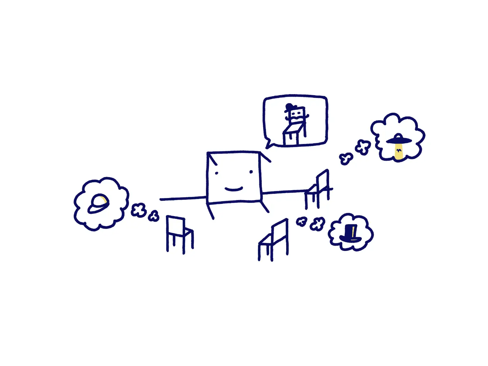
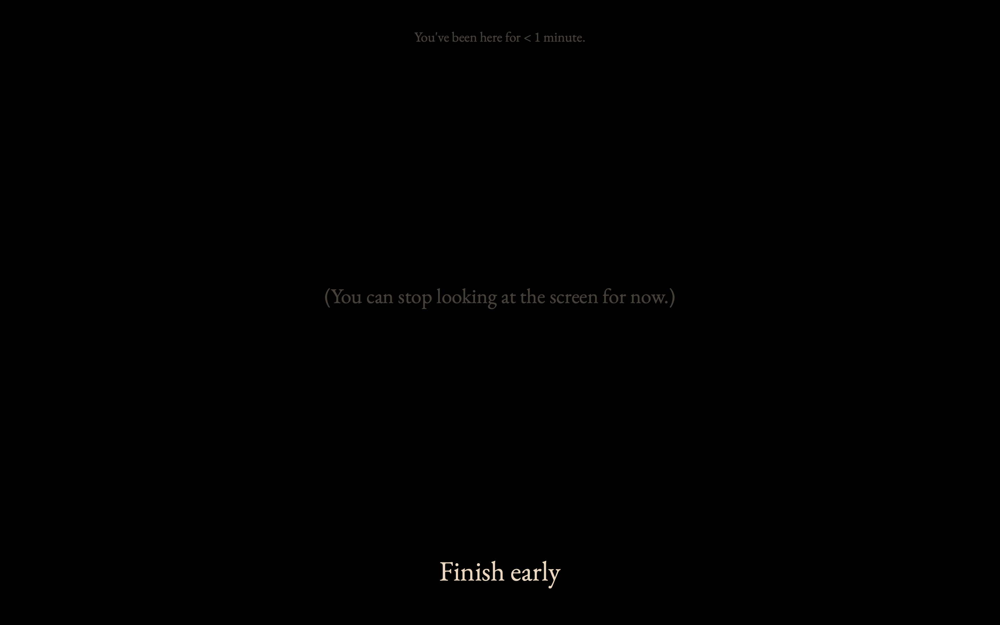

<em>Students are out few char</em>

This is a sketch/working note on two possible variants of [Sit.](https://sit.sonnet.io), so it will likely change as I continue to work on it. But if any of the ideas shared below sounds interesting to you or you have any questions/suggestions on how to improve it, [let me know!](mailto:hello@sonnet.io)  
  
Sit. is a tool for *doing nothing*. Since its launch, we've managed to generate hundreds of hours of sweet, blissful unproductivity. Let's scale this up! ***Sit, together* a group meditation app. Or a group, *sitting and doing nothing* app.** 

I can see this being built in two steps. I like it when every iteration, no matter how small, brings in something useful and meaningful (or at least pretty), so we'll split it into two apps: a *toy* and a *tool*.
## Passenger (the toy)

^90b7ce

Sit., is very simple to use. It's a glorified timer. You open it, select the break duration, hit `[start]` and see this:

In this iteration, I'd like to add an option where instead of the timer you'll see a black background with little droplets. They're small, slightly blurry and don't get in your way. You can toggle them off. But, here's the thing: **every drop is another person**, meditating alongside.

Now, every time a gong goes off, the droplet belonging to a person will ripple gently. There's no audio. Just the acknowledgement that they're there.

You're not meditating (or doing nothing) alone, you're sharing a ride with a bunch of people (see [2 cheesy existential metaphors](<../2 cheesy existential metaphors>)). Some of them will leave earlier, some of them will stay after you've left. It's a 1-bit version of [Journey](<../Journey>).

## Group meditation (the tool)

^5a62df

The *tool* is built on top of the technology used for the *toy*. But, from the UX perspective it's even simpler. In fact it has fewer steps than the 2 clicks required to use Sit., since you don't need to select the session duration: it's a remote controlled gong. That's it.

It's aimed specifically at group meditation sessions, especially those run remotely via Zoom/Jitsi/Meet. The facilitator creates a session, and shares a link everyone can join.

### What I want to learn from this:

- Will people find it useful enough to pay for?
	- I've received some feedback that they would, but in practice, money in the bank is a stronger signal than feature requests from non-paying users

## Why do I want to work on this?

- **User need:**
	- People have asked me about a group meditation tool that can be used with zoom/video calling/etc...
- **Alignment with my goals ([Be kind, be curious](<../Be kind, be curious>))**:
	- **I want to build [Kind software](<../Kind software>)**:
		- need for simpler tools 
		- need for private tools (I don't trust Zoom extensions, use jitsi, btw)
	- **Curiosity:**
		- I met Matt Webb and got curious about [PartyKit](https://www.partykit.io) – seems like a good excuse to try it out! If it doesn't work I can always fall back to [ws](https://www.npmjs.com/package/ws), I've done a tonne of projects with WebSockets already.
- It feels simple from a technical PoV, which allows me to focus on better execution.

## Inspirations/resources

- [Journey](<../Journey>) - using presence as the simplest form of communication
- [PartyKit](https://www.partykit.io)
- [Sit.](https://sit.sonnet.io)
