[Sit (together)](https://nothing-together.sonnet.io) was a successful experiment ([reasons why/perspective](<../Sit., (together) – why I'm happy with it>)) and I think I've learned enough from it to move to the second stage: building an app for remote meditation session facilitators.

Plus, I've had a chance to work on it today and would like share my notes! I think (hope) that both of us can learn from this exercise.
## How to read these notes:

I'll do my best to share them in the rawest form possible. I want to do that for three reasons:

- To demystify the process, let you see all of my naive, silly mistakes and perhaps come up with better options! (*Why is he overcomplicating this so much?* *No, **that's** how you do this!*)
- To give you some confidence to share your own unfinished work ([Work on my notes with the garage door up](<../Work on my notes with the garage door up>)).
- To get better at sharing unfinished work myself. I've done a tonne of architecture and design documents for my clients. But, this is different, I'm working solo and need to be pragmatic when using my mental resources and time. I'm fighting an urge to make the drawings below cleaner/spicier.

## Current progress

### My usual process is to:

1. Jump straight into the project without any prep.
2. Make a tonne of mistakes.
3. Throw out everything.
4. Start with a clean slate, but this time with *some* knowledge of where I want and don't want to go.
5. Rinse and repeat.

We're at step 4. I've been fucking around and finding out for long enough to start coding.

## Sketches, TIL

I have some initial sketches done in [Concepts](https://concepts.app/en/). We'll use them as a map to navigate the rest of this note:
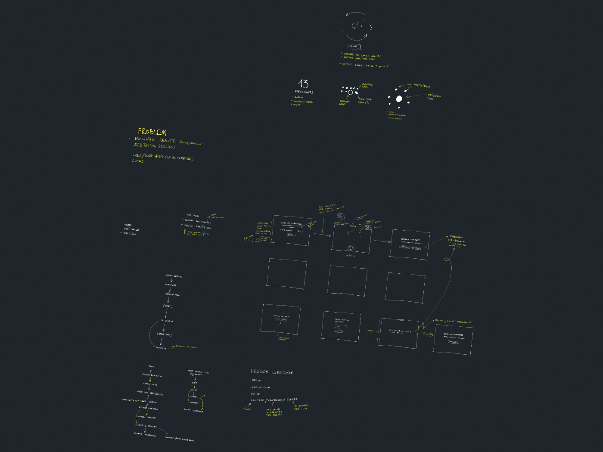
Full-size preview [here](<../sit-part-2-dev-notes-entire-board.pdf>).

The subject matter is fairly simple from a technical PoV. It's a remote controlled timer, with rooms defined by unique URLs, at least for now. So, this board is much cleaner than what I usually start with, e.g.:

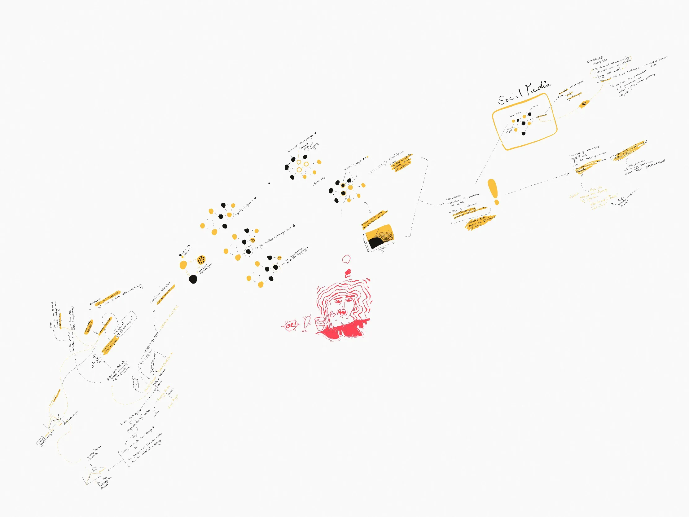
### Problem statement:

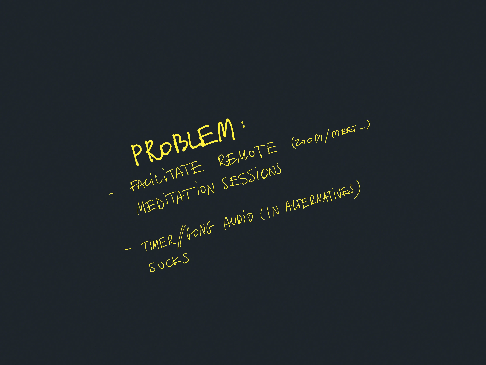

- Facilitate remote meditation sessions for people using Zoom/Meet/etc...
- Gong/timer audio in all of the other solutions sucks!
- (personal) I don't support Zoom or Meet as products, so I'd like a platform-independent solution.

### Defined types of users:

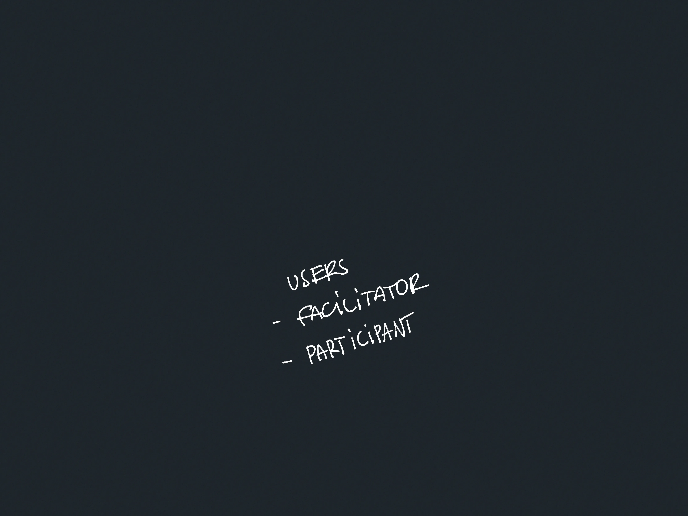

- Facilitator
- Participant

I'm not using Personas here because I don't see any reason to yet.

### Use-cases

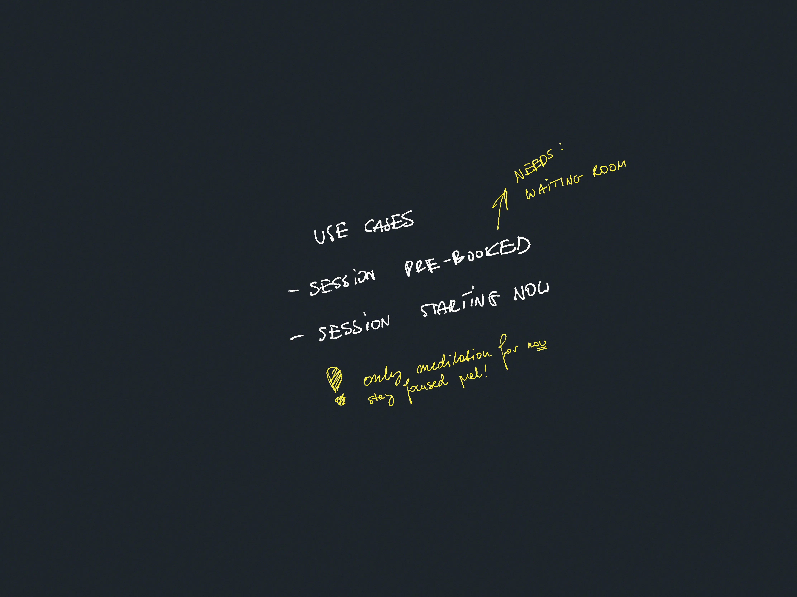

These are very narrow on purpose. This will change.

### A map of user interactions:

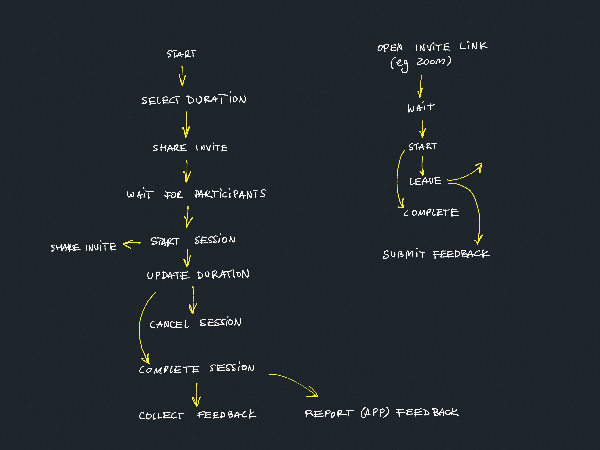

It's a quick draft of two user journeys for Facilitators and Participants. This borrows  from Experience Mapping and User Story Mapping as normally I'd turn these into:

- domain entities (Session, User, SessionSettings)
- UI screens and wireframes

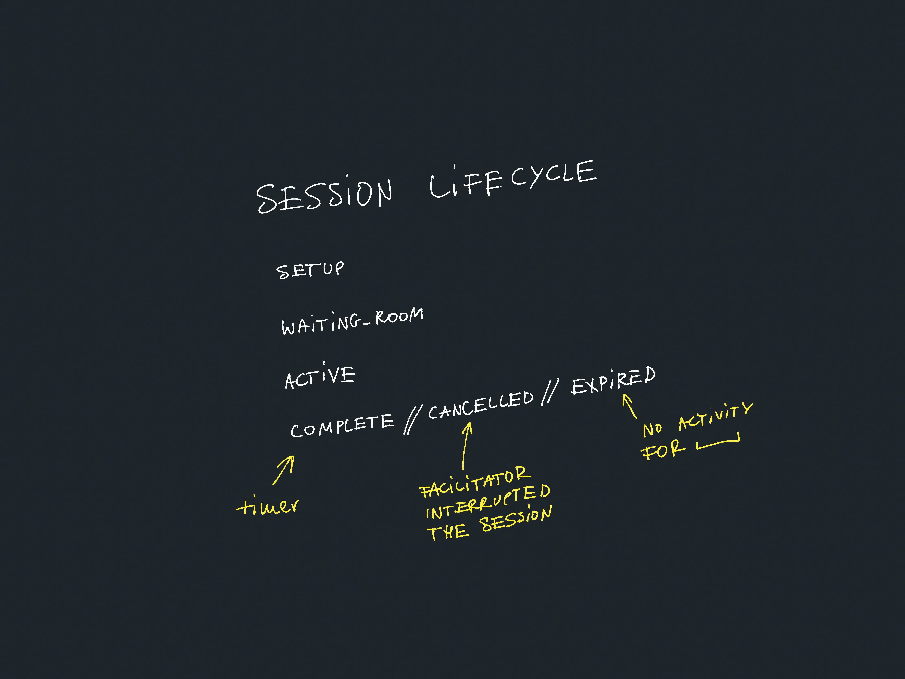

But for now I'm quite selective and I just sketch the parts that either don't seem obvious, or the parts I want to commit to memory and keep at the back of my mind when coding. 

I can do that because I enjoy jumping between code, product, and design. Plus, the project itself isn't that complex. I'll probably move on straight into code in the next step and prototype in the browser.

The point of those steps is to let my brain simulate how this thing would work, prompt questions, come up with new pieces of work.

#### What I gained here (examples):

- Question: What to do if the user joins a session that hasn't started yet?
- Likely piece of work: allow the Facilitator to share the session link when the session has already started.
- Likely piece of work: Let participants test their volume before joining the session
	- Bonus: this will also help us warm up the audio player as a user interaction is required for autoplay on mobile.

## Wireframes

Based on the diagrams above I sketched some preliminary wireframes. This helps me to better understand the information hierarchy, possible user interactions, UX bottlenecks, unplanned work:
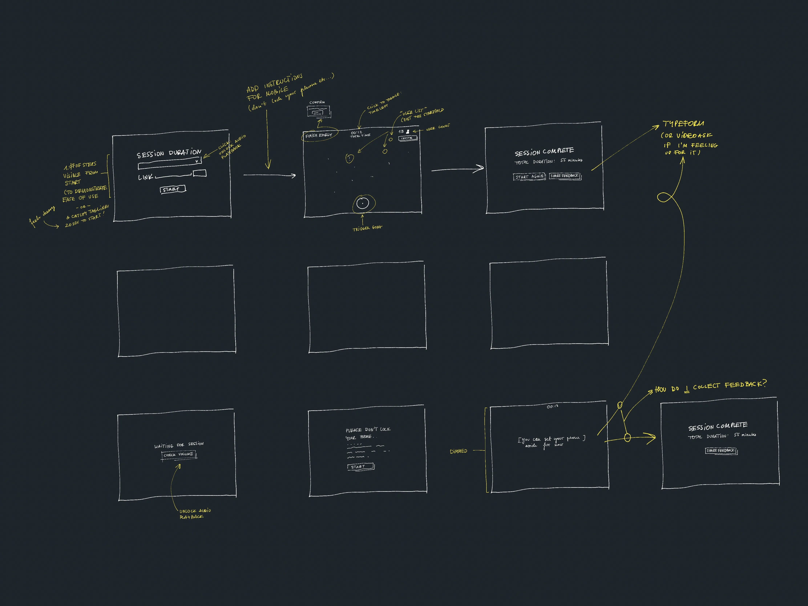

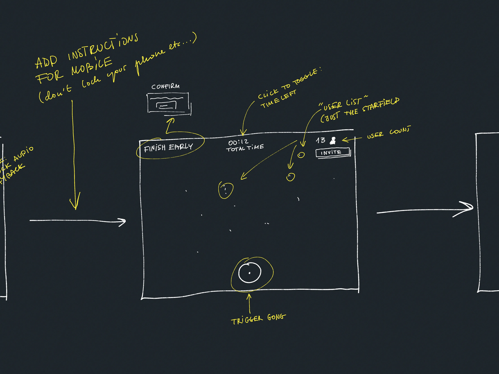
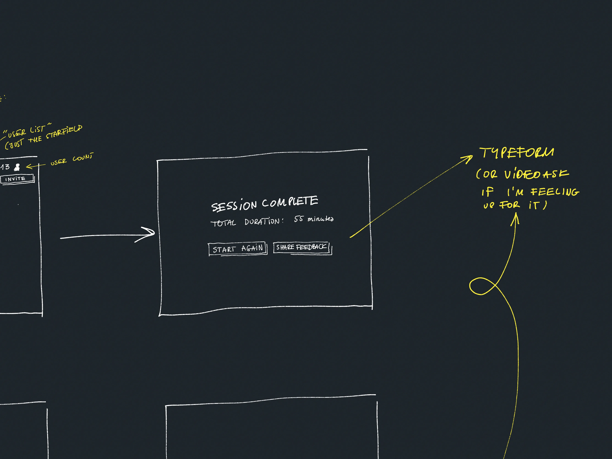
#### What I gained here (examples):

- Likely piece of work: I'll need a few modal screens to confirm actions such as cancelling a session early (`window.confirm` will do for now)
- Likely piece of work: Display active user count on the Facilitator screen
- An experiment to try:
	- On the first screen, can I use the disabled UI state to show how simple the app is or should I use multiple screens and catchy copy?
- Question: how to show connectivity issues?
	- minimalistic: just a dot with a text label
	- bold: a big red toast

## Session state sketch

I also had a chance to play with some ways to represent the session state. I still like the current one with a little Galaxy:

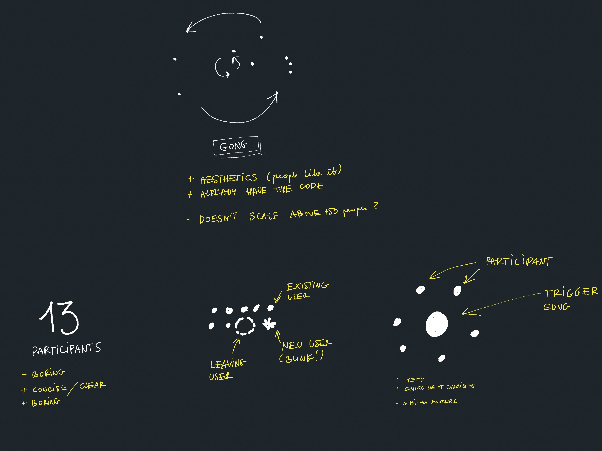

Next steps:

- Answer the questions and try out the experiments mentioned earlier
- Build a simple, ugly PoC I can share with a friend therapist who facilitates meditation sessions
- Come up with a better name for this thing!

That's all for now. I hope you found this quick peek into my brain useful or somewhat entertaining. See you tomorrow!
