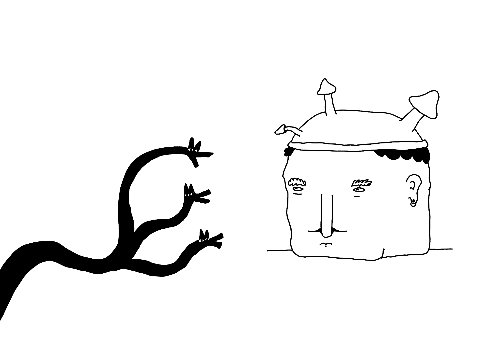
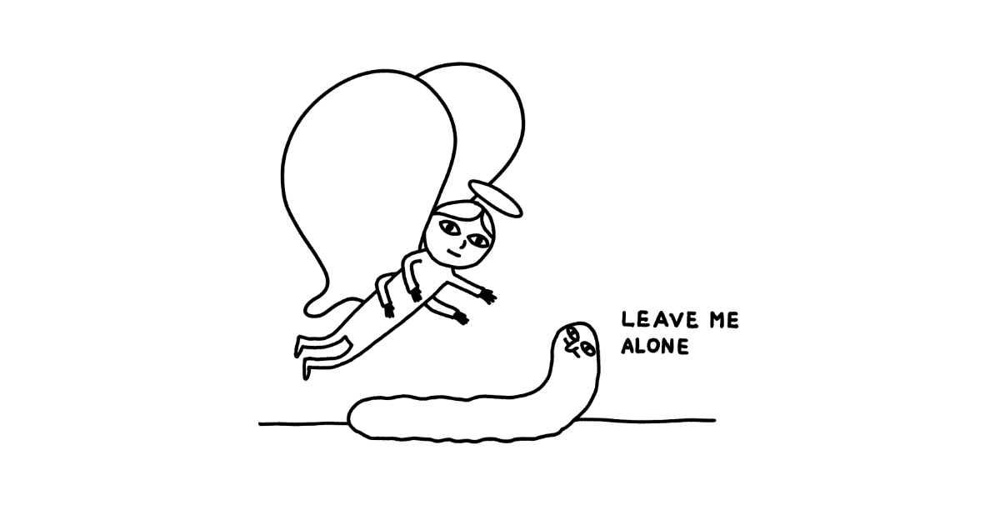
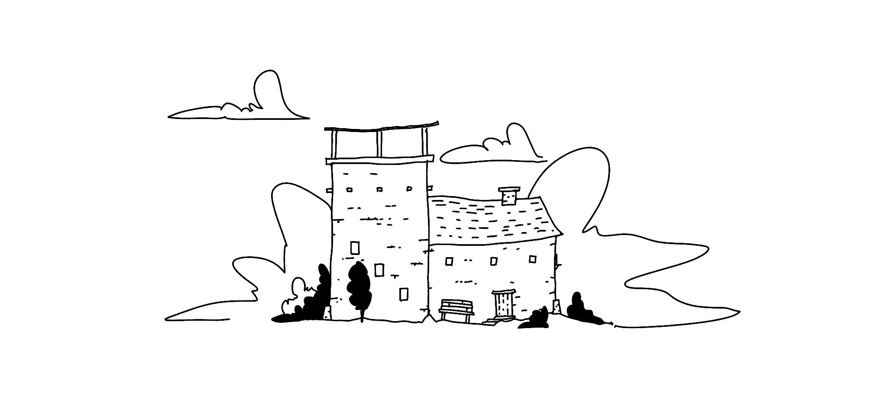

(don't overthink this, [I didn't](<../Share your unfinished, scrappy work>))

I'm playing with a "coffeeshop" mode for [Ensō](https://enso.sonnet.io). It's pretty simple: hit `shift` twice to toggle between visible and masked text:

<video src='https://res.cloudinary.com/dlve3inen/video/upload/v1731587755/enso-coffeeshop-mode_fa3r8u.mp4' autoplay loop muted playsinline controls></video>

## Why am I doing this:

**Immediate reason:** I usually write my [Stream of Consciousness Morning Notes](<../Stream of Consciousness Morning Notes>) at home, but this time I was in a crowded coffeeshop with people breathing down my neck. 

Original title: *My guardian angel putting me to sleep*.

**Less immediate, but more important, reason:** a big chunk of my writing practice is learning how to process and understand my emotions. This means that my notes are deeply personal.

Even when I write at home, and my partner (someone I trust more than anyone else!) is passing by, just *knowing*/*feeling* that someone might see what I'm doing makes me feel anxious. That has to do with a couple of things:

- **vulnerability** — feeling self-conscious as often during writing I touch on things that make me feel vulnerable. I want to be open to that feeling.
- **intimacy** — I need a space that is just mine. Ensō has always been one of those places (related [Expressive Writing](<../Expressive Writing>)).

And yes, I know that we're all just little boats floating in the sky, people are busy and no one is really looking. This is not a rational fear, this is about having a sense of emotional safety. A feral cat lives in my head rent-free and I'm trying to make it easier for her to feel comfortable. I accept it.

## What's next:

This feature is not available in the app yet. I'm working on a bigger update for Ensō (more on that soon). I'll give it a few more weeks before making changes. 

### Questions to answer

- is it useful? (seems so!)
- how to balance: the simplicity of the UI, ensuring its purpose is clear, as well as discoverability of new features. This is tricky when your app aims to be a clean slate of paper with almost no UI ([MISS – Make It Stupid, Simple](<../MISS – Make It Stupid, Simple>)).
## Edit: Emotional Blockers

As I was editing this I realised that this feature relates to todepond's approach to *emotional blockers* in creative work. Read about them [here](https://www.todepond.com/report/arroost/) (OK, I don't 100% agree with their way of categorising these problems, but I think it's a powerful and useful metaphorOK.)

Also, check out [Projects and apps I built for my own well-being](<../Projects and apps I built for my own well-being>) and [Things to support my own well-being – a wishlist](<../Things to support my own well-being – a wishlist>) if you're interested in work similar to this.

Thanks for reading, see you soon!

---

P.S. This note started as a draft of a post on Bluesky. I'm really happy I finished it here. I feel like I have a much clearer picture of how to work on this ([Instead or writing a comment, write a post and link it](<../Instead or writing a comment, write a post and link it>)).