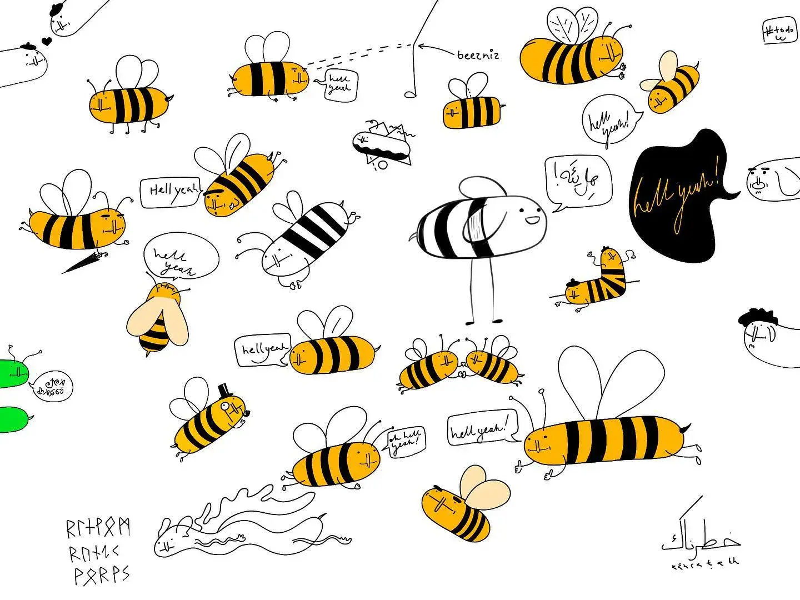

Code spikes are simple throwaway pieces of work. Consider them sketches for the feature you want to implement. I'd call it a dry run, but a good spike is anything but dry: it's wet, it's messy and it has a familiar, enticing, yet disturbing (yet enticing) smell.

I use them both for personal projects and when working with larger teams on complex, well-tested code bases.

It's not rocket science, it's fucking around and finding out science. But don't be deceived, there's a reason why some people are better at spiking than others. Let's take a closer look.

## Here's how you do it:

1. Think briefly of how and what you want to build (duh).
2. Move on straight to prototyping. Don't overthink it. Don't write tests, just doodle, you crazy diamond!
3. Start with the uncertain changes first. This is important. Just like a good sketch is both playful and selective, a spike is about messing around and answering the non-obvious questions quickly (_How do these two modules fit together?_ _Will the user know how to use X?_ or if in React-land: _How do I pass state from X to Y?_).
4. Feeling lost? Throw it out and start again! Get used to the discomfort. Good sketches are fast and cheap. ([Kill your darlings, their bones are the best fertiliser](<../Kill your darlings, their bones are the best fertiliser>))
5. Now, finish as soon as you know **enough**. Enough means that you've answered your key questions (_How many parts of the systems do we need to touch?_ _Does this thing even make sense?_). Don't answer the obvious questions just to practice typing.
6. Know enough and are happy with the results?
   1. If working solo:
      1. Give it a moment to rest. A moment here could mean a single pomodoro, a coffee break or leaving it until the next morning.
   2. If working in a team:
      1. Share them with your team for a quick Story Time/DEMO. The point of which is:
         1. a "sanity check" — does my approach make sense?
         2. avoiding reinventing the wheel, finding shortcuts
         3. finding alignment
7. Look at it again.
8. Throw it out. This important. Don't directly copy the spiked code. If I feel emotionally attached to my code I tell it I need to grab a pack of smokes from the store and will be back in 5 minutes. Then I put it on a separate branch lying to myself that I'll revisit it.
9. Implement things following the appropriate practices, e.g. TDD and pairing for larger projects or a small amount of tests for smaller things.

## Why?

They help me come up with better ideas, allow me to be more concise and communicate my changes better. I also don't get bogged own in details because I let myself play and explore. This is similar to how and why I use [Ensō](https://enso.sonnet.io): to separate writing from editing.

Spikes are fun.

### Other less obvious reasons:

Spikes with Story Time™ can improve alignment, esp. in teams without a strong testing or pair programming culture. You should still consider writing tests and pairing _first_, really ([Pair Programming with Snakes](https://sonnet.io/posts/snakes)).

Spikes help you get better at working iteratively. Being able to switch between these two modes of thinking is an important, transferrable skill. And, as with any skill, it can be improved with some practice. In my experience this has worked well with teams without a strong TDD/testing culture or with unexperienced engineers. Think of code spikes as a workout for that particular muscle.

That's all for today, thanks for reading! Stay spiky!

Related: [An Intro to Spikes – GeePawHill.org](https://www.geepawhill.org/2020/06/02/an-intro-to-spikes/)
