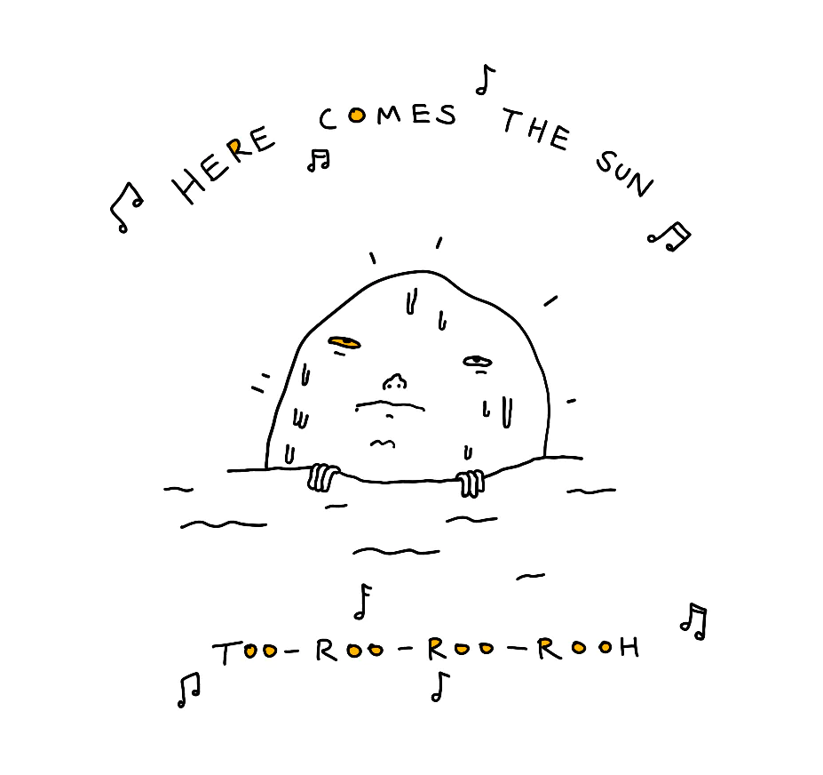
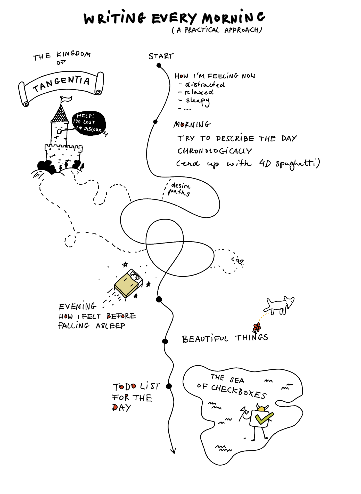

I was going to publish my review of Obsidian Publish today, but I realised it would get too long and messy to be useful. Instead of publishing it as one long blog post, I'll share it as several smaller, connected notes. This way you'll be able to read the review at your own pace and the level of detail you like. It's more fun this way anyway ([Wikipedia rabbit holes and writing evergreen notes](<../Wikipedia rabbit holes and writing evergreen notes>)).

1. **[This is not writing or productivity advice](<../This is not writing or productivity advice>)**.
2. Please don't pay too much attention to the tools I use. Pen and paper is fine. I'm picky and eat my own dogfood ([Projects and apps I built for my own well-being](<../Projects and apps I built for my own well-being>)).

## I journal to:

- be more aware of my emotions and thought patterns, feel more present
- to have a space to think without editing myself (divergent thinking)
- to notice broader patterns in my life, in my behaviour 
- to rant
- to practice taking different perspectives (reframing)
- to build snapshots of my life at a given moment (that realisation/goal came after a few months of writing, it wasn't my plan)

## My Morning Notes: Short Version

1. wake up, ingest caffeine and dihydrogen oxide
2. write for about 20-40 minutes in [Ensō](https://enso.sonnet.io)
3. copy the notes to Obsidian

## Slightly longer version

^6f8ae1

I start my day by writing in [Ensō](https://enso.sonnet.io)  — a "stream of consciousness" app I wrote for myself. Ensō makes it really hard for you to edit text, so you start focusing on *what you want to say* instead of *how you want to say it*. In that sense it's similar to using a typewriter or a piece of paper and a pen. Record the fleeting thoughts, and move on.

My journal didn't have much structure to start with, but with time patterns emerged. That was not the intent from day one. Every day rhymes with the previous one. It just takes time to notice that.

I'm also not a good typist, but I write these notes relatively fast. I don't worry about typos, grammatical errors or sounding "stupid", incoherent, weird. It doesn't matter.

Writing this way is like playing a Choose Your Own Adventure game. You might know roughly where you'll end up but you rarely know how to get there! So, I don't worry about keeping the chronological order of events. If anything comes to my mind, I just write it down and move on. This means that often I go back to a previous event, a semi-random tangent, fast forward. Ensō makes it very easy.

### Here's what I do, step by step:

**1\. Describe how I felt when I woke up.**

- did I dream?
- do I feel stressed, anxious, high-energy, lazy, unfocused, content?

**2\. Describe how my day went, by replaying it in my head, step by step.**

1. Write down my thoughts and feelings *as I think and feel them*.
	1. How I felt *then*?
	2. How do I feel about them *now*?
2. Try to avoid judgement or general statements, just record the thought, event, feeling, observations.
3. Try to separate feelings from the person feeling them. Feelings are real, but not necessarily true
4. Don't worry about chronology, tangents, just fast-forward or rewind.

**3\. Describe how I felt in the evening, before going to bed.**

**4\. List the beautiful or interesting things I noticed.** 

Beautiful or interesting are very subjective categories:

1. Sunset over Douro as seen from Virtudes.
2. A tree growing in an abandoned building.
3. A grave in [Cemitério de Agramonte](https://www.tripadvisor.pt/Attraction_Review-g189180-d6523088-Reviews-Cemiterio_de_Agramonte-Porto_Porto_District_Northern_Portugal.html).
4. Snuggling with Luna and Mango on the couch. Mango releasing a mean fart.

**5\. Write down my todo list for the day:**

I try to plan my week every Monday. The plan includes a bunch of must-haves (e.g. apply to *\<company name>*, chat with people via my [Say Hi](https://sonnet.io/posts/hi) calls) and the routine stuff that's good for me (go climbing, go for a walk with Luna and Mango) but easy to forget when I get busy. I treat the weekly plan as a menu of things to pick from. The daily note as the daily menu based on that.

**6\. Copy the notes to Daily Notes in Obsidian**

**7\. Paste the todo list into my weekly plan**

## What have I learned so far?

Generally, I feel much more present during the day when I write in the morning.

**This is a big one for me:** It's easier to spot red flags (lowered mood, anxiety, lack of focus, avoidance) and work with them. For instance, if I notice that I feel more anxious than usual, I add a TODO with a quick walk, making sure that I don't neglect myself (go bouldering in the evening, don't skip breakfast), spend enough time with Luna, remember to call a friend. This is a part of my personal [Mental Health Toolbox (working title)](<../Mental Health Toolbox (working title)>).

**Writing how I feel allows me to spot certain patterns**. For example, if read HN/Twitter in the morning, even for 5 minutes, I can become less focused and get less stuff done. I don't sleep well, I'm more moody. This perspective allows me to build routines to counteract that: make sure I don't check HN or my mail the next morning before afternoon, take it easy and remind myself that I'm moody because I didn't sleep well, have a nap in the afternoon.

Patterns aside, having done this for a few years, I've accumulated enough snapshots of my life to be able to get back to them, notice how much I've changed, or more often – what hasn't changed, what was noise and what was important.

**Writing in this fashion can _soothe_ or _amplify_ your current mood.** This is a double-edged sword, but you can learn to use that to your advantage. Incidentally, this is similar to how we'd use music during therapy sessions at [wavepaths](https://wavepaths.com): depending on the goal of the therapy session, the therapist could choose to amplify or lower certain core emotional atmospheres (e.g. tension, stillness, vitality).

**Finally, my fluency when it comes to writing has improved drastically.** There's an obvious upside to this, but also it means that when I write *for others*, I really need to keep myself in check and edit things down! In that situation, working with an editor helps. I'm lucky enough to [live with one](https://www.lunifer.net). I highly recommend consulting an editor even once or twice if you want to improve your writing.

Thanks for reading, and see you tomorrow!

References: [Enso](<../Enso>)

