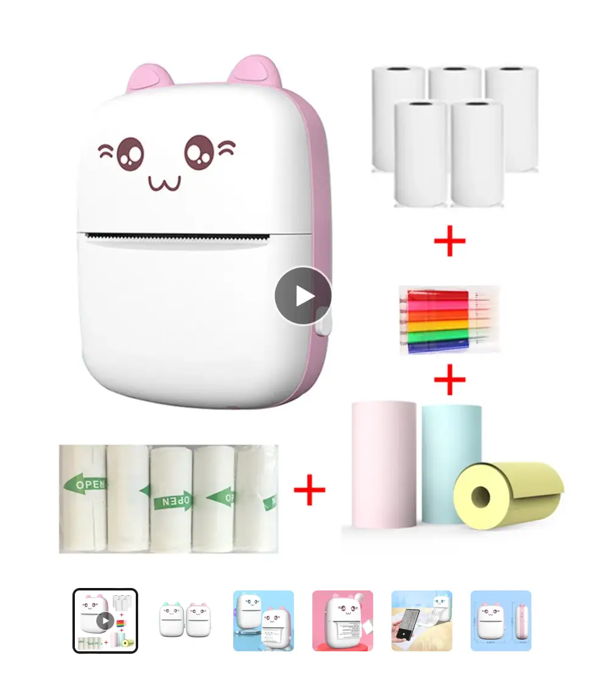

[Skip to the links](<../40>)

## Meta

Let's put on the fish-janitor hat: 

This site is an [iterative experiment](<../../../111>) so let's follow-up on the [retrospective.png](<../../../retrospective.png>) actions. 

Switching from a linear blog to Obsidian works well. Or rather: *using a non-linear publishing tool that reflects the way I think and iterate works **really** well*. There are some parts of Obsidian I don't like, but for now it's *good enough*. 

Mind you, these are not issues with the product itself but my use-case and personal philosophy. I want something less clever, just a hypertext editing tool with pictures and links. When I say hypertext I mean it in its strictest, pre-web sense: a bunch of linked text documents.

I also wish Obsidian Publish offered better customisation, was slightly more performant, and had better custom domain support. There will be a review of both coming soon. ([Obsidian (personal review)](<../../../Obsidian (personal review)>), [Abusing and reviewing Obsidian Publish](<../../../Abusing and reviewing Obsidian Publish>)).

The bottomline is that I can say more, using fewer words, and it's easier for me to manage my time (juggle research, writing, [Say Hi](https://sonnet.io/posts/hi) calls, looking for clients).

Also, I didn't have as much time to read as I would've liked to, but luckily I've had a tonne of Say Hi calls and the people I met gave me some really good brain-food!

## Interesting stuff

bab3f9

**Favourite article:** [Muddle Your Way To Success](https://xeny.net/Muddle%20Your%20Way%20To%20Success)

> *(I bet you like it)*

This is the body of a message sent by a reader of [Dog mode](<../../../Dog mode>). Yes, I did like it. I think you might as well.
 

**Favourite project:** [yay.boo](https://yay.boo)

[Beautifully](<../../../Brutally simple>) simple drag & drop website publishing tool. 

A part of me wishes that's where Zeit, now know as Vercel, had stopped. Give it a go and don't forget to check their [favourite sites](https://yay.boo/favorites) gallery.

**Favourite piece of tech:** [PartyKit](https://www.partykit.io)

Learned about it from [Matt Webb](https://twitter.com/genmon). 
Related: [Exploring AI interaction design and multiplayer with tldraw](https://blog.partykit.io/posts/ai-interactions-with-tldraw) 

This is very timely as I'm working on a little project which could be simplified quite a bit with PartyKit. More on that next week!

### Cat printers

*Cat Printers are tiny BTLE cat-shaped printers.*

For a couple of years now I've been playing with the idea of using a network of tiny, Bluetooth-activated printers to send my friends short, physical, tangible messages. 
Imagine a pretty wooden box sitting on your desk. Once in a while it starts buzzing and  produces a quick note from a friend, or a doodle. When was the last time you received a letter that was not a bill, or an ad? Imagine how that would that make you feel.

I made some progress on the idea a couple of weeks back, inspired by the work of [Good Enough](https://guestbook.goodenough.us) and [Berg](https://nordprojects.co/projects/littleprinters/). There's also an ["*almost*-community"](<../../../Cat Printer – tools and resources>) of people hacking with this stuff (*almost*, as it's not centralised, just smaller branches, groups of people).

I'd like to write about this more in detail, but in short:

- the hardware has become **significantly** cheaper
- it's relatively easy to hack
- you don't need to be a hardware expert to control it the printer programmatically (there are decent high-level python libraries to take care of that)

Having said that, there are still issues with making it a sustainable business. I don't care about scale, but I do care about being able to pay rent. Do you think becoming a *boutique handmade digital printer craftsman* is a valid career path? Let me know.

### Webrings and IndieWeb

I visited a site written in a voice I really enjoyed. I opened their *webring* section and it had only one item there - a link to [sonnet.io](https://sonnet.io). I melted a little bit.

#### Marginalia.nu and Website Explorer
[Marginalia](https://explore.marginalia.nu/view) is a non-commercial search engine maintained by Victor Lofgren.

The site also contains a [StumbleUpon-like random site browser](https://explore.marginalia.nu/view). 
I use it when I feel like reaching for Reddit. Do this. Immerse yourself in its beautiful weirdness, the sheer diversity of voices and styles, the angst, (and the occasional niche programming tips.) 

## Things I've written in the past couple of week that people liked

- [How to draw a Janusz](<../../../How to draw a Janusz>)
- [Projects and apps I built for my own well-being](<../../../Projects and apps I built for my own well-being>)
- [Dog mode](<../../../Dog mode>)
- [Things to support my own well-being – a wishlist](<../../../Things to support my own well-being – a wishlist>)

Thanks for reading this, here's a [poem](<../../../Nothing Twice>) for you.

## Footnotes

[Nothing Twice by Wislawa Szymborska - Poems | Academy of American Poets](https://poets.org/poem/nothing-twice)
[Dither it!: a web application for dithering images](https://ditherit.com) [Wislawa Szymborska](<../../../Wislawa Szymborska>)
[What's the Current Week Number?](https://www.epochconverter.com/weeknumbers)
