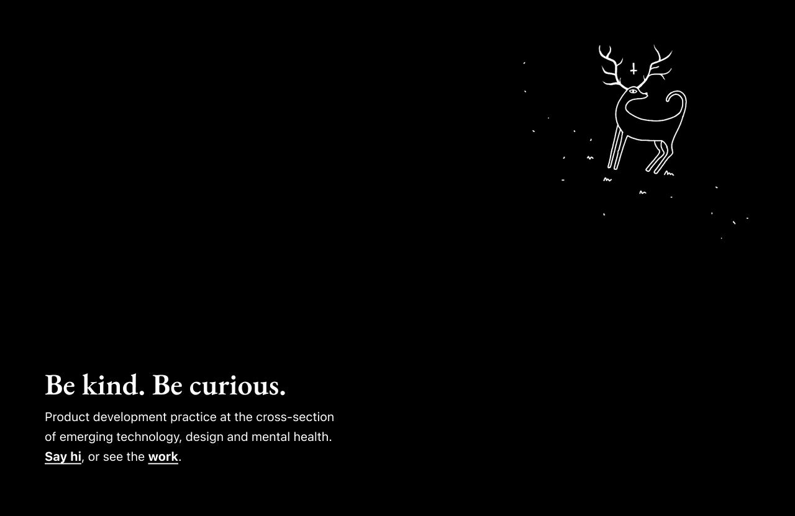
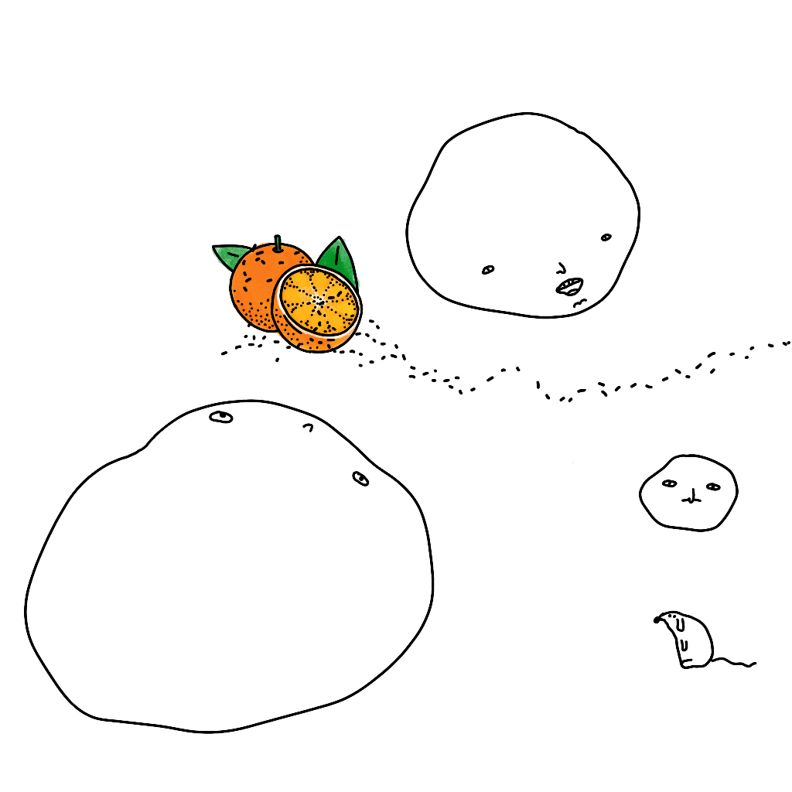

## Meta

This site is an [iterative experiment](<../../../111>), so let's put on the janitor hat:

**Writing here is fun, perhaps too fun as it's still taking much longer than I would like. I need to exercise self-control to stick to the schedule.** [Sit., (together)](<../../../Sit., (together)>), the quickest post to write this week took ca. 2 hours of work, and that's only because I already had a draft connected to a bunch of notes collected over the past few weeks. At the same time, yesterday's [Stream of Consciousness Morning Notes](<../../../Stream of Consciousness Morning Notes>) took most of my Thursday. It was fun! But, I need to make it sustainable if I want continue working this way as well as continue paying the rent.

Obsidian Publish is good enough for the next few weeks (for my use case), but as soon as I have more time, I'll play with something leaner where I have more control over appearance and accessibility.

I'm working on several posts and demos related to this subject.

### Next week:

In order of importance/deliverability:

- I will keep all of the notes under 500 words
- I will publish one follow-up on the existing notes
- **I'd also like to spend more time with [Sit., (together)](<../../../Sit., (together)>) and share a prototype, even if it's just a [toy](<../../../Sit., (together)>).**  
- Learn more about projects focused on improving mental health through nature and tech, like [Gardens of Things](https://gardensofthings.com).
- Make a new home for my mental-health related projects ([Things to support my own well-being – a wishlist](<../../../Things to support my own well-being – a wishlist>)), here's a draft:

## Favourite project

[Fluid Responsive Design | Utopia](https://utopia.fyi) – I'm a bit of a typography nerd, and this thing just saved me from spending 2 hours yak-shaving. In short, fluid responsive design allows you do create visual hierarchies in CSS without having to resort to breakpoints. 

## Favourite site

[GrEg teChnOLOGY](https://greg.technology)- a site made by one of the first people who contacted me via [Say Hi](https://sonnet.io/posts/hi). We bonded over our shared love of Roland Topor, but you should visit his site for [beautifully weird](<../../../beautifully weird>) experiments at the cross-section of product-dev, emerging tech and creative coding. 

Be sure to check out his current work at the [Recurse Center](https://recurse.greg.technology)–a 12-week-long program focused on helping engineers work at the edge of their abilities, through tackling projects that spark joy and curiosity. 

## Favourite piece of tech

[Penpot](https://penpot.app) – a free and open-source alternative to Figma. First, it's not a toy: unless your job requires you to use Figma, I can't think of many reasons not to use this instead. I know successful design-heavy [agencies](https://manufacturaindependente.org/about/) using it for all of their work.

I ditched Adobe software after almost 20 years of use and never looked back. I did this *only partially* because of their predatory and illegal pricing practices and [vendor lock-in](https://blog.jim-nielsen.com/2023/precarious-modern-computing/#:~:text=Tools%20Like%20Figma%20Not%20Only%20Own%20Your%20Data%2C%20They%20Own%20Your%20Skillset). The main reason is that the alternatives are just so much better ([Alternatives to Adobe](<../../../Alternatives to Adobe>)). 

One interesting feature of Penpot is that it uses open web standards under the hood (e.g. SVG, CSS), which means that things like autolayout or CSS units just work™, where Figma has to play catch-up and reinvent the wheel.

## Interesting articles

[How to see beauty](https://ralphammer.com/how-to-see-beauty/) – Few people can communicate ideas as concisely, precisely and poetically as Ralph Ammer. You'll see more of him in my updates in my future updates.

[Notes from “Weathering Software Winter” by Devine Lu Linvega - Jim Nielsen’s Blog](https://blog.jim-nielsen.com/2023/precarious-modern-computing)
– why "Tools Like Figma Not Only Own Your Data, They Own Your Skillset"

[Getting Started with Large Language Models: Key Things to Know](https://flyte.org/blog/getting-started-with-large-language-models-key-things-to-know#what-are-llms) – contains a decent overview of **Chain of thought (CoT) prompting** and **In-context learning (ICL)** and **Retrieval Augmented Generation (RAG)**. (You might want to skip the first part of the article.)

Context length was a big limitation in my previous LLM-based projects and this article provides some strategies I can apply without getting a Data Science PhD.

[The Baked Data architectural pattern](https://simonwillison.net/2021/Jul/28/baked-data/)–get the best of two worlds when it comes to statically generated sites and databases, by bundling the copy of your DB alongside the code of your application. 

I tried this approach (and failed miserably) when working on [Lemonade](https://lemonade.sonnet.io): I wanted to have a read-only searchable database of Lemmy instances, without having to deal with setting up databases an infra.

Honestly, [Simon Willison](https://simonwillison.net) seems to be a one-man-StackOverflow for me at this stage. Check out his [TILs](https://til.simonwillison.net) and this [twitter thread](https://twitter.com/simonw/status/1711714615338627187) for more context.

## Things I wrote last week that people liked

- [Medieval Content Farm and Procedural Cheese ](https://untested.sonnet.io/Medieval+Content+Farm+and+Procedural+Cheese)–on embracing cheese in procedural art, taxidermy, and NSFW medieval poetry
- [Sit., (together)](https://untested.sonnet.io/Sit.%2C+(together))–new project: a group ~~meditation~~ *doing nothing* app, plus some multiplayer demos exploring non-verbal communication through presence.

## News

**Starting this November, I'm available for consulting work! Got an idea worth building? [Give me a shout!](mailto:hello@sonnet.io)** 

You can find the list of services I offer on my new and shiny **[Consulting Page](https://consulting.sonnet.io)**

P.S. I offer (very generous) discounts for businesses focused on social good.

Thanks for reading! See you on Monday!

