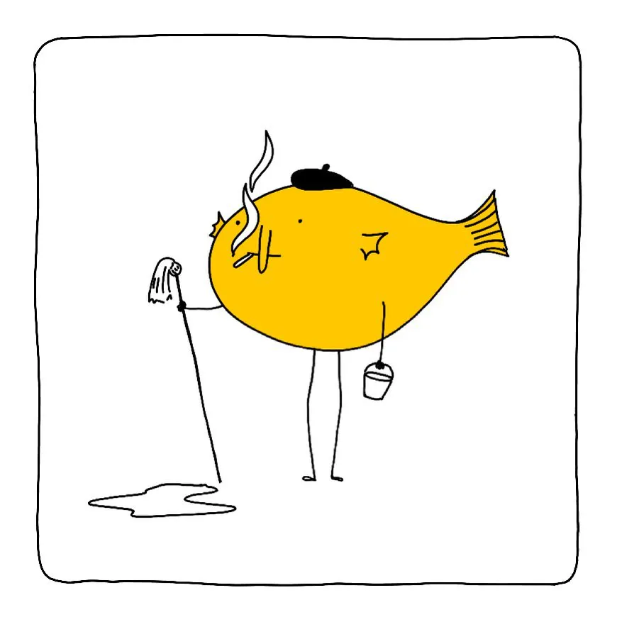
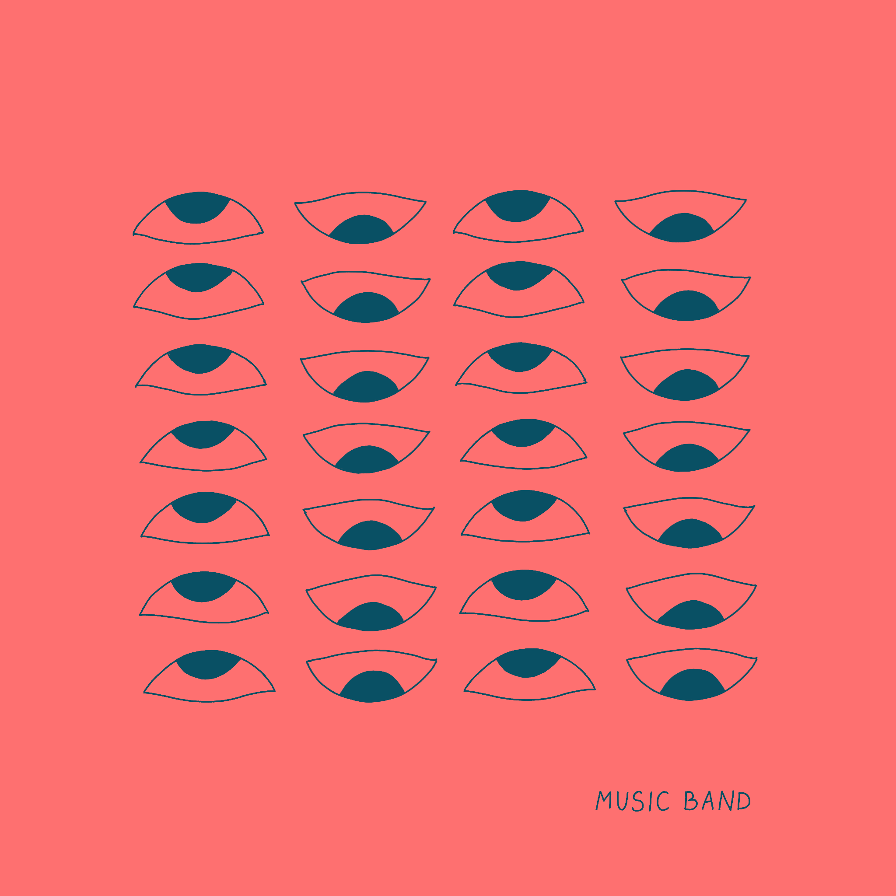
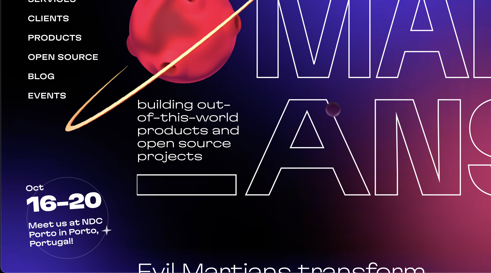
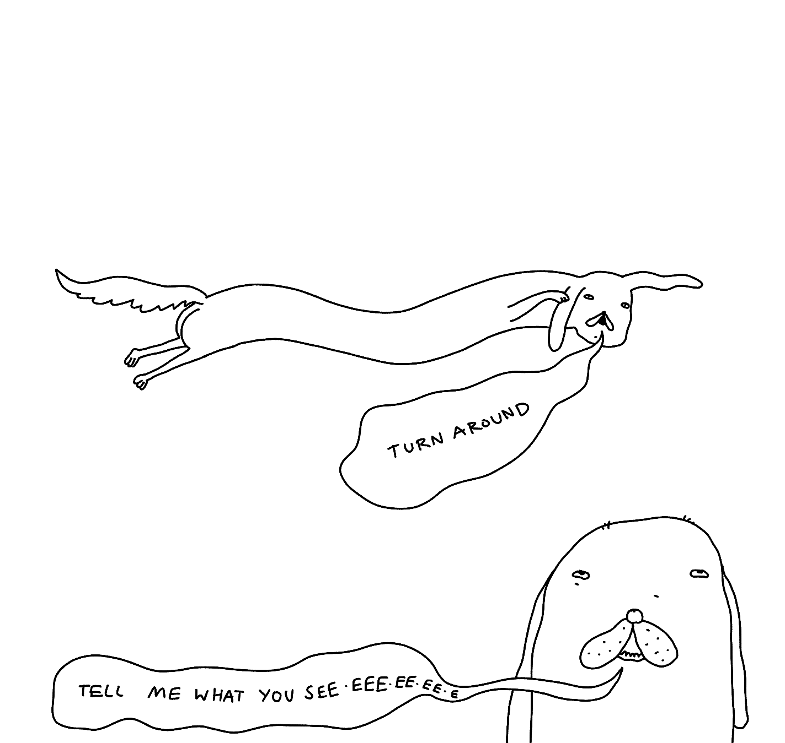
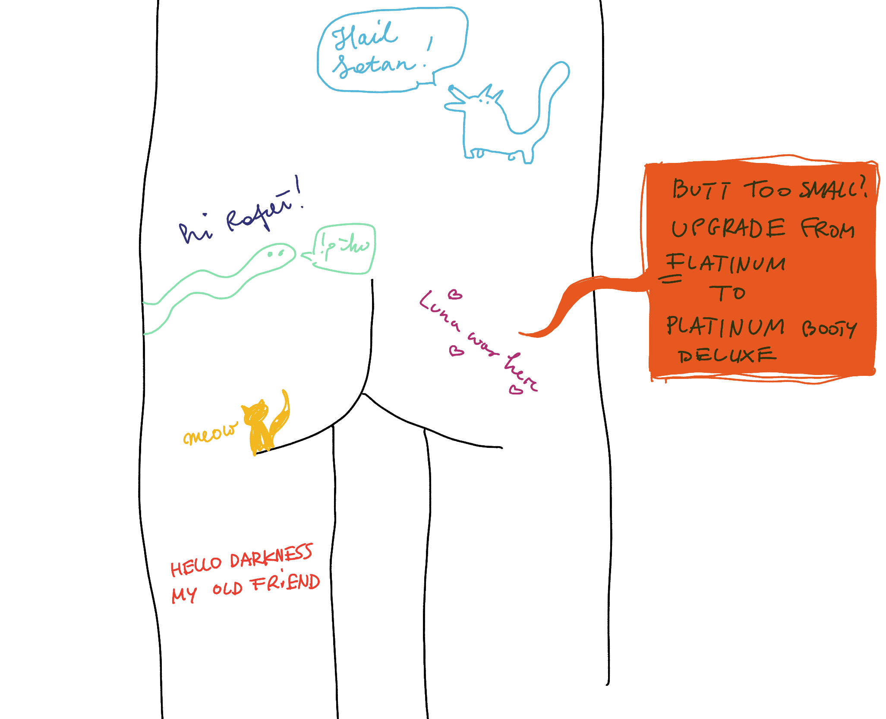

## Meta

This site is an [iterative experiment](<../../../111>), so let's put on the janitor hat:

*My mind is a school of fish, therefore the school of fish janitor seems appropriate*

### Brevity 

The theme of this week was brevity, i.e. keeping the notes under 500 words. 

Rationale: if I want to make this sustainable and give you something useful, I'll need to publish in smaller chunks.

Result: keeping the content shorter helped! I did have more time for other pursuits and people seemed to like the shorter content as well.

An interesting pattern emerged:

1. I'd draft a longer (>1000 words) note, then:
2. struggle to find a way of narrowing it down, then:
3. end up picking a different subject instead, finally:
4. share that article after 1.5-2h.

Lesson learned: brevity is not just about finding ways to compress meanings elegantly into small packages. It can help with concision but doesn't guarantee it. However, culling and being more pragmatic about the subject matter can save you a lot of work.

(I enjoy poetry, so I tend to focus on the former more than the latter.)

I will continue publishing in this format. My expectation is that I'll start writing in a sliding-window manner: work on multiple articles over the course of a few days, but occasionally throw in an ad-hoc post.

### Sit.

I made some progress on [Sit., the Toy](<../../../Sit., (together)>), but it's more of a tech demo rather than a useful MVP. Stay tuned!

### Next week

- **Share a usable demo of [Sit., the Toy](<../../../Sit., (together)>) (usable ≠ stable, but the UX should be coherent, now it's just a pile of buttons)**
- Publish a follow up to [Here's a List of Toys](<../../../Here's a List of Toys>) (either [Why make toys, why play?](<../../../Why make toys, why play?>) or [My Bootleg T-shirts](<../../../My Bootleg T-shirts>))

*Psst. I'm working on music album art (not this one, but it's coming out in November.)*

## Favourite project

**[howler.js](https://howlerjs.com)** – the gold standard when it comes to audio on the web. I've been using it with Sit., Mrr, and a bunch of other projects over the years.

## Favourite site(s)

**[scrollcat](https://sc.rollc.at/)** – I'm quitting smoking, again (yes, in 2023). Once I drafted a similar toy with a never-ending cigarette, but this is perfect. Incomplete, never-ending, yet complete.
**[Recursive Recipes](https://recursiverecipes.schollz.com)**– How to bake an apple pie, when the only thing you have are apple seeds?

## Favourite piece of tech

[TinyBase](https://tinybase.org) – I'm a huge fan of [PouchDB](https://pouchdb.com), and any offline-first databases making it easy to write reactive code. The main difference here is that TinyBase supports both relational and non-relational ways of structuring your data and is not tied to CouchDB. [Sit., (together)](<../../../Sit., (together)>) looks like a perfect excuse to try it out!

[ffmpeg-online.vercel.app](https://ffmpeg-online.vercel.app/?inputOptions=-i&output=output.mp4&outputOptions=)– a browser-based build of ffmpeg.

## Interesting articles

[A High-Level Overview Of Large Language Model Concepts, Use Cases, And Tools — Smashing Magazine](https://www.smashingmagazine.com/2023/10/overview-large-language-model-concepts-use-cases-tools/) – a more practical follow-up to the previous ML-related article I shared last week.

I liked [this Evil Martians article about CSS colour spaces](https://evilmartians.com/chronicles/oklch-in-css-why-quit-rgb-hsl), mainly because of how concise it is, but also because the website feels like an alternative reality where Smashing Magazine came out in 2022 and was run by an omnipotent AI built in the image of [Josh W Comeau](https://www.joshwcomeau.com).

As I was writing this note, I learned that people behind Evil Martians will be speaking in Porto, today!

### Reading list 

[Ready Player Two – Bringing Game-Style State Synchronization to the Web](https://rocicorp.dev/blog/ready-player-two)
[The Web Is For User Agency](https://berjon.com/user-agency/)
[The History of Wordstar - by Bradford Morgan White](https://www.abortretry.fail/p/arrogant-difficult-powerful)

## Things I wrote last week that people liked

- [Alternatives to Adobe](<../../../Alternatives to Adobe>)
- [Here's a List of Toys](<../../../Here's a List of Toys>)

Thanks for reading! See you on Monday!
   

---

      
  still here?  
    
  

P.S. I dug out this wireframe/sketch of an [uncolouring book](https://lines.potato.horse)-inspired guestbook website widget, where users could leave notes on a virtual butt. If you're a VC, we should talk.

