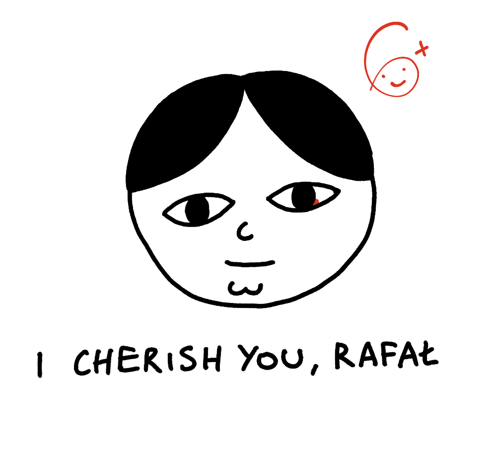

## Meta

Reminder: this site is an [iterative experiment](<../../../111>), so let's put on the janitor hat:

*Apologies, the fish school janitor was attacked by a Dangerous Carpathian Bumblesnake and ran away. The only way to scare the snake is to correctly pronounce the word "snake" in Polish.*

## This week's summary

Honestly, this has been a pretty challenging week. I've picked up too many tasks, ended up rushing and running around like a headless chicken. But we still got the main stuff done!

Goals from the previous "retro":

> - **Share a usable demo of [Sit., the Toy](<../../../Sit., (together)>) (usable ≠ stable, but the UX should be coherent, now it's just a pile of buttons)**
> - Publish a follow up to [Here's a List of Toys](<../../../Here's a List of Toys>) (either [Why make toys, why play?](<../../../Why make toys, why play?>) or [My Bootleg T-shirts](<../../../My Bootleg T-shirts>))

<sonnet-embed >../../chirps.mp4</sonnet-embed>
OK, we have a *usable* demo of [Sit., the Toy](<../../../Sit., (together)>) (codename: Space Kalimba!). You can find the app here: **[Sit (together)](https://nothing-together.sonnet.io)**

Check it out and let me what you think!

### Brevity

- Most of the stuff I've written this week is longer than 500 words. 
- One of the things that people liked enough to message me about it was a single quote with a one-liner introduction: [Proteus - Uncertainty is the only Certainty](<../../../Proteus - Uncertainty is the only Certainty>). 

### Dev logs

I'll try to establish a better format for them: focused on 1, 2 smaller interesting facts and not going too much into detail. I really like [Simon Willison's approach](https://til.simonwillison.net/cloudflare/robots-txt-cloudflare-workers) and the tiny [sketches](https://twitter.com/steveruizok/status/1708207350232817694) posted by people like Steve Ruiz. [Let me know](mailto:hello@sonnet.io) what you'd like to see here.
### Next week

- Focus (again) on brevity and stop being afraid to post shorter, messier, meatier notes.
- (carried over) Publish a follow up to [Here's a List of Toys](<../../../Here's a List of Toys>) (either [Why make toys, why play?](<../../../Why make toys, why play?>) or [My Bootleg T-shirts](<../../../My Bootleg T-shirts>))
- (nice to have) another small experiment or toy

## Favourite project

[NaNoWriMo](https://nanowrimo.org)–National Novel Writing Month (NaNoWriMo) is starting next week. I noticed some traffic from a forum thread talking about ADHD-friendly writing tools where someone mentioned Ensō.

[Frank Sidebottom Head Tutorial](https://www.youtube.com/watch?v=UphC6JAqd5E&pp=ygUUZHlpIGZyYW5rIHNpZGVib3R0b20%3D) – I was going to make a wearable papier-mâché Janusz mask for Halloween. I've seen a tonne of tutorials and this one's far from the best, but it's a good intro.

## Favourite site(s)

[Tero Parviainen](https://teropa.info)–Tero's a developer and generative artist with some impressive work at the intersection of emerging tech, music and visual arts. I've learned a tonne this week just playing with his demos on CodePen.

[Naive Weekly](https://www.naiveweekly.com)–The Quiet Old and Poetic Web newsletter.

[webcurios](https://webcurios.co.uk)–If popbitch, Naive Weekly, mmm.page and [mrr](https://mrr.sonnet.io) had a baby, and that baby was a semi-regular newsletter, you'd get web curios. 

## Favourite piece of tech

[Ruffle](https://ruffle.rs/)–a Flash player emulator written in Rust used by Internet Archive. I found it when I tried to recover some of my old Flash-based sites. Unfortunately, my SWFs are gone from the web, so I'll need to travel into a deep dark Carpathian forest to dig them out (that's where my old PC rests in state of torpor, like an antediluvian vampire).

## Interesting articles

[Don’t Worry, These Gangly-armed Cartoons Are Here to Protect You From Big Tech – Eye on Design](https://eyeondesign.aiga.org/dont-worry-these-gangley-armed-cartoons-are-here-to-protect-you-from-big-tech/) – notes on Alegria, a.k.a. Corporate Memphis aesthetic, using visual language to paint big tech as harmless, cute and friendly. 

[A Journey Into Shaders](https://www.mayerowitz.io/blog/a-journey-into-shaders) – concise to the point where they explain the main differences between GPUs and CPUs in two GIFs.

[Unlocking reactivity with Svelte and RxJS](https://timdeschryver.dev/blog/unlocking-reactivity-with-svelte-and-rxjs#refactored-typeahead) – using Rx.js in Svelte might sound like overkill, but it seems that Observables can be used almost as a drop-in replacement for stores. I will use a similar (albeit slightly simplified) approach in the upcoming group meditation/doing nothing app I'm building at the moment.

[Atomic Design | Brad Frost](https://bradfrost.com/blog/post/atomic-web-design/) – I had a free morning to re-read some old CSS/design system related articles and particularly enjoyed this one.

[Nakatomi Space](https://www.bldgblog.com/2010/01/nakatomi-space/) – on being a worm inside a big apple.

## Things I wrote last week that people liked

- [Proteus - Uncertainty is the only Certainty](<../../../Proteus - Uncertainty is the only Certainty>)
- [Obsidian for Vampires](<../../../Obsidian for Vampires>)

Thanks for reading! See you on Monday!

P.S. 

I learned that [finger piano](https://en.wikipedia.org/wiki/Mbira) (kalimba) is a traditional Zimbabwean instrument (called *mbira*)!

See you next week!
