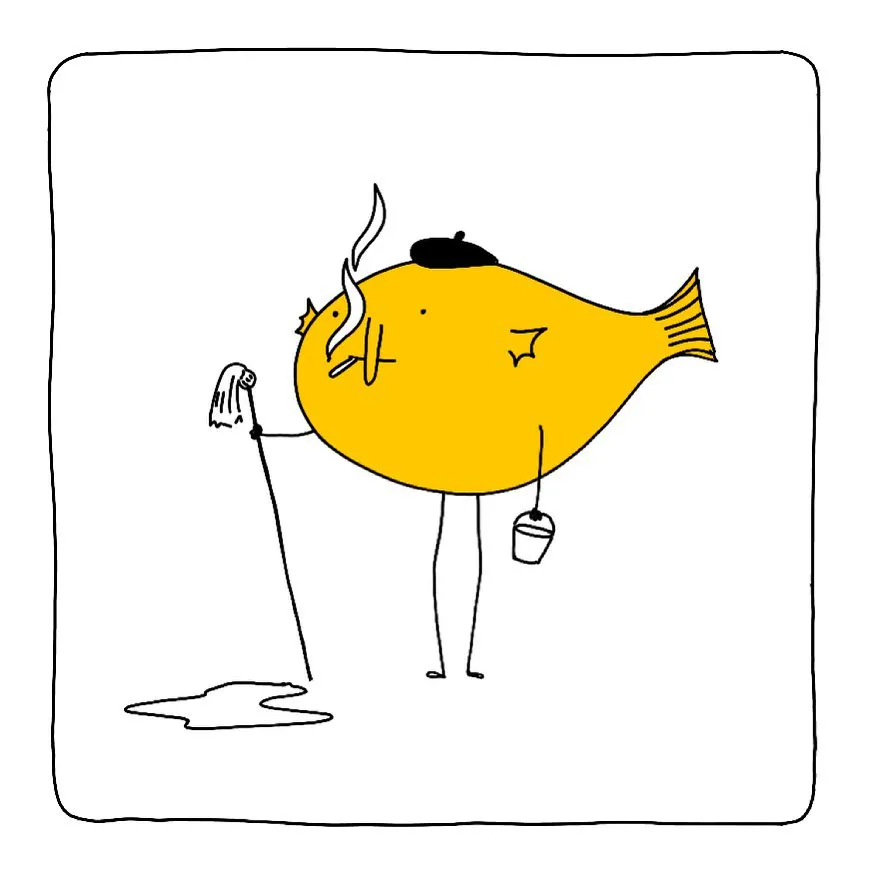

## Meta

**Click [here](<#Favourite project>) to skip the Meta section.**

Reminder: this site is an [iterative experiment](<../../../111>), so let's put on the janitor hat:

## This week's summary

My projects landed on the top of Hackernews, twice in 3 days! This generated a tonne of traffic and some great feedback from my users. 

Some context why I care about this more than I normally would: a bit more than a year ago I decided to take a break from traditional employment. I wanted to focus on my mental health, studying, experimentation, and finally – figuring out if I can find a way to be useful to others while working on the things I love doing ([Be kind, be curious](<../../../Be kind, be curious>)). 

This isn't the first signal that I can make this work, but it's the first time when my work generated enough revenue to *aaaalmost* pay rent. I know this is just a temporary (and hardly the first) spike in traffic, but to be perfectly honest, I've been feeling quite rough and just needed some encouragement. The idea of being able to support myself felt real. I was able to visualise getting paid directly for my work. There's some irony here, as I'm much better at advising businesses or founders than tending to my little garden here. 

However, it was really hard to juggle the amount of booked Say Hi calls, job search, some personal (family) matters, then writing and research, plus coding on top of all of that. I'm happy that I kept going and I feel like every post here was useful (or at least mildly entertaining).

At the same time I had almost no time to read, and any creative work felt like a chore. I hope it didn't become too apparent.

### Next week

^7e52c8

- publish [Abusing and reviewing Obsidian Publish](<../../../Abusing and reviewing Obsidian Publish>) – some quick notes on how I'm using (or abusing) Obsidian publish and how I'd like to make it better for my own purposes.
- focus on shorter notes (< 500 words)

## Favourite project

[Is It Toxic To?](https://iitt.chester.how) – a quick way of checking if a plant is toxic to your pets. I love how snappy and intuitive it feels. The site errs on the side of caution: many plants marked as toxic are only such in large quantities. Don't panic if your dog just munched on a cherry tomato, just click on the attached article and read more, make salsa.

## Favourite site

[Chester's Garden](https://chester.how) – Chester is the author of the above mentioned [Is It Toxic To?](https://iitt.chester.how) as well as a bunch of smaller projects like this series of mini hackathons small enough to fit around a [Foldaway](https://foldaway.space) table.

[Buddhism for Vampires](https://buddhism-for-vampires.com) – sharing partially due to my personal biases. Thanks to this website I came across [shi-ne meditation](https://vajrayananow.com/shi-ne-meditation) which inspired me to build [Sit.](https://sit.sonnet.io). Also, in a different life, I ran a coterie of Vampires roaming the dungeons of Kraków.

## Favourite piece of ~~tech~~ toy

[Short Trip - Alexander Perrin](https://alexanderperrin.com.au/paper/shorttrip/) – a 5-minute game/toy where you control a little funicular train passing through a series of tiny villages. 

[Matt Webb adding semantic search to Braggoscope](https://twitter.com/genmon/status/1720405077540651243) – Braggoscope is a directory containing all episodes of *In Our Time*, one of the best radio shows/science podcasts I've had a chance to find.  ^252d17

The embeddings-powered semantic search works really well there! For instance, typing *last pagans in Europe* will point you to the [Baltic Crusades](https://www.braggoscope.com/2016/11/24/baltic-crusades.html) episode (one of my favourites). Give it a go!

Demo here: [Braggoscope search](https://braggoscope-search.genmon.partykit.dev) ^00baf5

## Interesting articles

[Loyal workers are selectively and ironically targeted for exploitation - ScienceDirect](https://www.sciencedirect.com/science/article/abs/pii/S0022103122001615)

[Bark Mitzvah - Wikipedia](https://en.wikipedia.org/wiki/Bark_Mitzvah) – It's been exactly one year since we adopted Mango, and we used to call his birthday a dog-mitzvah. Seems like we weren't the first ones to come up with this idea.
## Things I wrote last week that people liked

- [The Janusz I Live In](<../../../The Janusz I Live In>)
- [Dogs and Palimpsests](<../../../Dogs and Palimpsests>)

Thanks for reading! See you on Monday!

---

PS. The halloween version of Janusz turned out [way less Madonna](<../janusz catwalk.mp4>) and more [Berghain](https://www.architecturaldigest.in/content/berlin-guarantee-now-wont-turned-away-entrance-berghain/) than expected:

