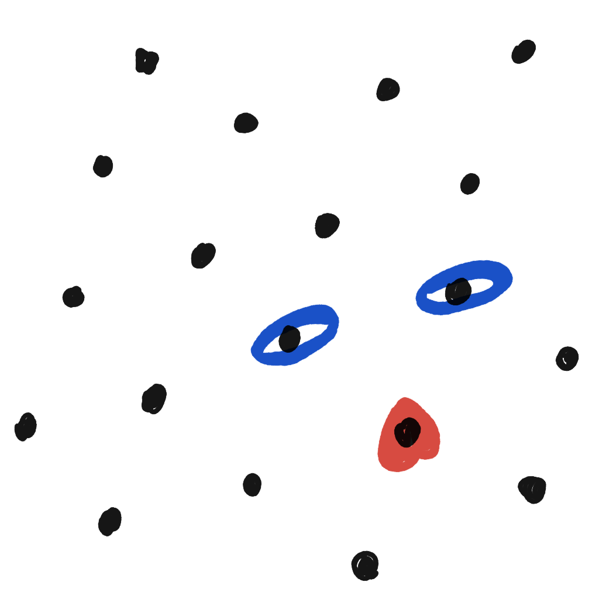
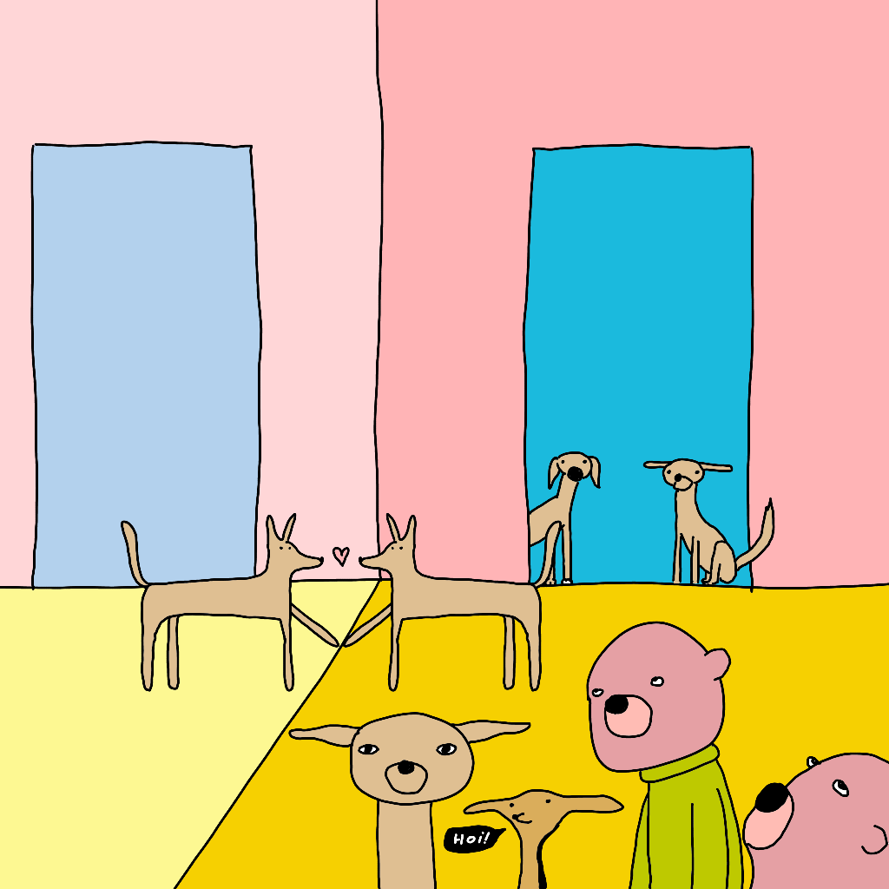
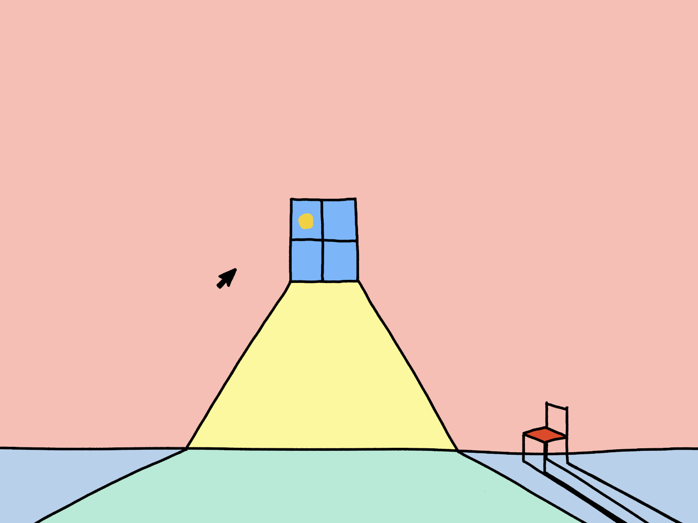

This is the first Weekly TIL also shared via my newsletter! The newsletter contains: 

- Untested Weekly TIL – shared *every Friday*
- Any other work (essays, apps, experiments) – shared *as often as I publish it*

<a class='subscribe-cta subscribe-cta--inline' href='https://letters.sonnet.io'>Subscribe here</a>

## Meta

Reminder: this site is an [iterative experiment](<../../../111>), so let's put on the janitor hat:

## This week's summary

I tried publishing more short-form notes and it seems to have worked out pretty well! I partially attribute this to accidentally discovering a pile of [older projects](<../../../Spiritual Volleyball>) I completely forgot about. We also had a chance to experiment and play with UX and design a little bit. Visit [this note](<../../../Sit., part 2 – devlog 001>) to find the first steps of my work on [Sit., (group meditation tool)](<../../../Sit., (together)>).

I'm also working on another, smaller project: a [simple](<../../../Brutally simple>), private night reading app (more on that [here](<../../../Night Rider>) and [here](<../../../Obsidian for Vampires>)). I might share it before the new Sit., so stay tuned!

Important lesson learned: if you find it hard to write, give yourself some time to read, explore. To quote the zen master [土豆沙拉](https://duckduckgo.com/?q=土豆沙拉&ia=images&iax=images): *One must fuck around and find out, [Muddle Their Way To Success](<../../../Muddle Your Way To Success>)*. Some people liked my older articles on the subject, so feel free to check them out:

- [Hummingbirds are Evil! Procrastination, Laziness and Play](https://sonnet.io/posts/hummingbirds)
- [Sit.](https://sonnet.io/posts/sit).

I've also received a tonne of Say Hi calls this week. I've learned so much from the beautifully weird people I met this way, and wish to share more here.

### Next week

- Release Night Rider to test (and come up with name)
- Writing prompt: Say More about [Say Hi](https://sonnet.io/posts/hi)

There's a chance I'll take a break from more elaborate notes, due to personal reasons (PS. I'm fine).

*You might've heard about the French exit, but did you know about the Dalmatian interlude?*

## Favourite project(s)

[Seeking Pen Pals | Kev Quirk](https://kevquirk.com/seeking-pen-pals) – Kev Quirk started a little project where he becomes pen pals with his readers for a month. I have some accidental pen pals I've found through Say Hi and I love this idea! I'll be speaking with Kevin in February... 2025. Can't wait!

[Conversational 404s](https://www.producthunt.com/posts/conversational-404s-formless-typeform?ref=ph_extension) – Normally try to keep this place full of indie content and I have mixed feelings about ProductHunt. But, I like that this heads-on tackles the issue of people looking for information and getting lost. 

I wonder if a similar, albeit a bit limited, system could de implemented using embeddings, without 3rd-party services. Let me know if you'd like me to write about this. I'm looking for excuses to procrastinate my [job search](https://consulting.sonnet.io).

[Braggoscope source code](https://twitter.com/genmon/status/1721602573512085680) – This is a follow-up to our [last week TIL](<../44>). I feel tempted to write about this project in detail because of the tech stack selected by Matt is so much different from what I'm used to.

Also, bloody hell, there are so many insanely productive people in this newsletter! 

[Remotion](https://www.remotion.dev) — Remotion allows you to programmatically create videos. I wonder if one could connect it with [tldraw](https://tldraw.dev) to make videos with realtime doodles, animated like [the uncolouring book](https://lines.potato.horse)?

[Tutanota is now Tuta.](https://tuta.com/blog/tutanota-is-now-tuta) – I'm using this branding change as a reminder that when it comes to privacy-friendly email, there are more options than Proton.

## Favourite site

[Alexander Obenauer](https://alexanderobenauer.com) – If untested was a more serious project, I'd like to make it more similar to Alexander's Lab Notes. I also stole the shade of yellow used on his site and poured it allover my sweet ***Subscribe*** button.

## Favourite piece of tech

[Balsamiq](https://balsamiq.com/) – What a blast from the past! Balsamiq is the OG wire-framing tool, known for its simplicity of use, solving one problem, but solving it really, really well. Also, I admire Peldi Guilizzoni's (Balsamiq's founder) approach to building sustainable, healthy, and ethical businesses. You can find out more in this [‎episode](https://podcasts.apple.com/gb/podcast/throwback-building-a-business-meant-to-last-with/id1206165808?i=1000555716446) of the Indie Hackers podcast.

[Concepts](https://concepts.app/en/) – Concepts is a highly customisable and stylus-friendly infinite canvas. I use it for most of my technical drawings, from architecture diagrams, project wireframes to lecture notes and doodles of a prototype dog toy I might build one day (spoiler: it'll probably lose to an empty kitchen roll filled with snacks).

[RxJS](https://rxjs.dev) – Another blast from the past, prompted by the rising popularity of signals as a paradigm in FE dev and [this toot](https://mas.to/@TodePond/111374640204129587). The RxJS way of handling events, state, and data flow fits so neatly with how my brain works. This is transferrable knowledge: I'm using RxJS or similar FRP libraries when working in other technologies (Unity, Java, Swift UI w. Compose). Most React state libs age like milk, but this aged like a delicious bottle of wine, let's call it *l'Observable*.

The second reason I'm adding it here is that I'll use it again in the next version of [Sit., (together)](<../../../Sit., (together)>).

[NewPipe](https://newpipe.net) – Alternative Youtube client for Android. Youtube started making the experience of using their service even more terrible for adblock users. If you're not on YT Red, and have an Android phone, give it a go (and use Firefox with µblock origin on desktop).
## Interesting articles

[Quality software deserves your hard‑earned cash — Steph Ango](https://stephango.com/quality-software) – Explains why I'm charging people for what's [essentially](<../../../Essentially>) a less capable text field.

[summary.md](https://gist.github.com/simonw/d50c8634320d339bd88f0ef17dea0a03) – Simon Willison's notes on the recent Open AI feature announcement. It's opinionated and concise.

[Own Your Web](https://matthiasott.com/newsletter) – "a newsletter by [Matthias Ott](https://matthiasott.com/?utm_source=ownyourweb&utm_medium=email) about designing, building, creating, and publishing for and on the Web."

[I try to code a PS1 game. - YouTube](https://www.youtube.com/watch?v=QYVGczdflyY) – developing games for old systems is insanely difficult. This is an efficient way of both: 1) learning and 2) experiencing Schadenfreude.

## Things I wrote last week that people liked

- [Spiritual Volleyball](<../../../Spiritual Volleyball>)
- [Leading or Line Height - a Measured Response](<../../../Leading or Line Height - a Measured Response>)

Thanks for reading! See you on Monday!

P.S. If you enjoyed reading this post, consider donating [here](https://rafal.ck.page/products/tip).

