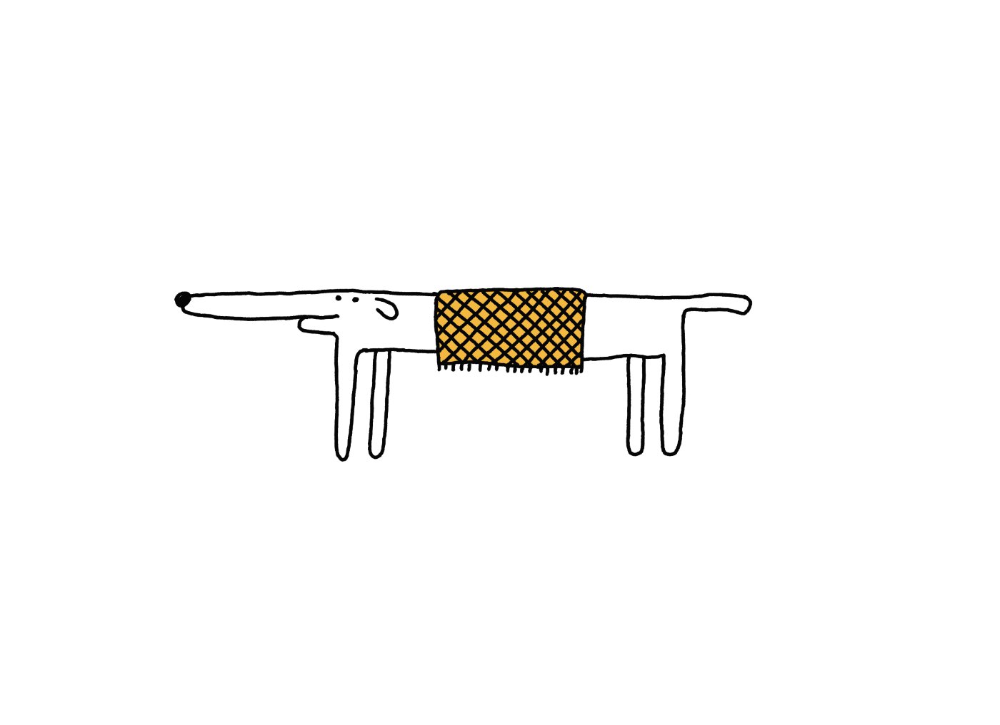
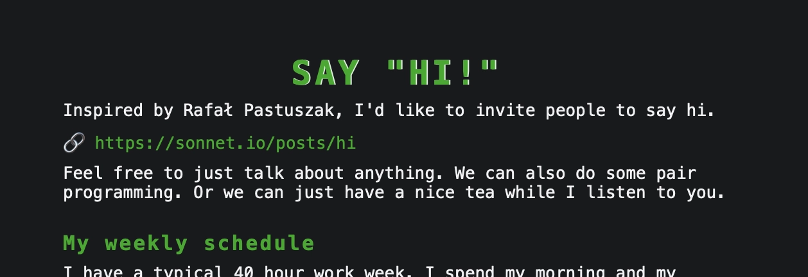
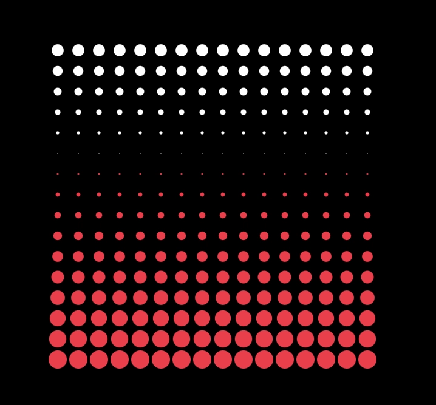
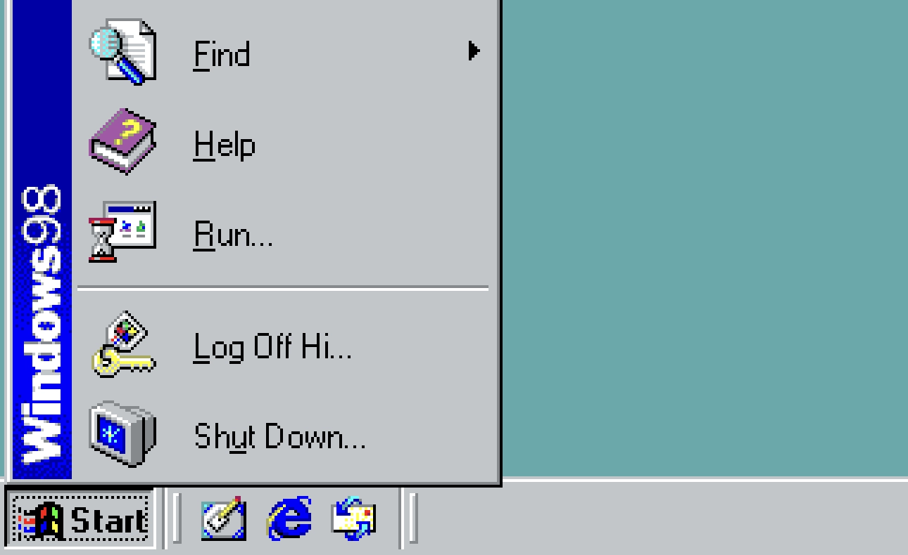
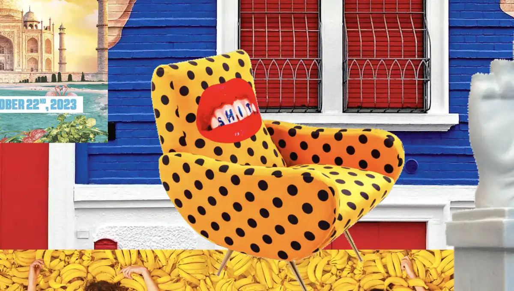
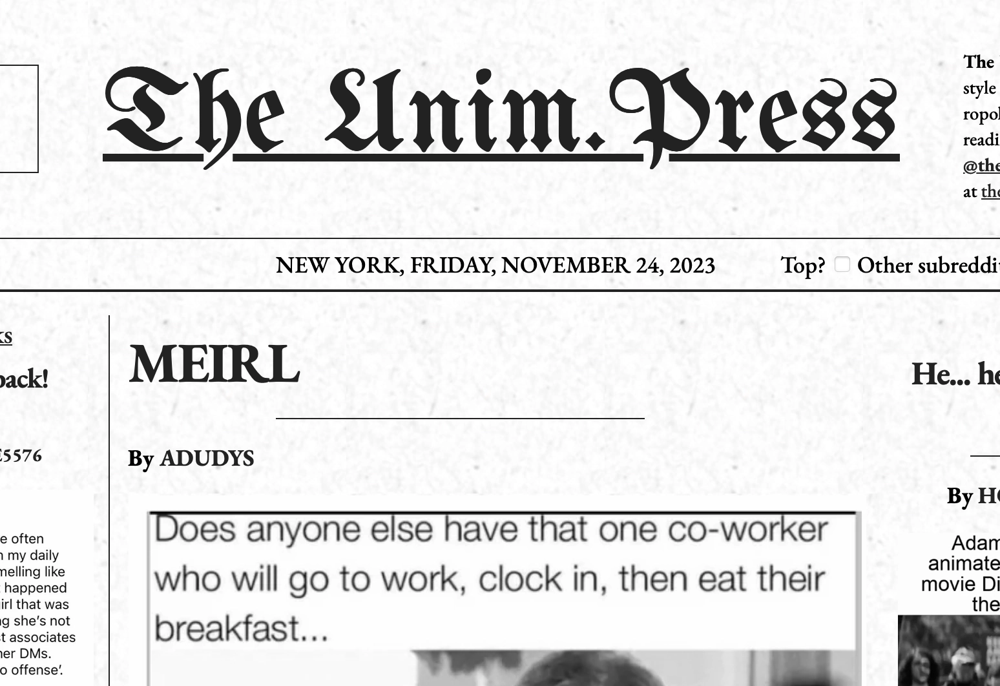
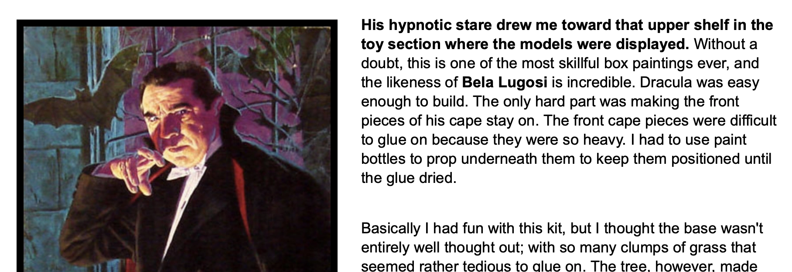

> [!NOTE] Psst psst
> If you prefer receiving these weekly updates via email: <a class='subscribe-cta subscribe-cta--inline' href='https://letters.sonnet.io' style='--font-size-cta: 1em'>Subscribe here</a>

## Meta

Reminder: this site is an [iterative experiment](<../../../111>), so let's put on the ~~janitor hat~~:

*unfortunately the original image took [too long to load](<../../../Abusing and reviewing Obsidian Publish>). Longboi can smell that.*
## This week's summary

A wise person said to me this week: experience is not about figuring out what you want to do, but deciding what you don't want to do.

This was a very timely piece of advice. I'm still juggling research, building, writing here and dealing with the little pesky detail of having to pay rent. (btw, Mango's fine, he lives rent-free as Ensō handles his upkeep, and I still feel richer than with a 6-figure salary and a 150m2 office surrounded by suits.)

**My progress on Night Reader has been steady, but slower than I expected, and that's OK!** I didn't have time to get it out on the AppStore, but I've added better loading error UX, ability to report bugs, and improved page loading performance. I think we're ready to go! 

(Related: [Heart of Dorkness](<../../../Heart of Dorkness>))

The app will be paid, but if you want to give it a go you can use [TestFlight](https://testflight.apple.com/join/jn7XlV3M) or just [message me](mailto:hello@sonnet.io) and I'll try to give you a free version, **no questions asked**.

**Publishing smaller articles worked quite well.** My approach is to start with a bigger topic, work on its branches and then by Thursday come back to the main article. This way you–the reader can control how you want to navigate the subject.

I want to write a bit more about mental health, so will try to wrap up a few drafts in the next two weeks.

Also, I've received a lot of feedback from my new batch of Ensō users. **I won't add any big new features**, but I'll make it possible for users to switch off some stuff, following the [MISS – Make It Stupid, Simple](<../../../MISS – Make It Stupid, Simple>) philosophy.

Finally, I was so happy to see that [more and more people](https://bentinata.com) have a Say Hi page now! Perhaps we should create a catalog of all [Say Hi](https://sonnet.io/posts/hi) sites? ([project todo](<../../../Say Hi Catalog>))

### Next week

- (possibly) get a job
- put Night Reader on the app store
- keep writing smaller, TIL articles

## Favourite project

[(t,i,x,y) => "creative code golfing"](https://tixy.land) — Interactive code golf! OK, I know that there's a 3D version of this project hidden somewhere in the depths of the web. If I find it, I'll post it in the next one.

[Windows 98 - Virtual x86](https://copy.sh/v86/?profile=windows98) — Run Windows 98 in the browser.

## Favourite site(s)

[Toiletpaper Magazine](https://www.toiletpapermagazine.org) – I just discovered that one of my favourite print magazines has a site, and that site really speaks to its physical counterpart. ToiletPaper magazine is an avant-garde publication co-created by Maurizio Cattelan and Pierpaolo Ferrari. It's a mixture of commercial photography, and surreal, bizarre imagery. It's beautifully and unashamedly trashy, and that speaks to me at a deep and personal level. Keep scrolling, feed your eyes, and take a shower afterwards (then buy a physical copy).

[unim.press](https://unim.press) – Reddit Front Page reader in the style of New York Times. Initially [The (Medieval) Times](https://tidings.potato.horse) was supposed to be an NYT-styled news reader, but the idea evolved quickly once I learned about this project. I don't use Reddit any more, and I built a catalog of alternative communities: [Lemonade](https://lemonade.sonnet.io), so might give the project another shot.

[Welcome to the Sixties](https://www.jeffs60s.com) – A catalog of 60s related memories I found via the marginalia site explorer. 

## Favourite piece of tech

[Cursorless: Voice coding at the speed of thought](https://www.cursorless.org) — Cursorless is a composable, spoken programming language designed for keyboard-free programming. To learn more about its design and see a quick demo, check out this Strangeloop talk by [Pokey Rule](https://www.youtube.com/watch?v=NcUJnmBqHTY&pp=ygUKY3Vyc29ybGVzcw%3D%3D).

## Interesting articles

[An Attempted Taxonomy of Web Components—zachleat.com](https://www.zachleat.com/web/a-taxonomy-of-web-component-types/) — Zach is one of my main sources of wisdom when it comes to Web Components and JAMStack. My main issue with Web Components was scalability and composability, but after seeing [more work using this tech](https://github.com/genmon/braggoscope-search), I'm starting to notice more value in it from the perspective of my own personal practice.

Side note: if you're interested in JAMStack, be sure to fill in the [The Future of Jamstack](https://thefutureofjamstack.org) survey (it's short.)

[5 Animals Whose Blood Isn't Red | HowStuffWorks](https://animals.howstuffworks.com/animal-facts/5-animals-whose-blood-isnt-red.htm) - Sharing this for very selfish and idiosyncratic reasons: I caught myself reading it in Night Reader and had a pretty good experience **despite my app using only three colours: black, red, dark red**.

[No feature](https://ia.net/topics/no-feature) — an opinion piece discussing how brittle and myopic the mainstream approach towards building AI apps is at the moment, plus some (vague) directions on how to move forward. I think they overestimate the usefulness of chatbots/conversational UX when it comes to interacting with LLMs. To learn more about that I recommend Maggie Appleton's [Language Model Sketchbook, or Why I Hate Chatbots](https://maggieappleton.com/lm-sketchbook). I think that in the age of rapid enshittification, removing features rather than piling them up can be an advantage ([MISS – Make It Stupid, Simple](<../../../MISS – Make It Stupid, Simple>)).

[Early-life stress changes more genes in the brain than a head injury](https://medicalxpress.com/news/2023-11-early-life-stress-genes-brain-injury.html) — one of the reasons that the tools I build for my own well-being ([examples](<../../../Projects and apps I built for my own well-being>) and [wishlist](<../../../Things to support my own well-being – a wishlist>)) seem to work for folks with ADHD, despite me not being on the ADHD spectrum *is* early-life stress. So, naturally I find this subject interesting. If you're interested in mental health, esp. the impact of trauma from a child development and *epigenetic* point of view — [let me know](mailto:hello@sonnet.io). I've been collecting research on the subject for some time and I'd love to share it (either links or a compiled article).

## Things I wrote last week that people liked

- [Abusing and reviewing Obsidian Publish](<../../../Abusing and reviewing Obsidian Publish>) 
- [MISS – Make It Stupid, Simple](<../../../MISS – Make It Stupid, Simple>), alternative title:

> **M**ake  
> **I**t  
> **S**tupid  
> **S**imple,  
> **T**o  
> **E**xperience  
> **R**evenue 
> 
> =  **M.I.S.S.T.E.R.**

Thanks for reading! See you on Monday!

See you next week!

You still here? 

Here's a treat: [BUTTERFLY LAUNCHES FROM SPAR POLE](https://butterflylaunch.com). I found this site by sheer accident. I'm attaching it here, because when I read it I see a real person on the other side of the screen.

