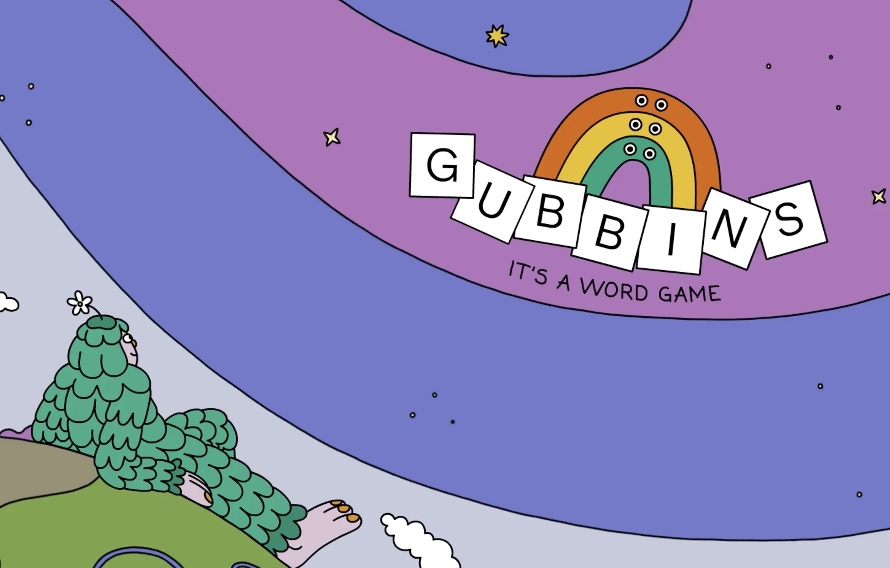
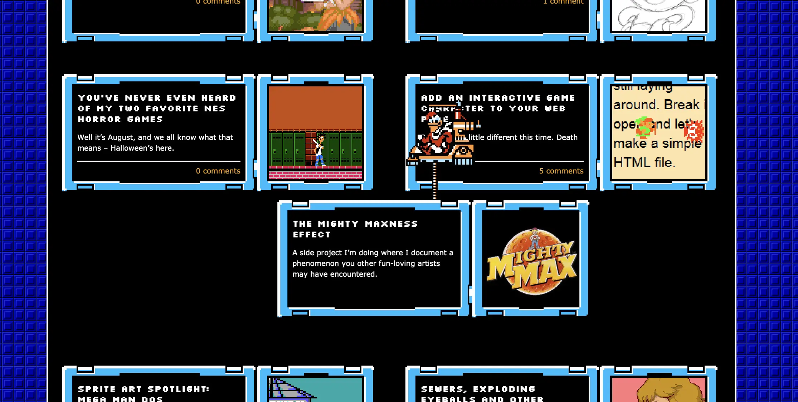

> [!NOTE] Psst psst
> If you prefer receiving these weekly updates via email: <a class='subscribe-cta subscribe-cta--inline' href='https://letters.sonnet.io' style='--font-size-cta: 1em'>Subscribe here</a>

## Meta

Reminder: this site is an [iterative experiment](<../../../111>), so let's put on the ~~janitor hat~~ IT'S BENANADRYL TIME:

_Allergy season is just 4 months away, so don't wait. It's not a drill, it's Benanandryl!_

## This week's summary

### Night Reader is available on the AppStore!

**You can download it from [here](https://apps.apple.com/gb/app/night-reader/id6472076217) for €2,99.**

It's priced at 1.25 x coffee price in my local coffee shop. I chose the price based on my own usage. I spent ca. 2 hours using it in the past two weeks.

Psst. If you can't pay for it, [hit me up](mailto:hello@sonnet.io) and I'll send you a promo code.

### Writing, other

I've experimented with much smaller, less technical notes. People seem to like my linguistics related content. [Portuguese Orange, Persian Portugal](<../../../Portuguese Orange, Persian Portugal>) ended up on the front page of HN and generated some fun discussions in the comments. I can see that _1 in every 6-8 articles_ I post gets popular on the orange website, which is surprising given the subject matter. I will not focus on that too much for the same reason untested doesn't use analytics: I want to share the stuff that's important to me in the first place and then do my best job to make it interesting, useful or at least entertaining to you. I find it easier to be earnest when I'm writing to a friend, rather than performing.

### Next week

- rename Night Reader as there's a different reading app with the same name. Current contenders: _Ink_, _Night Mode_, _Moonlit_, _Lunar_, _Midnight_
- post a follow-up to [Communication is Action](<../../../Communication is Action>) (working title [Stories Help Us Learn, Teach and Remember](<../../../Stories Help Us Learn, Teach and Remember>))
- bite the bullet and market night Reader enough to convert those sweet words and pixels into a bowl of noodles at my local ramen place.

## Favourite project(s)

[Dobb·E: On Bringing Robots Home](https://dobb-e.com) — an open-source framework for building household robots, trained via imitation learning. Apparently giving the robot a sock lowers the error rate by 80%.

[Ansel](https://ansel.photos/en/)— an Open Source alternative to Lightroom. If you're still using Adobe, check out my list of [alternatives](<../../../Alternatives to Adobe>). Most of them are free and easier to use anyway (speaking as someone who used Photoshop since AD 2000).

[Letterbird](https://letterbird.co) — my friends at [Good Enough](https://goodenough.us) designed a simple, private, enshittification-resistant contact form. (I'm not getting paid for this, I just like them.)

[Sewer Rave by Autumn Rain](https://slitherpunk.itch.io/sewer-rave) — There's a giant rat rave happening in the sewers _and you're invited_!

[Whisky](https://getwhisky.app) — Whisky is a WINE powered tool allowing you to run PC games on MacOS. It relies on Apple Porting Toolkit, so you should expect pretty good performance. I see it as a free, slightly leaner, rougher around the edges alternative to CrossOver. Also, the guy who wrote it is barely old enough to use Night Reader (17)!

## Favourite site

[Studio Folly](https://folly.studio) — sharing mostly because of the [Gubbins](https://www.youtube.com/watch?v=S_EHPX0503s) related artwork featured on their main page. Big missed opportunity to use \<marquee>\</marquee> for the top page header!

[musicforprogramming.net/latest/](https://musicforprogramming.net/latest/)— Wake up babe, new musicforprogramming just dropped. If you haven't listened to the older versions, [here's my favourite episode](https://musicforprogramming.net/sixtyfive)(just wait till Alice Coltrane pays a visit).

[2D Will Never Die](https://2dwillneverdie.com/blog/) — a blog devoted to arcade games and 80s to mid-90s aesthetic. Sharing mostly because it tickled a few neurons in my thought sponge that haven't been tickled for some time.

## Favourite piece of tech

[Yashica Mat 124g](https://www.35mmc.com/28/06/2019/yashica-mat-124g-and-its-auxiliary-lenses-review-by-aivaras/)— my camera, listed in my [Default Apps 2023](<../../../Default Apps 2023>) note. It's 53 years old still works beautifully. Also, one of my favourite visual artists ([Francesca Woodman](https://www.tate.org.uk/art/artists/francesca-woodman-10512/finding-francesca)) used it in her work.

https://ggml.ai — a C library allowing to run large ML models on commodity hardware. It powers [llamafile](https://github.com/Mozilla-Ocho/llamafile) and [whisper.cpp](https://github.com/ggerganov/whisper.cpp).

[Saxophone Ring Thing](https://sax.greg.technology) — it's a ring thing that helps you learn how to play the saxophone! By [Greg](greg.technology).

[Make WordArt - Online word art generator](https://www.makewordart.com) — it's a WordArt editor, that's it!

## Interesting articles

[Why I love the London coding scene](https://www.todepond.com/wikiblogarden/london/) — sharing because of [saudade](https://en.wikipedia.org/wiki/Saudade). I was looking for places like this when I lived in London, but I'm starting to feel that I needed to leave to be able to find them ([Say Hi](https://sonnet.io/posts/hi) helped). Visit for links to communities and experiments. If you live in the UK, meet those people, they seem like a cool bunch.

[IndieWeb Events | IndieWeb Events](https://events.indieweb.org) — speaking of meeting people, here's a calendar of IndieWeb related events!

[iA Writer 7](https://ia.net/topics/ia-writer-7) — [last week](<../47>) I published a note on the iA approach to AI assisted writing. iA Writer 7 contains the first LLM-powered feature and... I'm still digesting my thoughts on the implementation, so will refrain from any opinions. Give it a read and let me know what you think.

[llamafile is the new best way to run an LLM on your own computer](https://simonwillison.net/2023/Nov/29/llamafile/?utm_source=substack&utm_medium=email) — Simon Willis wrote a 5-minute tutorial on how to set up a offline, perfectly private LLM on your machine, using [llamafile](https://hacks.mozilla.org/2023/11/introducing-llamafile/). llamafile is a cross-platform executable containing model weights, GUI and a simple web server. It worked as fast as GPT4 on my crappy M1 MacBook Air. I can't wait till we have more offline-first, private, OSS models, Open AI creeps me out.

[Get started with technical writing](https://opensource.net/get-started-with-technical-writing/) — I don't do much strictly technical writing here, but I think that the article is worth at least a skim, mainly because it focuses more on practice and experiences of authors, rather than prescriptive advice. And, you know my opinion on [writing advice](<../../../This is not writing or productivity advice>).

[A Complete Guide to CSS Grid | CSS-Tricks - CSS-Tricks](https://css-tricks.com/snippets/css/complete-guide-grid/) — a (very) comprehensive guide to CSS Grid. If you're struggling with layout in CSS, give it a go. Things are [so much easier](https://tedium.co/2023/11/24/weird-html-hacks-history/) than they used to be.

[Creating a Fluid Type Scale with CSS Clamp](https://www.aleksandrhovhannisyan.com/blog/fluid-type-scale-with-css-clamp/) — A few months back I shared [utopia](https://utopia.fyi)—an online tool to generate CSS vars for fluid type scales and layout. This article provides some good theoretical foundations behind fluid typography.

## Things I wrote last week that people liked

- [Portuguese Orange, Persian Portugal](<../../../Portuguese Orange, Persian Portugal>)

Thanks for reading! See you on Monday!

P.S. [Portuguese Orange, Persian Portugal](<../../../Portuguese Orange, Persian Portugal>) reminded me of a different (Sufi) citrus, and [this song](https://www.youtube.com/watch?v=a64OFz4PkkA) by Mohsen Namjoo (who I consider the Iranian Bob Dylan)

See you next week!

