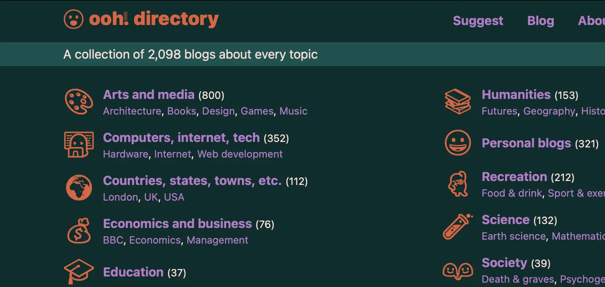
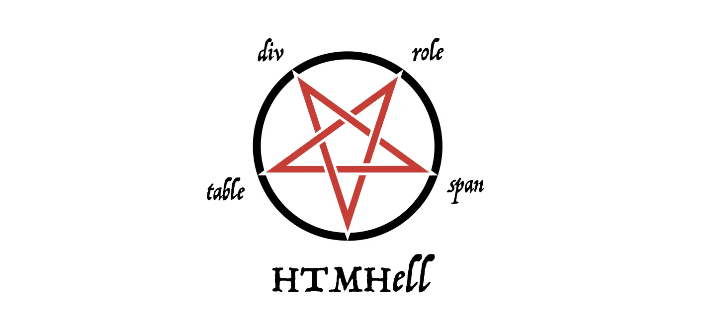
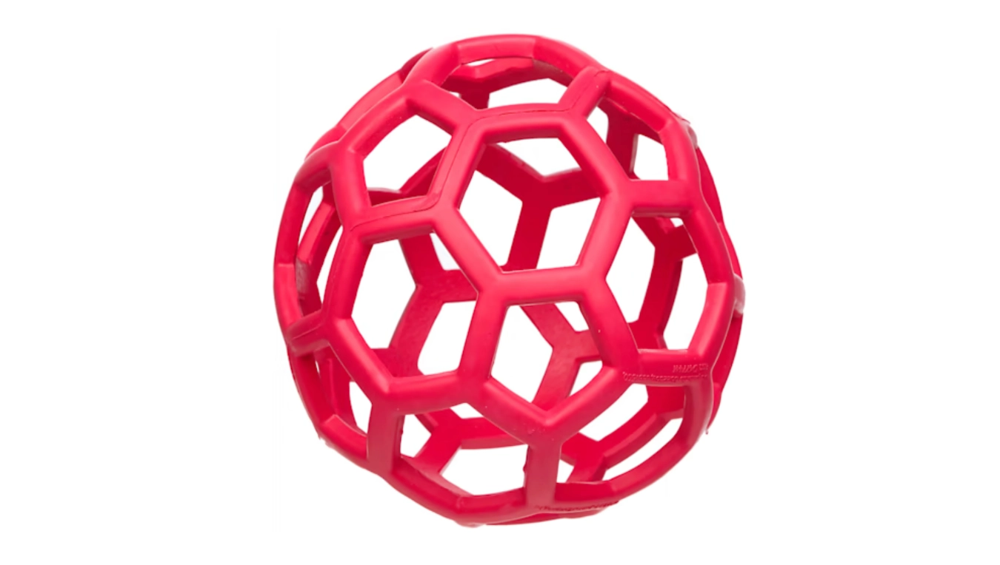
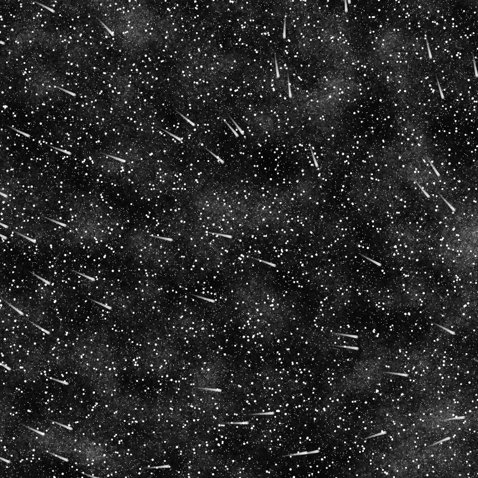
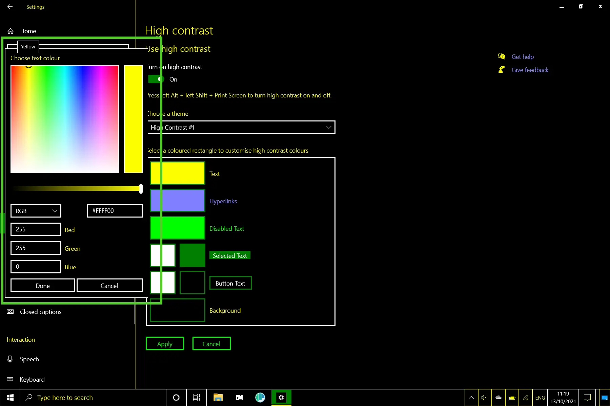

## Meta

Reminder: this site is an [iterative experiment](<../../../111>), so let's put on ~~the janitor hat~~:

*(the fish janitor disappeared, possibly devoured by the white vixen above)*

## This week's summary

[My goals for the last week](<../48>) included:

- [x] renaming Nigh Reader and marketing it ([site](https://midnight.sonnet.io))
- [x] earning enough money from it to buy a bowl or ramen ([done!](<../../../Midnight Ramen>))
- [ ] posting a follow-up to [Communication is Action](<../../../Communication is Action>) 

Writing prompts for the *next* week almost never works! There's always something new to explore and tickle the antennae attached to my thought sponge. I noticed that I still tend to come back to these prompts with a longer delay: 2-3 weeks or, more specifically, when I'm bored with the writing prompt for the current week.

The more I work on this stuff, the more I realise that [Muddle Your Way To Success](<../../../Muddle Your Way To Success>) is the right approach here: instead of forcing myself to work on something specific, I try to understand why I find it so hard to work on X instead of Y. 

Quick rant: The main *marketing* lesson I've learned this week is that [Product Hunt is an even bigger waste of time that I'd already thought](<../../../Product Hunt is an even bigger waste of time that I'd already thought>).  Long time ago I decided to never spend more than 1 hour on my PH launches, and I didn't expect much traffic from it. I was wrong — now I'm just getting flooded with influencer/growth hacker spam.

Messaging people who could benefit from using Midnight seems to work much better and feels more aligned with the product dev approach I aspire to ([Kind software](<../../../Kind software>)). Who would've thought?

*I don't consider PH a complete waste of time: I like the product screenshots I made for it and I'll probably reuse them somewhere else.*

### Next week

- [ ] double the ramen for Midnight
- [ ] write more short TIL notes

It'll be slower than this one, so expect fewer experiments by me and more found content that falls under the mildly strange category ('tis the Christmas spirit).

## Favourite project

[Shader Park](https://shaderpark.com) — a Javascript library that allows you to create interactive shaders using a DSL similar to processing/p5.js. You can read more about it here: [Shader Park is Kinda Neat](<../../../Shader Park is Kinda Neat>). It's so much fun to play with!

## Favourite site

[Random blogs (ooh.directory)](https://ooh.directory/random/) — a StumbleUpon-esque (wow) blog explorer. If you like the marginalia.nu site explorer, you might enjoy this one too. Contains stuff like this [Cabin Porn](https://cabinporn.com) catalog.

[A11y Advent Calendar | Kitty Giraudel](https://kittygiraudel.com/2020/12/01/a11y-advent-calendar/) —  an intro to the core accessibility concepts served in an easily digestible form. It's long enough to feel like you've learned something but small enough not to feel daunting. 

[You don't need JavaScript for that - HTMHell](https://www.htmhell.dev/adventcalendar/2023/2/) — a bunch of HTML-only solutions to UI problems often solved with JS. People often think that this stuff is important mainly from the accessibility point of view, but there's also a more "selfish" reason to use these patterns: they can be easier to implement than their JS counterparts. 

Btw, once you're there, be sure to check out their [A11y Advent Calendar](https://www.htmhell.dev/adventcalendar/) too. It goes into more detail than the one created by Kitty (at least days 1-8 of December, which I've read so far).  

I like that this year, besides the usual, annual Advent of Code, I've seen more initiatives focused on accessibility.

## Favourite piece of tech

[This weird dog ball with many unevenly sized holes](https://www.petco.com/shop/en/petcostore/product/jw-pet-hol-ee-roller-dog-toy-large-65-diameter-1434462) — people call ChatGPT a productivity boost, but it doesn't even compare to the amount of time I can save by:

1. sticking a carrot in that thing, and 
2. throwing it close to Mango as an impromptu canine distraction grenade. 

(I'm not getting paid to sell this to you, I'm just taking a break from AI news this week.)

## Interesting articles

[Volumetric Rendering: Signed Distance Functions](https://www.alanzucconi.com/2016/07/01/signed-distance-functions/#introduction) — a fairly comprehensive intro to SDF mentioned in my [previous note](<../../../Shader Park is Kinda Neat>). 

[Getting Creative with Perlin Noise Fields](https://sighack.com/post/getting-creative-with-perlin-noise-fields) — I'm sharing this mainly because of my love towards Perlin noise and a personal belief that generative artists should call their art form Chaos Magick (sorry [dad](https://en.wikipedia.org/wiki/Aleister_Crowley)).

[Forced colors explained: A practical guide](https://polypane.app/blog/forced-colors-explained-a-practical-guide/)— forced colours is a CSS media query triggered when the OS runs in high-contrast mode. It's possible that as much as 4% of your users rely on this setting. I'd risk saying that supporting high-contrast might be a more useful way of spending your dev time than implementing dark mode using `prefers-color-scheme: dark`. If you like this article, you might want to check out [my notes on dark mode](<../../../Dark Mode - Articles>).

[LLM Visualization](https://bbycroft.net/llm) — an interactive introduction to common LLM architectures, with detailed descriptions leading you through each inference step. It runs in the browser, which some people find impressive.

## Things I wrote last week that people liked

- [Find Your Tribe](<../../../Find Your Tribe>)
- [Shader Park is Kinda Neat](<../../../Shader Park is Kinda Neat>)

Thanks for reading! See you on Monday!

