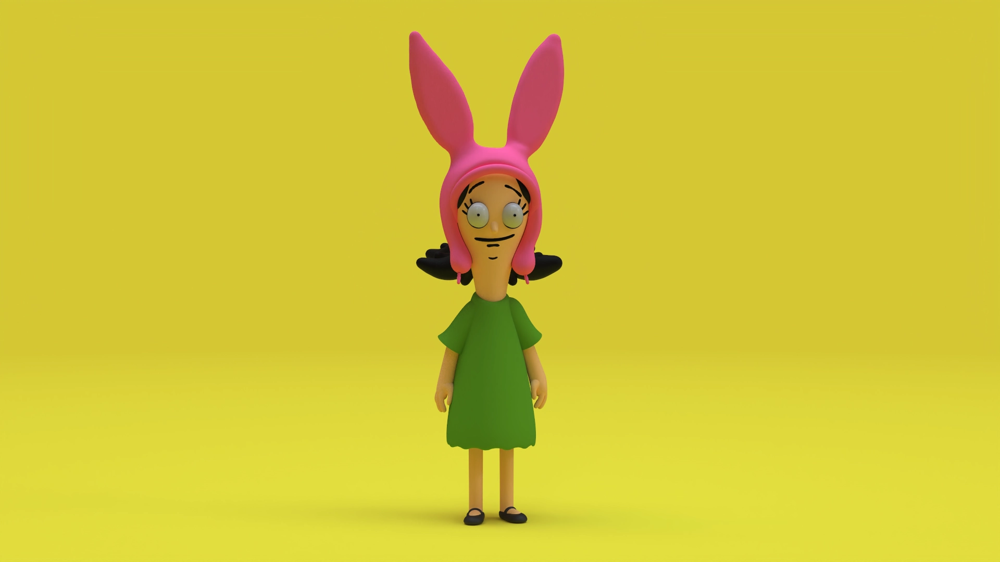
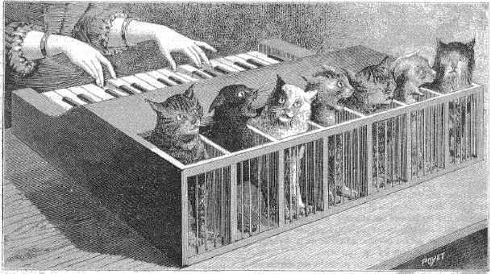

## Meta

Reminder: this site is an [iterative experiment](<../../../111>), so let's put on the (school of fish) janitor hat:

## This week's summary

### Midnight

We've (more than) doubled the ramen budget of Midnight this week! I also pushed some minor UX improvements based on user feedback.

**You can buy Midnight [here](https://apps.apple.com/gb/app/night-reader/id6472076217)** (if you can't pay, [hit me up](mailto:hello@sonnet.io?subject=Midnight) and I'll send you a promo code, no questions asked).

### Writing

I cannot express how happy I am that people are reading this and some are even reaching out to tell me that they appreciate my work. I know this won't last forever, I'll have to move back to a regular job next year, so I just wanted to tell you: 

Thank you, you're fantastic, nay, you're *mathematical*, please have this sock.

I've also had a bunch of fun, moving [Say Hi](https://sonnet.io/posts/hi) calls this week. Expect a write-up on Say Hi early next year.

### Next week

- [ ] Prepare for the Christmas break. I'll post some short, weirder notes from my backlog.
- [ ] Continue writing shorter TIL notes **but** don't expect an instant improvement, be patient.

<h2 id='sonnet-favourites'>Favourite project(s)</h2>
<video controls src='https://res.cloudinary.com/montaigne-io/video/upload/v1695251411/35235FA1-648B-4306-9F50-CD4FACB11C90.mp4'></video>

[Recur Email](https://recur.email) — a no-bullshit newsletter tool created by [Anton Podviaznikov](https://podviaznikov.com). It looks so [beautifully simple](<../../../Brutally simple>) to use.

I was going to post a different project today and I discovered his work just a moment ago on the [Future of Coding Slack channel](https://join.slack.com/t/futureofcoding/shared_invite/zt-1uaany0o1-jI5r~TLXn2tfEy8uF2i3bA). Anton's approach to product dev resonates with me and might resonate with many of the readers here.

Louise Belcher, *[rulfo](https://alpha.womp.com/profile/4d0c1893-dcbc-4e38-b113-72015c232c7b) CC0*

[Womp](https://womp.com)  — Womp is a (mostly) free 3D editor using [SDF](<../../../Shader Park is Kinda Neat>). If you liked my posts on Shader Park ([Shader Park is Kinda Neat](<../../../Shader Park is Kinda Neat>), [Midnight Shader](<../../../Midnight Shader>), [Shader Park and 2D](<../../../Shader Park and 2D>)) but don't feel like coding, give it a go! It's simple and playful.

[Sans Bullshit Sans](https://www.sansbullshitsans.com) — a clone of Helvetica which replaces corpospeak with ligatures thus protecting you from LinkedIn induced brain rot. I'm considering building a Sans Bullshit Sans userscript or a browser extension. If that sounds like your cup of tea, let me know so we can synergise and \#deliver_wow.

## Favourite site(s)

[What Will Enter the Public Domain in 2024?](https://publicdomainreview.org/features/entering-the-public-domain/2024/) — my gaming projects are the main reason I'm interested in this. [Tommy the Toe](https://apps.apple.com/gb/app/tommy-the-toe/id1498417487) used to include WW2-era Christian propaganda songs (wonderfully creepy, but suitable) and the [All-hands Meeting Simulator](https://rafsters.itch.io/all-hands) is a collaboration between yours truly and [another Polish man with an interesting nose](https://en.wikipedia.org/wiki/Frédéric_Chopin).

A quick glance at the list includes works by: Sergei Prokofiev, Francis Picabia, Virginia Wolf and the first full-length "all-talking" motion picture: Lights of New York. 

Check out [this link](https://copyrightlately.com/public-domain-day-2024/) for a curated list with a commentary. Now, please continue reading with the Empress of the Blues (public domain starting January 2024):

## Favourite piece of tech

*"Layers of haze, composed of complex organic compounds, covering Titan" - [source](https://en.wikipedia.org/wiki/Voyager_1#/media/File:Titan_Haze.jpg)*

[Voyager 1](https://en.wikipedia.org/wiki/Voyager_1) — we lost contact with the farthest human-made object sent into space, as well as the attached love letter (first and only interstellar mail we've sent so far).

<video loop muted autoplay playsinline src='https://res.cloudinary.com/dlve3inen/video/upload/v1702658213/wiggly-paint-potato-cloudinary_zae7ox.mp4'></video>

[Wigglypaint by Internet Janitor](https://internet-janitor.itch.io/wigglypaint) — it's a drawing plaything that makes things wiggle! 

[AltaVista - Web Design Museum](https://www.webdesignmuseum.org/web-design-history/altavista-1995) — AltaVista, the first serious search engine, was created exactly 28 years ago. 

## Interesting articles

[How To Become A Hacker](http://www.catb.org/~esr/faqs/hacker-howto.html) — a classic hacker howto I spotted by complete accident. I'm attaching it because of this quote:

> **Boredom and drudgery are evil.**
> 
> Hackers (and creative people in general) should never be bored or have to drudge at stupid repetitive work, because when this happens it means they aren't doing what only they can do — solve new problems. This wastefulness hurts everybody. Therefore boredom and drudgery are not just unpleasant but actually evil.

[Mixtral of experts | Mistral AI](https://mistral.ai/news/mixtral-of-experts/) — Mistral published their new open source LLM models and Simon Willison added them to his `llm` CLI tool.

[Cat Pianos, Sound-Houses, and Other Imaginary Musical Instruments](https://publicdomainreview.org/essay/cat-pianos-sound-houses-and-other-imaginary-musical-instruments) — every millennial knows the Keyboard Cat, but have you heard about Cat Piano? 

## Things I wrote last week that people liked

- [Texas Friendship Massacre](<../../../Texas Friendship Massacre>)
- [Building a private, clutter-free browser on top of Safari](<../../../Building a private, clutter-free browser on top of Safari>)
- [Midnight Shader](<../../../Midnight Shader>)

Thanks for reading! See you on Monday!

See you next week!
