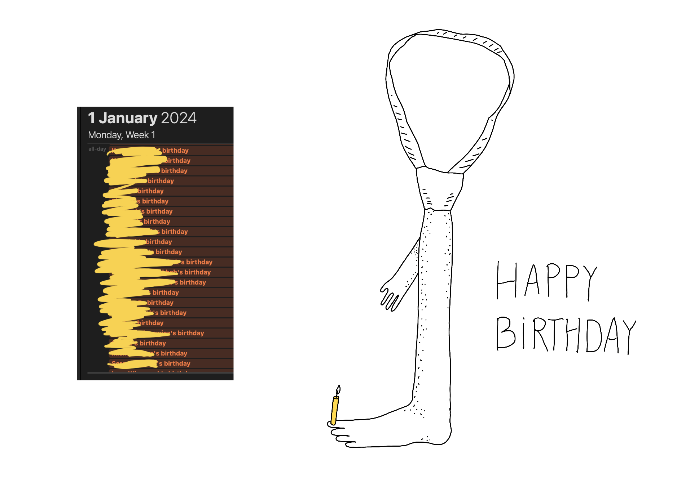
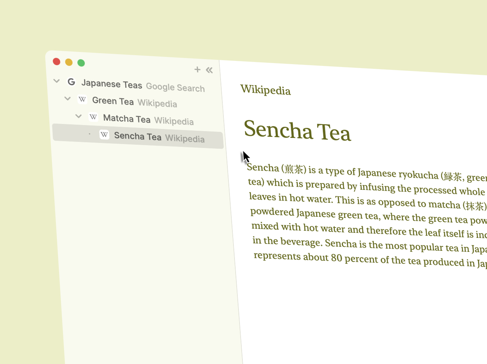
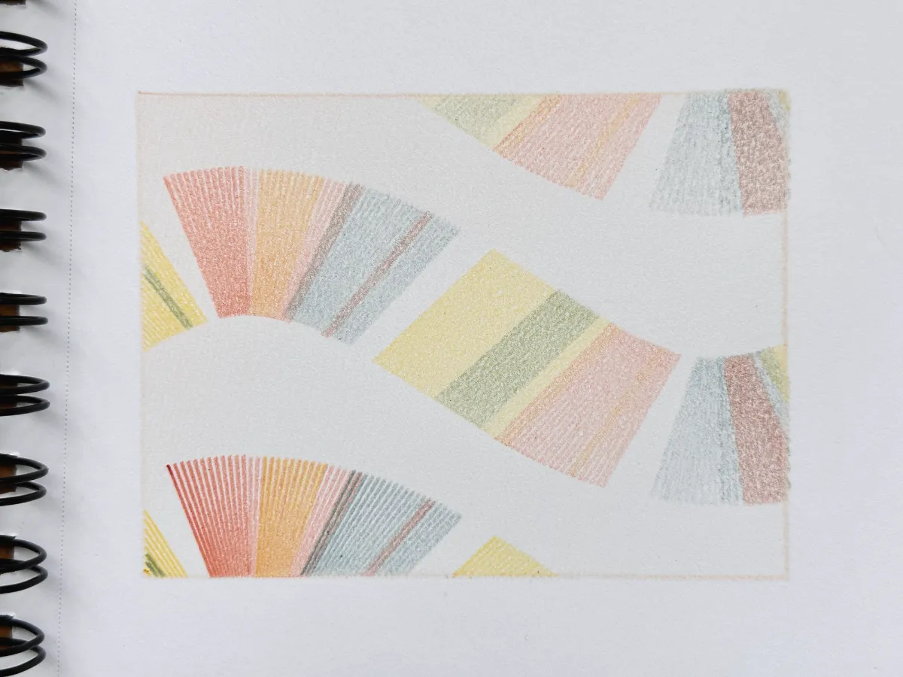
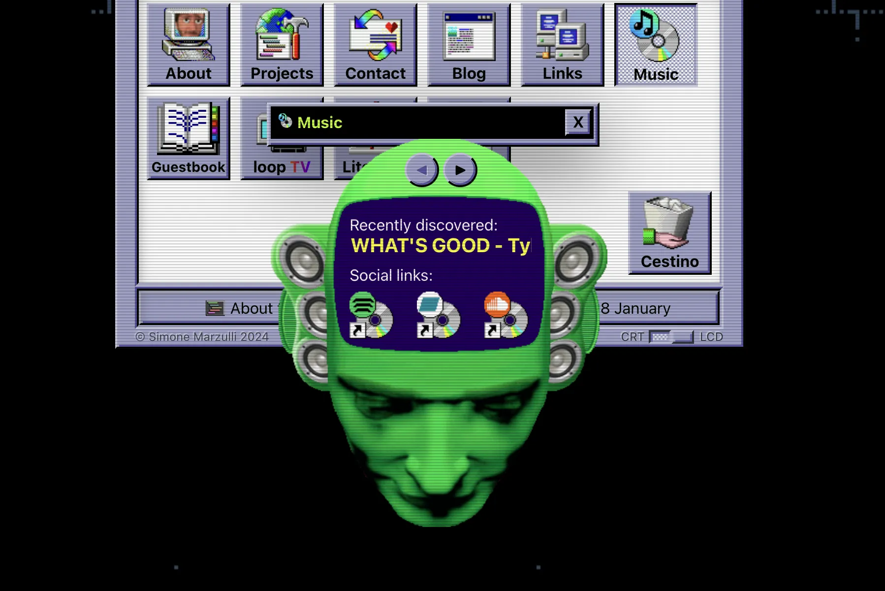
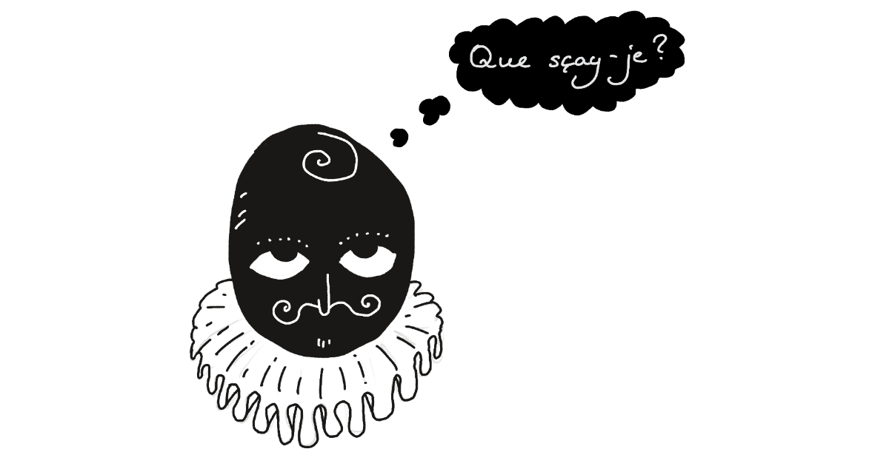

First, looking at my calendar, most of my friends were born on 1 January. Happy birthday! I hope you enjoy tie foot!

## Meta

Reminder: this site is an [iterative experiment](<../../../111>), so let's put on the (fish school) janitor hat:

## This week's summary

### 🐝

A post on Sit. went viral and with more than 50,000 people visiting the site in less than 48 hours, collectively generating ca. **2 months** of blissful, doomscroll-free unproductivity. Also, dozens of people booked Say Hi calls and my calendar is dead till the end of January. Just this week I've met 12 fascinating, beautifully weird people. 

Before starting [Say Hi](https://sonnet.io/posts/hi) I considered the possibility that I'd end up in a bubble, but I  whatever this thing is, it's shaped like an octopus, with its arms reaching towards: neuroscience, [mental health](https://www.scientificamerican.com/article/how-parents-rsquo-trauma-leaves-biological-traces-in-children/), linguistics, the *strange and alluring world of Russian rap battles*, pen plotters and [Walking for Vice President](https://www.w4vp.com). OK, that's 6 arms, so perhaps the bubble is more like an insect, a bumblebee, let's call it a bubble-bee. *Ah, ja... the noble bubble-bee, a creature of never-ending dichotomies, it neither buzzes nor sings, but screams, trapped between the liquid and the solid state, yet still, somehow, sublime. OK, my inner Werner Herzog let's move on.*

My world is bigger, stranger, and more beautiful because of people who reach out to me. Thank you, stranger.

Also, **Sit. is available as a Progressive Web App for Android users**. I'm afraid this won't work if you have an iPhone or an iPad because of an iOS bug (more info here: [Sleepy Safari](<../../../Sleepy Safari>)). To learn how I implemented PWA features in Sit. and how to do this yourself, read [Sit. Offline Mode](<../../../Sit. Offline Mode>) and the attached resources.

### Next week (in order of priority)

Missing embed: fishlist-cover.webp 
- focus on posting research notes, shorter TILs over essay-like content
- publish a living note on setting up Say Hi calls
- pick up the [Mental Health Toolbox (working title)](<../../../Mental Health Toolbox (working title)>) from [Things to support my own well-being – a wishlist](<../../../Things to support my own well-being – a wishlist>) or build a smaller useless toy

I don't have a Patreon and most of my projects are free, but if you want to support me and know someone looking for a product developer / technical founder, [hit me up](mailto:hello@sonnet.io)!

## Favourite project

[Horse Browser](https://browser.horse) — a minimalist browser organised around tasks and flows rather than tabs. I'm sharing it because:
- I'm exploring different ways of navigating web content (flows and timelines over messy, linear tabs) and one of my *Say Hi* friends brought it up.
- the `.horse` gTLD

[LED Industrial Piercing - mitxela.com](https://mitxela.com/projects/scaffold) — a very Cyberpunk (but not too [Cybergoth](https://www.youtube.com/watch?v=gPbVRpRgHso)) take on body mods.

*Amusing Grove Burn by Luca Bailey*

[Leaving Weathervane Mountain Out Overnight](https://photongarden.notion.site/Leaving-Weathervane-Mountain-Out-Overnight-6a02621c6831416a89bde6e91843cc69) — pen plotter art by Luca Bailey, a linguist/CS nerd and visual artist I met this week via *Say hi*.

[drawing.garden](https://drawing.garden) — just a little emoji doodling music plaything. You might've read about the value of DYI software being like a [home-cooked meal](https://www.robinsloan.com/notes/home-cooked-app/). This is the software version of your partner making a toasted sandwich.
## Favourite site

[Simone's Computer](https://simone.computer/#/) — imagine [Cameron's World](https://www.cameronsworld.net) and [WINDOWS93](https://www.windows93.net) had a baby and that baby turned out to be a personal website. It's not a new discovery, but seeing a recent post on [GodotOS](https://github.com/popcar2/GodotOS) reminded me of it.

## Favourite piece of tech

[What PWA Can Do Today](https://whatpwacando.today) — Progressive Web Apps (PWA). Why?

- [Nothing beats the Web Platform when it comes to short feedback loops and ease of experimentation.](<../../../Web and Feedback Loops>)
- You'll likely to be surprised to see how capable the mobile web platform is in 2024

## Interesting articles

*Michel de Montaigne in Middle French. This ruffle took me 1 hour to draw. I want you to know that. I'll be posting it repeatedly from now on. I also complained to the author of [Montaigne](<../../../Montaigne>) asking him to name his future apps after simple geometric shapes. He has not responded to my enquiry yet.*

[My number one tip for posting viral tweets, toots, posts, etc](https://www.todepond.com/wikiblogarden/social-media/write-less/) — [Lu's](https://www.todepond.com) social media marketing advice and a must-read for aspiring web 7.0 growth-hackers.

[Think more about what to focus on - by Henrik Karlsson](https://www.henrikkarlsson.xyz/p/multi-armed-bandit) — a decent introduction to [Exploration-exploitation dilemma](https://en.wikipedia.org/wiki/Exploration-exploitation_dilemma) through the lens of personal experience. This is another article shared by a reader. 

> Psst. Have you *seen/read/heard/played with* anything that people reading this might like? Then [send me a link](mailto:hello@sonnet.io)!

[Cory Doctorow: What Kind of Bubble is AI? – Locus Online](https://locusmag.com/2023/12/commentary-cory-doctorow-what-kind-of-bubble-is-ai/) — a nuanced take on the current state of the AI hype cycle which might sound particularly relevant if you've lived through the the past 2-3 bubbles. The relevant question I was left with after reading it: once the bubble bursts, what can we salvage? (yes, I know it sounds dark, but if you think of it it's less grim and cynical than selling shovels during a gold rush, cue my next angsty note, titled [In a Gold Rush, Sell Coffins](<../../../In a Gold Rush, Sell Coffins>))

[Definitive edition of "How to Favicon" in 2023 - DEV Community](https://dev.to/masakudamatsu/favicon-nightmare-how-to-maintain-sanity-3al7) — To paraphrase Phil Karlton: *There are only ~~two~~ three hard things in Computer Science: cache invalidation, naming things and adding icons to your PWA.* The main reason I'm sharing this is because despite having worked with mobile web for 13 years, I had no idea how messy this subject is.

### Watching and reading this week:

- [YOU’VE JUST BEEN FUCKED BY PSYOPS - media.ccc.de](https://media.ccc.de/v/37c3-12326-you_ve_just_been_fucked_by_psyops)
- The Body Keeps the Score (audiobook)
- [Annihilation](https://en.wikipedia.org/wiki/Annihilation_(VanderMeer_novel)) (book)

## Things I wrote last week that people liked

- [Sit. Offline Mode](<../../../Sit. Offline Mode>)

Thanks for reading! See you next week!

P.S. Don't overthink it, just go with it:

