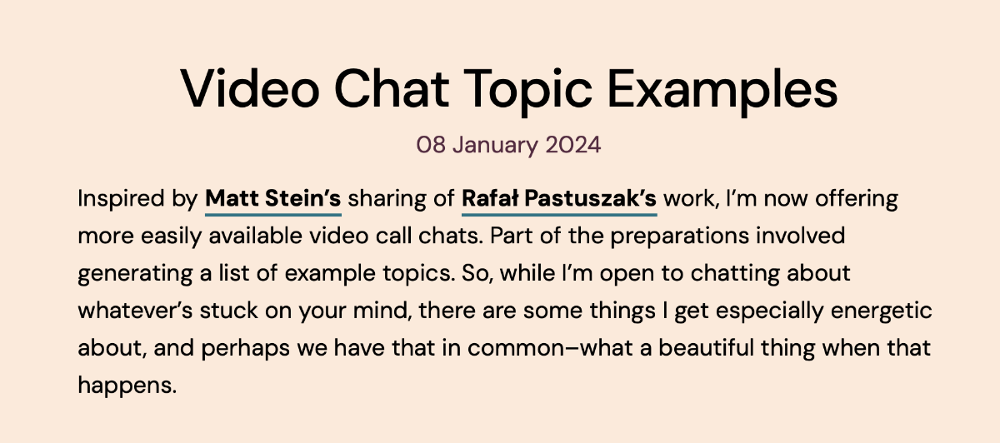
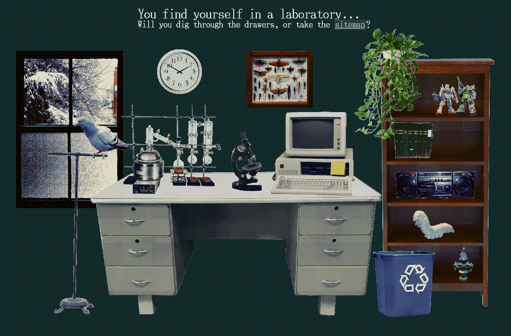
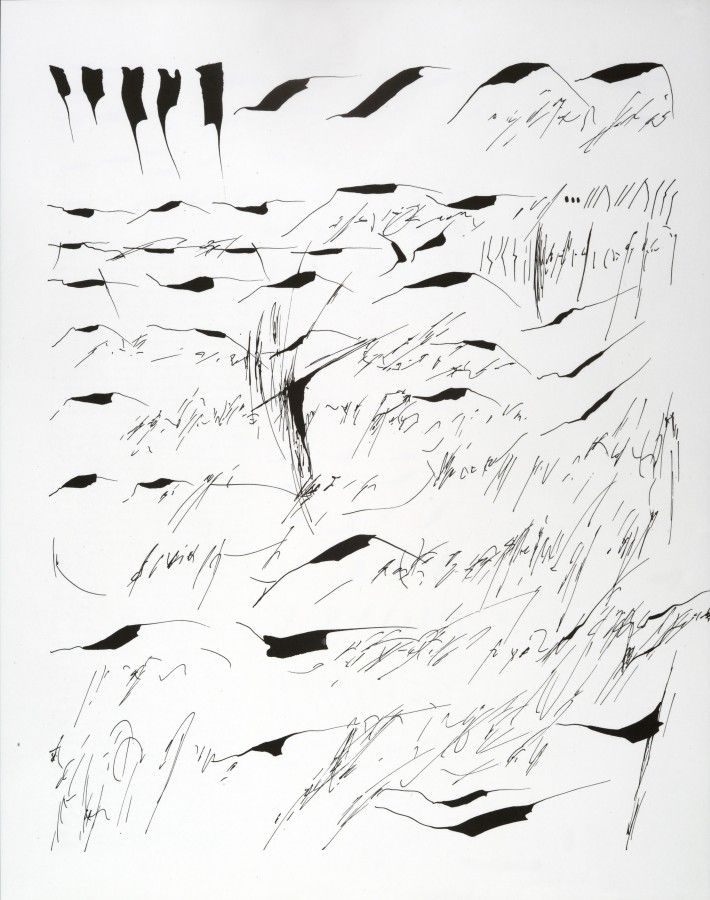

## Meta

Reminder: this site is an [iterative experiment](<../../../111>), so let's put on ~~the (fish) janitor hat~~ the Perfect Cat™:

This program is brought to you by the Perfect Cat: *Perfect Cat: it's all downhill from here!*

## This week's summary

It's still tiny steps, but I'm getting closer to building a [sustainable](<../../../Kind software>) business around the things I care about and try to share here. More on that in the upcoming weeks.

Another [Say Hi/Video Chat page](https://jonitrythall.com/video-chat-topic-examples) popped up in the wild!

*(thanks to Shawn from [Good Enough](https://goodenough.us) for sharing the find)*

Having less time to write this week made it much easier for me to stick to the challenge set in the previous one: smaller, sharing messier, less essay-like notes ([Say Hi](<../../../Say Hi>), [How I Use Analytics With My Indie Projects](<../../../How I Use Analytics With My Indie Projects>)). OK, this approach feels uncomfortable, but so was writing daily when I started. 

Job search and Say Hi (**not** work-related) calls took up most of my free schedule, so I didn't have a chance to push any experiments, but I'm expecting more breathing space next week. Stay tuned!
### Next week

- keep posting smaller articles/dev notes instead of essays
- share one experiment
- fix and re-publish one of my old games

## Favourite project

[The Good Time Garden](https://store.steampowered.com/app/1200860/The_Good_Time_Garden/) — "Explore a throbbing pink world full of strange naked creatures to gather food for your friend in this short, surreal experience.", by [Coal Supper](https://www.coalsupper.com). The visual style of the game feels like [it was designed just for me](https://sonnet.io/images/opt/lUr0O6_lke-1200.avif).

[A Mortician's Tale](https://laundrybear.itch.io/morticians-tale) — a death-positive narrative-driven game where you learn about running a funeral home (takes ca. 1h to play).
## Favourite site

[RIBOSE | clay](https://ribo.zone/clay/) — excellent claymation and beautiful dithered graphics. Their [index page](https://ribo.zone) looks like a Microsoft Bob remake for Window 98 (so, retro²).

[Carciofi alla Romana | Recipes for Food](https://recipesforfood.net/recipes/carciofi-alla-romana#active) — a small recipe platform and community by [Nazlı Ercan](http://nazli-ercan.com/) and [Eric Li](https://eric.young.li/). It's not particularly big or full of *Serious Eats level* recipes. It doesn't stand out. It's just a small community of friends, open to others. It has a few decent recipes. It feels normal. I want to see more stuff like this. 

Another reason I'm sharing it: not that many recipes use early 20th century abstract art in their instructions (Jean Fautrier, _Artichoke_, ca. 1926, Oil on canvas, 35 x 27 cm).
## Favourite piece of tech

[Embark: Dynamic documents for making plans](https://www.inkandswitch.com/embark/) - In the past I wrote about choosing smaller composable apps over programs-as-silos. *Embark* takes a different approach to coordinating works across different environments by replacing them with dynamic documents. This feels timely: more people are spending time in both "soft" LLM-powered conversational interfaces and interactive notebooks like Jupyter or Observable. I'd like to explore this idea a bit further in the upcoming months.

## Interesting articles

[Asemic Writing and the Desire for the Esoteric](https://www.samwoolfe.com/2022/06/asemic-writing-and-the-esoteric.html) — Asemic writing is a form of abstract writing without any specific semantic content. It *looks* and *feels* like traditional writing but it doesn't convey any fixed meaning. Check out Mirtha Dermisache for more examples. (found in [this birdshite thread](https://twitter.com/codexnoirmatic/status/1746598498470920251))

*I still wonder if this reed on one of the beaches of the Baltic was practicing asemic writing or nastaliq calligraphy. Read more [here](https://sonnet.io/posts/face/).*

[A Manual of Orthographic Shorthand | Orthic Shorthand](https://orthic.shorthand.fun/manual#introductory-remarks) — a much faster way to write. I'm sharing it here because it's the complete opposite of asemic writing (despite looking somewhat similar.)

### Watching and reading this week:

- [The Internet Is About to Get Weird Again (Rolling Stone)](https://www.rollingstone.com/culture/culture-commentary/internet-future-about-to-get-weird-1234938403/)
- [The Work of Art in the Age of Mechanical Reproduction](https://web.mit.edu/allanmc/www/benjamin.pdf) — homework from a Say Hi call.
- The Body Keeps the Score (audiobook, ⅓ done)
- [Annihilation](https://en.wikipedia.org/wiki/Annihilation_(VanderMeer_novel)) (book, almost done)

## Things I wrote last week that people liked

- [How I Use Analytics With My Indie Projects](<../../../How I Use Analytics With My Indie Projects>)
- [Bootleg T-Shirts - December Batch](<../../../Bootleg T-Shirts - December Batch>)

Thanks for reading! See you on Monday!

P.S. 

*I told you it was all downhill from there!*

See you next week!
