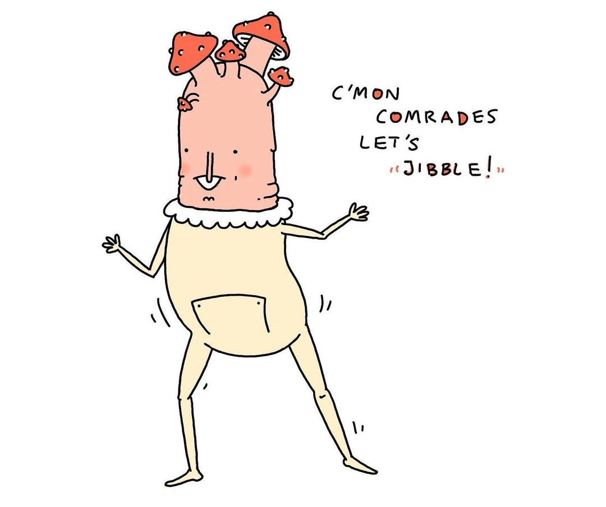
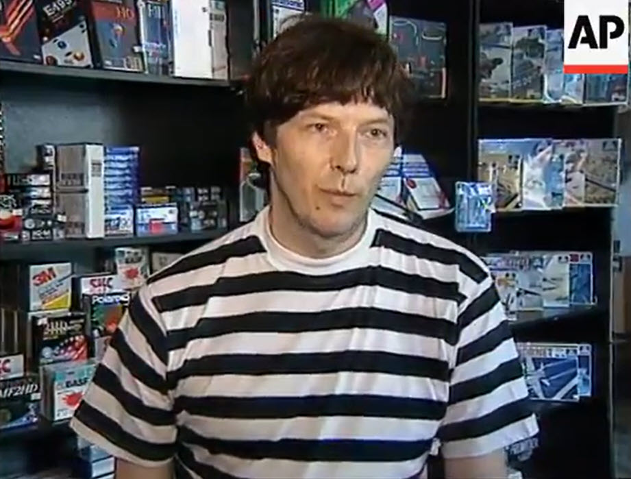

## Meta

Reminder: this site is an [iterative experiment](<../../../111>), so let's ~~put on the janitor hat~~ jibble:

## This week's summary

I'll keep this one short. I've had 10 Say Hi calls this week, 9 of them with people I've never met before. A part of me wishes I could share more about them here. But, one of the reasons I enjoy them so much is their anonymity by default. These calls, along with writing and studying, are taking a lot of my time (+30h per week), and I'll have to make some changes to the writing schedule. 

I will take advice from the man who decided to [walk for vice president](https://www.w4vp.com)—instead of stopping and making drastic changes, I'll slow down. More on that next week.

An unexpected side effect of writing/building here plus chatting with random internet strangers™ as a part-time job is that I'm getting more recommendations to put here (more than I can find via [Places to Find Indie Web Content](<../../../Places to Find Indie Web Content>)!). Sometimes, if I'm lucky, they send me something they made themselves and I put it here.

### Next week

- Learn more and write about [Asemic Writing](<../../../Asemic Writing>)
- Stick to shorter notes
- Share one experiment

## Favourite project

[(the) Gnorp Apologue](https://store.steampowered.com/app/1473350/the_Gnorp_Apologue/) — "(the) Gnorp Apologue is the journey of the gnorps as you guide them towards their goal of delightfully excessive wealth accumulation." (reader recommendation) ^8723e6

[Atkinson Hyperlegible](https://brailleinstitute.org/freefont) — a free typeface optimised for visually-impaired people (reader recommendation.)

Despite its use-case, it **does not** feel like a compromise. It's very legible even with low contrast, it ensures that characters are maximally distinguishable, but at the same time it feels very polished (e.g. it's waaaay better kerned than most of the web fonts I see).

## Favourite site

[mymind](https://mymind.com)— I'm a sucker for bold, serif typography and their colour palette. I don't think I'd use their product, because I don't want vendor lock-in for my second brain, but the site looks gorgeous and I want it to have babies with more websites, more designs. Then, put them here in my tiny serif font zoo.

## Favourite piece of tech

[ArVid: how Russians squeezed 4 hard drives into one VHS tape in the 90s – Jacob Filipp](https://jacobfilipp.com/arvid-vhs/) —  I wasn't born in post-Soviet Russia, but this article took me back to a familiar place. I remember buying game magazine CDs at a flea market in Vienna, or travelling for 1.5h from my village in the mountains to Kraków – just to get a totally legit copy of Diablo 1 at a bazaar. 

Visit for the time travel, stay for the tech. It's a longer read but it's done by someone who doesn't just know what they're talking about. It's a labour of love.

[Val Town](https://www.val.town)— val.town is a social site/code platform allowing you to build and deploy small functions/code sketches. Their pitch:

*If GitHub Gists could run*
*And AWS Lambda were fun*

It has a pretty comprehensive "standard library" (or set of available packages) including features such as: HTTP responses, CRON jobs or even sending emails with a single import + function call (zero config)! 

*Node-based programming explained in a single drawing*

[TouchDesigner | Derivative](https://derivative.ca/UserGuide/TouchDesigner) — TouchDesigner is a node-based visual programming tool used for interactive media installations, processing/p5.js style generative art, multimedia performances. I wrote about it more extensively here: [TouchDesigner (and Mr Noto, the Talking Ball)](<../../../TouchDesigner (and Mr Noto, the Talking Ball)>).

## Interesting articles

[Turning an iPad Pro into the Ultimate Classic Macintosh ⌘I  Get Info](https://blog.gingerbeardman.com/2021/04/17/turning-an-ipad-pro-into-the-ultimate-classic-macintosh/)— [Math Sephton](https://twitter.com/gingerbeardman) creates PlayDate games. He also turned his iPad into a Macintosh and uses to to create 1-bit wood block art. It looks gorgeous.

[grid: dabble in precision: fundamental principles](https://cssprinciples.com/3/grid/)— an interactive **very comprehensive** intro to CSS grid. 

[Mario Zechner (Mastodon)](https://mastodon.cloud/@badlogic@mastodon.gamedev.place/111818406701804569) — Mario Zechner is an Austrian developer who became weirdly successful at using tech to [expose/ridicule corrupt politicians](https://www.wired.com/story/heisse-preise-food-prices/). To do so, he uses relatively simple tech in creative ways. I find that inspiring.

[Crusty, the Indestructible Mac](https://geocities.ws/rehasoft/crusty.html) — they tried to drown him, they tried to bury him alive. But Crusty kept coming back, stronger than ever, crustier, angrier. 

(It's a strange read after having finished Annihilation last week. Perhaps they buried him in Area X, or perhaps it was the *brightness* that kept him alive.)

### Watching/reading this week:

- [Magic Ink: Information Software and the Graphical Interface](http://worrydream.com/MagicInk/), plus some commentary:
	- [Magic Ink by Bret Victor | Future of Coding Podcast](https://futureofcoding.org/episodes/060.html)
	- [‘Magic Ink’ and the evils of interaction design! – Platformability](https://blog.caplin.com/2012/03/02/8630/)

## Things I wrote last week that people liked

- [Zhoozh](<../../../Zhoozh>)
- [TouchDesigner (and Mr Noto, the Talking Ball)](<../../../TouchDesigner (and Mr Noto, the Talking Ball)>)

Thanks for reading! See you on Monday!

