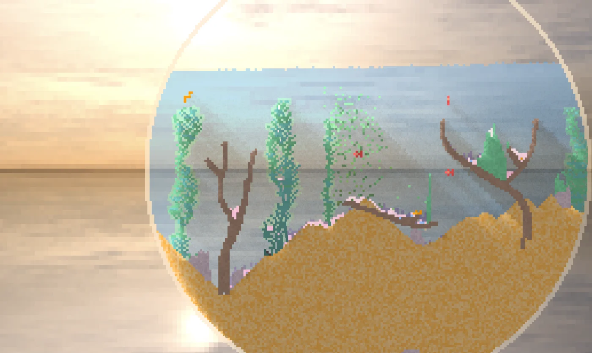

## Meta

Reminder: this site is an [iterative experiment](<../../../111>), so let's ~~put on the janitor hat~~ welcome the mysterious foreign duck:

## This week's summary

The 200 year old (!) magnolia tree in my neighbour's garden is blossoming. It's sunny, warm, beautiful. It's been really, *really* hard to stay inside, but at the same time I felt much more productive this week. Getting out of the house helped me get out of my head and everything feels just lighter.

### Past week

Lesson 01: After almost 100 days of writing here (almost) daily I've learned that the best way to guarantee that **I won't** write about something is to add it to a writing prompt for the next week.

Lesson 02: What works instead (demonstrated by the content shared this week):

- responding to a question sent by a stranger via email → [Spikes](<../../../Spikes>)
- revisiting an old piece of work or expanding on a conversation I had when walking Mango ([Tip of the Tongue and Handmade Software](<../../../Tip of the Tongue and Handmade Software>))
- sharing something I found funny ([Jeremy Bent-ham](<../../../Jeremy Bent-ham>))
- documenting something I learned about ([Talk to the Blog](<../../../Talk to the Blog>))

I'm still organising this knowledge in my mind and I'll post something more useful/actionable once we have reached 111 days. The **fun** part is sharing something useful by *exploring* it with the reader. The **difficult** part is to making those evergreen notes feel polished and accessible.

### Next week

If something doesn't work, change it. But don't fix what's not broken — instead crank it up to 11 and keep pushing it til it breaks! That's my plan for this week: prioritise talking to people, responding to questions, spinning out little (incl. "boring") prototypes and write about them as I go.

#### What I'm playing with at the moment:

- Tools for [Expressive Writing](<../../../Expressive Writing>): 
	1. analysis/feedback using ML 
	2. using Ensō as an Expressive Writing tool (related resources: [Using Writing to Process Your Emotions](<../../../Using Writing to Process Your Emotions>), [Summarise My Weekly Notes (With Llamas)](<../../../Summarise My Weekly Notes (With Llamas)>))
- Messing with smaller realtime projects:
	- collaborative doodles with [Partykit](https://www.partykit.io), OR
	- analytics GUIs with Elixir + Phoenix
## Favourite project

[Orb.Farm](https://orb.farm) — a tiny virtual ecosystem, filled wit creates that live, grow, interact and die. If you want to learn how to build your own, check out this recent [Coding Train](https://www.youtube.com/watch?v=L4u7Zy_b868) tutorial. This project was created by the author of [sandspiel.club](https://sandspiel.club). 

Related: [Sandboxes, Games, and Play](<../../../Sandboxes, Games, and Play>)

[Graphical User Interface Gallery](http://toastytech.com/guis/) — inspired by a conversation with a new Say Hi friend, I started digging through a list of old GUI galleries and stumbled upon this catalog.

[Damn Small Linux 2024](https://www.damnsmalllinux.org) — I don't use Linux much nowadays, but DSL was one of my favourite distros back in the day. I used to run the previous version of it on a my grandpa of computer (60MHz, 8MB RAM) in the early 2000s. I remember it was so responsive I felt like the context menus would appear on the screen *before* I clicked!
## Favourite site

[BorisTheBrave.Com](https://www.boristhebrave.com) — Boris is a developer writing about procedural generation and game design. I spent an entire morning reading up his tutorials on tiling algorithms. 

[Little Alchemy 2](https://littlealchemy2.com) — a crafting game with an aesthetic reminiscent of the early 2010s Flash games. I'm sharing this since everyone's talking about [Infinite Craft](https://neal.fun/infinite-craft/) anyway.

## Favourite piece of tech

[LLaVA-1.6: Improved reasoning, OCR, and world knowledge | LLaVA](https://llava-vl.github.io/blog/2024-01-30-llava-1-6/) — LLaVA is a multimodal language model I briefly mentioned in [Summarise My Weekly Notes (With Llamas)](<../../../Summarise My Weekly Notes (With Llamas)>). This version claims to surpass Gemini Pro (a commercial model), which makes it even more exciting given its current use cases, such as allowing blind or visually-impaired people to interact with images by auto-captioning them ([source](https://2mb.codes/~cmb/ollama-bot/)).

[CoronaFaceImpact](https://v-fonts.com/fonts/coronafaceimpact) — a variable font supporting only one character (you).

## Interesting articles

[Classification of Tilesets – BorisTheBrave.Com](https://www.boristhebrave.com/2021/11/14/classification-of-tilesets/) — an article I wish I had read before I played with tilesets in my games for the first time.

[Dorf Fort](https://www.androidarts.com/df/dorf.htm) — illustrations of the characters and creatures from Dwarf Fortress.

[In Loving Memory of Square Checkbox @ tonsky.me](https://tonsky.me/blog/checkbox/) — a visual history of the humble check box, created by the author of [Grumpy Website](https://grumpy.website).

[jh3yy (birdsite)](https://twitter.com/jh3yy) — a creative coder messing with CSS and modern Web tech. I like the balance between theory and application in his [threads](https://twitter.com/jh3yy/status/1748283435435835684). (I wish he kept his mastodon profile up to date.)

[Around the World in Eighty Lies | The Walrus](https://thewalrus.ca/around-the-world-in-eighty-lies/) — "How a writer fabricated a series of stories for Atlas Obscura".

## Things I wrote last week that people liked

- [Jeremy Bent-ham](<../../../Jeremy Bent-ham>)
- [Tip of the Tongue and Handmade Software](<../../../Tip of the Tongue and Handmade Software>)

Thanks for reading! See you on Monday!

P.S. If you liked Orb Farm, you might enjoy [this](https://www.youtube.com/watch?v=woSFGeMpoxI) or the scaled-up version, [here](https://www.youtube.com/watch?v=-q7z8sm5UaM).

