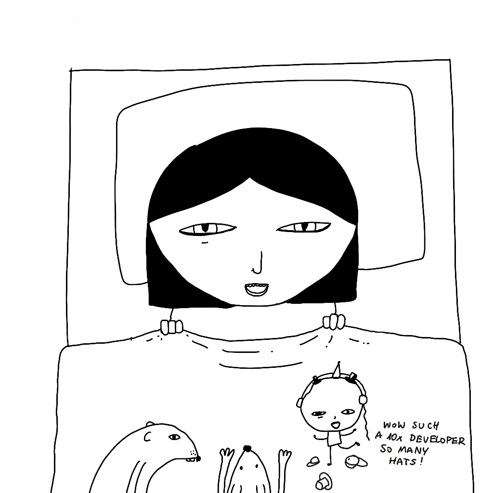
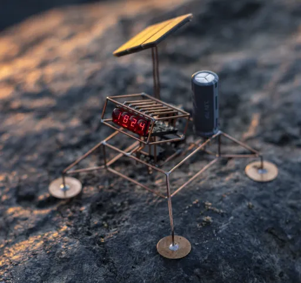

## Meta

Reminder: this site is an [iterative experiment](<../../../111>), so let's ~~put on the janitor hat~~ stay in bed and get some rest:

*(I don't look like this, but that's how I felt)*

## This week's summary

Hey, how have you been? We skipped two weeks because of health reasons (I'm ok, it wasn't the plague).

### Next week

I'm also working on a little side project I'd like to share with you next week. Here's a clue:


and 


What is it? [Take a guess](mailto:hello@sonnet.io?subject=doodle). The winner will receive a personalised doodle of uncertain quality. You don't have to guess right. Guess interesting.


Between [markdown-infused](https://mastodon.cloud/@raf/111929394577675925) fever dreams I've been reading up on [Asemic Writing](<../../../Asemic Writing>), less-known numeric systems, as well as messing with browser security. Expect a quick write-up on at least one of those things.

## Favourite project


*by [Mohit Bhoite](https://www.bhoite.com)*

[Sculptures](https://www.bhoite.com/sculptures/)— a series of Electronic sculptures by Mohit Bhoite.

[Hanakami.Art](https://www.hanakami.art) — the art of folding flower petals. Project created by [Michael Lai](https://linktr.ee/michael_lai), one of the people who contacted me via Say Hi.

[Open Broadcaster Software | OBS](https://obsproject.com) — I had to record a bunch of screencasts in the past few days and, being the cheap bastard I am, I decided to get back to OBS instead of using Loom. It's impressive to see how much OBS on Mac has improved in the last 2 years. Audio capture works flawlessly, resource usage is low, and the video quality is better than Loom's.  ([Screencasting with OBS](<../../../Screencasting with OBS>))


[Atuin - Magical Shell History](https://atuin.sh/) — a nicer TUI around shell history w. cross-device sync. I rely on shell history as my short-term memory and have used [fzf](https://github.com/junegunn/fzf) in the past, but atuin seems even easier to set up.
## Favourite site


[Mac OS 9 Wallpapers in 5K Resolution – 512 Pixels](https://512pixels.net/projects/mac-os-9-5k-wallpapers/) — I'm sharing this one because someone published a collection of all OSX wallpapers online which made me think of this peak mid- late-90 aesthetic. I mean, this flower looks like it was taken from a [No Doubt music video](https://www.youtube.com/watch?v=TR3Vdo5etCQ).


## Favourite piece of tech


[Cistercian numerals](https://en.wikipedia.org/wiki/Cistercian_numerals)— a ligature-based numeral system popularised by the Cistercian Order in the 13th century.

[SDXL⚡️lighting](https://fastsdxl.ai) —  SDXL⚡️lighting is to diffusion models what [Groq](https://groq.com) is to most mainstream LLMs. It's a model generating results faster than you can type.

But more importantly, Alex Volkov put these two tools together and created a modified version of Neil Agrawal's [Infinite Craft](https://neal.fun/infinite-craft/) . You can find the demo [here](https://twitter.com/altryne/status/1760561501096575401?s=20). For more context on alchemy/crafting games, check out [the previous weekly note](<../54>).


*credit [RetroArch](https://www.retroarch.com)*

[RetroArch](https://www.retroarch.com/index.php?page=platforms) — is a front-end for 100s of emulators and game engines. If you have a copy of a game you could play in the past – you can probably get it to work with RetroArch.

Another interesting thing about RetroArch: you can run it on \*nix, Windows 11, Windows 3.11, Haiku (BeOS). Do you want to run your favourite DOS games using a Win 3.11 VM hosting an emulator from 2024? You madman! Should you? Probably not. Could you? Yes, most definitely.

[A random dungeon generator that fits on a business card (2019) | Hacker News](https://news.ycombinator.com/item?id=39420385) — I'm not much of a code golf expert, although I'm easily impressed by it (self-imposed constraints as a creativity booster are my kink). I'm sharing this mostly because of a comment describing how to render an ASCII dungeon in 50 characters:

```sh
w=(╱ ╲);while :;do echo -n ${w[RANDOM%2]};done
```

Result [here](https://i.stack.imgur.com/fRX05.png).

## Interesting articles

[A Unified Theory of Fucks by Mandy Brown](https://aworkinglibrary.com/writing/unified-theory-of------) — you have a limited number of fucks so use them wisely. 

[The Glymphatic System – A Beginner's Guide - PMC](https://www.ncbi.nlm.nih.gov/pmc/articles/PMC4636982/) — the glymphatic system is a relatively recently discovered pathway responsible for removing waste and toxic substances from brain, especially during sleep.

[Neural Network Diffusion](https://arxiv.org/abs/2402.13144) — a paper discussing using Diffusion beyond image/video generation.

Last month I was reading about Linear Time-Sequence Modelling and [Mamba](https://maartengrootendorst.substack.com/p/a-visual-guide-to-mamba-and-state), then just a few days ago we learned about [Gemini and its 10mm token context window](https://blog.google/technology/ai/google-gemini-next-generation-model-february-2024/#architecture). The pace of progress and amount of information generated about ML is mind-boggling.


[Tailwind marketing and misinformation engine](https://nuejs.org/blog/tailwind-misinformation-engine/) — read it whether you like/use tailwind or not. I don't like the tone of this article, and the weird tribalism around web tooling (I'm saving my fucks for more important problems). But, the article does make some solid points regarding the distinction between "generic" and "utility-first" CSS. Don't stop reading there and for more context check out: [What is Utility-First CSS?](https://heydonworks.com/article/what-is-utility-first-css/) by Heydon Pickering. 


[Scientific Journal Publishes AI-Generated Rat with Gigantic Penis In Worrying Incident](https://www.vice.com/en/article/dy3jbz/scientific-journal-frontiers-publishes-ai-generated-rat-with-gigantic-penis-in-worrying-incident)— I said *interesting*, not important. Another reason I'm sharing this is that the Vice website seems to be [shutting down](https://writing.exchange/@ernie/111977450241144169). 

## Things I wrote recently that people liked

- [2-2-2 Project Scoping Technique](<../../../2-2-2 Project Scoping Technique>)

Thanks for reading! See you on Monday!

P.S. have some Turkish music for Saturday morning:


P.P.S. Did you notice that the mouth of a goat looks a bit like an evil rabbit? 


That makes two of us.


See you next week!
