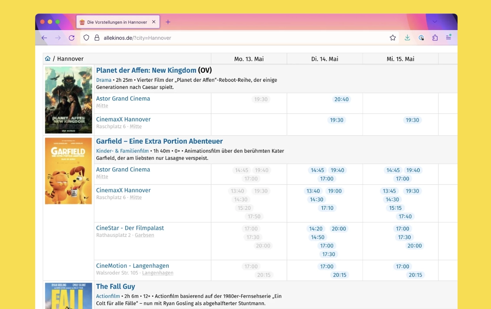
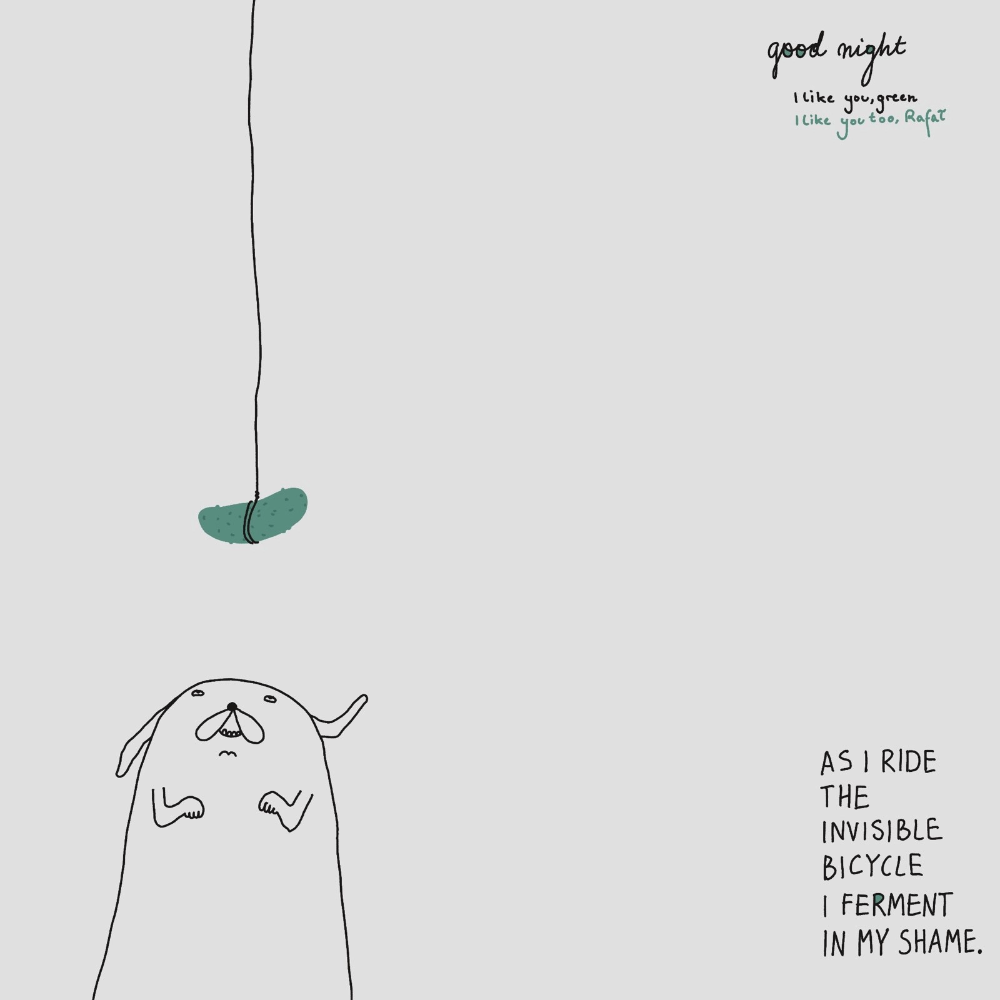

## Meta

Reminder: this site is an [iterative experiment](<../../../111>), so let's put on the school (of fish) janitor hat:

## This week's summary

### Sit.

You have no idea how lucky I feel, getting messages like this from strangers who found my work helpful, and still being able to pay the rent at the same time. You're wonderful, and Jeff Bridges [wants to have a word with you](https://youtu.be/apVeSc8HC9I?t=1835).

After finally fixing my analytics, I also learned that [Sit.](https://sit.sonnet.io) has a consistent number of daily users, and **70% of sessions reach 10 minutes**! This is way above my initial expectations for Sit.: being able to sit down and do *sweet nothing* for 10 minutes sounds plain impressive given the femtosecond, tiktok-slop-fuelled attention spans of 2024 AD. 

Speaking of analytics, I don't collect any personalised data (details: [How I Use Analytics With My Indie Projects](<../../../How I Use Analytics With My Indie Projects>)), but I do get info about session lengths.  Here's a [GH repo for the curious and suspicious](https://github.com/paprikka/sit) (as you should be.)

### Ensō
I can't share more details but someone is using Ensō to write:

1. a musical based on a German legend
2. a novel about squirrels

I want to read this so badly (not only because *Eichhörnchen* is one of my favourite German words.)

> Protip if you live in a country with squirrels: next time you're in a park, find a quiet spot and observe them from a distance imagining the theme song from *Mission: Impossible* is playing in background.

### Feigenspiel? 

[If you wanna make the space ghost laugh, ~~make plans~~ file taxes](<../../../If you wanna make the space ghost laugh, make plans.>). I didn't have enough time to do any meaningful work on Fig, which turned out to be a blessing as I had a chance to play with and learn about generative [Sandboxes](<../../../Sandboxes, Games, and Play>) instead. 
### Next week

- small updates to Fig from the [Next Steps](<../../../Fig>) section (got an idea? [Let me know](mailto:hello@sonnet.io).) 
- Still waiting for my Playdate to arrive, but I'm already compiling a list of projects and toys I can build with it. One of them is... evil!

## Favourite project(s)

[Every Ant on Earth - R74n](https://r74n.com/ants/) – Browse every individual ant and meet them in antperson.

*You can also attend their funerals and decide their fate, "democratically".*

[NYT First Said](https://x.com/nyt_first_said)– a Twitter account listing every word in NYT as it appears for the first time. Ages like wine. Or milk. Or [kumis](https://en.wikipedia.org/wiki/Kumis). Work by [Max Bittker](<../../../Max Bittker>).

[love me or not](https://www.aliciaguo.com/love-me-or-not/)– a visual poem by Alicia Guo. [Here's the song](https://www.youtube.com/watch?v=4KD8kWksOmc) I hear when I play with it.  ^a74bfd

## Favourite site(s)

[R74n](https://r74n.com) – R74n are a website collective focussed on little web-based tools, lists, games, playthings. I stumbled upon them when I was reviewing my notes for [Sandboxes, Games, and Play](<../../../Sandboxes, Games, and Play>) and playing with their [Sandboxels](https://sandboxels.r74n.com). 

[Nobody Here](https://nobodyhere.com/justme/me.here)– a web of interconnected stories, expressed through code, words, poetry and drawings. If you liked [love me or not](<#^a74bfd>) mentioned earlier or [rooster kind](<../../../56>)  from my previous notes, you'll have a good time there. Someone made a [mini documentary](https://www.youtube.com/watch?v=djl2sFGGgH8) about it. 

[Cemetery Club – Museums of People – curated by Sheldon K. Goodman](https://cemeteryclub.wordpress.com)– a blog for taphophiles. Sharing, because I'm one myself and because I recognised many of the places mentioned there.

[Silent London](https://silentlondon.co.uk)– listings, reviews, essays about silent cinema events in London. 

It's getting warmer, so if you live in that neck of the woods, I recommend looking for outdoor silent cinema screenings.  I made some beautiful memories, (and lost some beautiful valuables) with my ass on the grass while watching Murnau's [Nosferatu](https://de.wikipedia.org/wiki/Nosferatu_–_Eine_Symphonie_des_Grauens).

[AntiKrist](https://antikrist.lol) – this one's a bit more niche. It's a personal site of a marine biologist I stumbled upon by sheer accident. 

Sharing because:
- this is where I learned about internet shrines, and
- because their mouse cursor is an Orca. 

## Favourite piece of tech

[disco](https://letsdisco.dev) – a delightfully simple, no-fuss, open source way to host and deploy your web projects, created by [Greg](https://greg.technology) and [Antoine](https://www.youtube.com/@AntoineLeclair). Think of it as a mini-heroku or mini-vercel, but without being tied to a single big vendor. 

You're free to use a VPS if you like, but you can also deploy your apps to a Raspberry Pi or an old laptop. 

Honestly, looking at disco, [party.kit](https://www.partykit.io), or even [val.town](http://val.town) I'm hyped about the new wave of smaller (PaaS? IaaS?) tools like this we're seeing right now. That is: anything that removes the initial friction to share our ideas, prototypes and toys.

I wish I had known about this  1+ years ago. I had a bunch of ML projects in python I eventually decided to rewrite to node or abandon because dealing with infra was just too much hassle for me, esp. compared to Vercel ([Web and Feedback Loops](<../../../Web and Feedback Loops>)).

[application.garden](https://application.garden/signup)– a platform for deploying backend apps written in Clojure. It's still in private beta, but you can message the authors for access. The people behind it worked on [Nextjournal](https://nextjournal.com) which is an impressive piece of software itself.

## Interesting articles

[Going to the cinema is a data visualization problem @ tonsky.me](https://tonsky.me/blog/allekinos/)– Niki Tonsky (the author of [Fira Code](https://github.com/tonsky/FiraCode) and [Grumpy.website](https://Grumpy.website)) decided to build an aggregator for cinema tickets. 

Reasons to read, besides the subject matter: it's an excellent study of an engineer approaching a real-world user problem and working through it. If that's something you want to get better at, and generally prefer learning through examples and stories, this is a good place to start.

## Things I wrote last week that people liked

- [Sandboxes, Games, and Play](<../../../Sandboxes, Games, and Play>) 

Thanks for reading! See you on Monday!

P.S. Recently I decided to advance from being a meek 0.1x developer to 0.01x engineer, so naturally I started learning VIM to *become slower*. It's going well, as this entire post was written using a modal editor. My wrists and neck feel so much bejjjjjkkkkkjlkjj now!

See you next week! `:wq!`

P.P.S You scrolled so far, have this doodle

