## Meta

Reminder: this site is an [iterative experiment](<../../../111>), so ~~let's put on the janitor hat~~ happy (belated) [World Goth Day](https://www.youtube.com/watch?v=WPw7nlluRdc)!

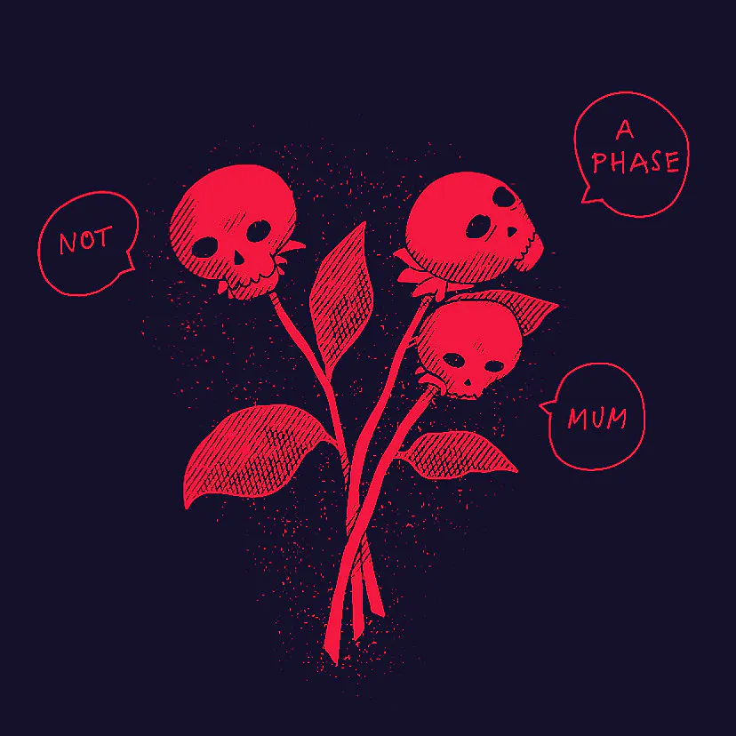

*Can you smell clove cigarettes?*

## This week's summary

#### Fingerlings ([🎶](https://www.youtube.com/watch?v=OhPFYPuW6dk))

I'm trying to take better care of my wrists and meatsticks and bought myself a [split keyboard](https://www.zsa.io/voyager). It's super comfortable. Or should I say *unquestionably* comfortable, as I'm still looking for the `?` key.

*(I'm not kidding, I even contacted their support asking if this was some sort of a test to see if I can learn to customise the layout myself.)* 

#### CDN(-ot now please)

Videos on untested stopped working due to the amount of traffic. Thanks for watching! I've upgraded my Cloudinary subscription for now, but will move to a simpler CDN setup (Bunny CDN, or uncle Bezos' simple storage shed). 

Lessons learned: 1) Cloudinary is expensive 2) they read your tweets and are happy to give you a discount if you ask.

#### Ensō
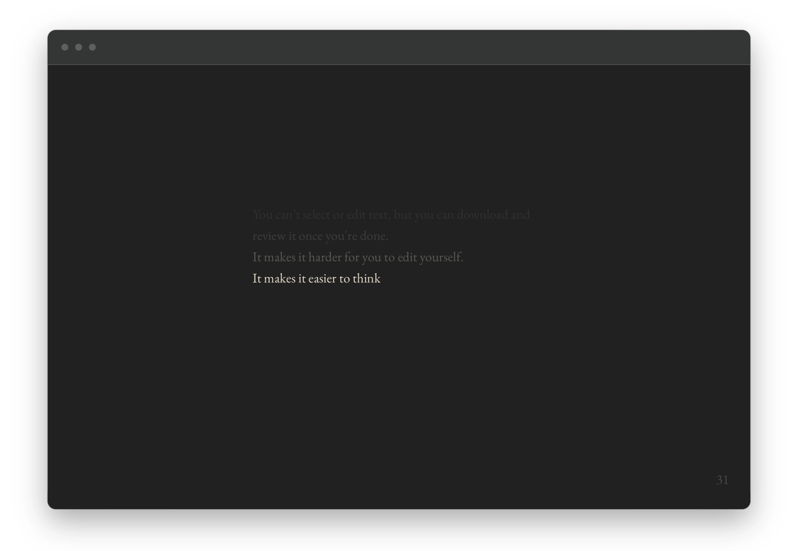

I've finally started working on a new version of [Ensō](https://enso.sonnet.io)! 

Historically, I avoided making any significant changes to it and **I'll keep it this way**. Having said that, I'd like to give people the ability to customise it a bit and allow for easier migration of features between platforms (I don't want to keep the web version as a moat). 

Ensō is private and I don't nag anyone for testimonials. Still, I've received a lot of feedback over the past 5 years so I'd like to organise it a little bit and share.

### Next week

- one small update for Ensō
- likely no newsletter, blame [King Gizzard & The Lizard Wizard](https://kinggizzardandthelizardwizard.com)
- drop everything and play with Playdate once it arrives
- find the missing `?` on my keyboard (perhaps it's travelling with my Playdate, perhaps their ship's name is Demeter and they haven't departed from Varna yet). 

## Favourite project

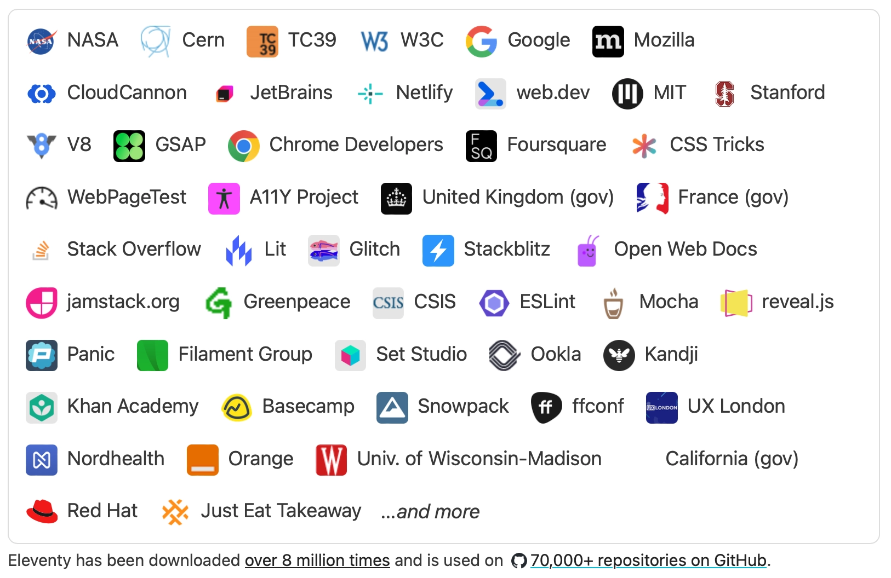

[Eleventy (11ty)](https://www.11ty.dev) – 11ty is a super simple, insanely flexible static site generator. It allows me to work with the web platform instead of piling trendy JS libraries on top of it. 11ty is the Pedro Pascal of static site generators–it looks modern and spicy, but ages like fine wine (@editor, leave it, I said, LEAVE IT!).

It has a wonderful, friendly community, and a ton of ready-made templates to get you started in case you want to focus on writing without getting distracted with bike shedding. I've been using it on [sonnet.io](https://sonnet.io) and a bunch of other projects for years. Even [the first version of untested](https://untested-30xjqk2l8-sonnet.vercel.app/posts/008/) was running on a basic 11ty template. 

Finally, [Eleventy](https://www.11ty.dev/blog/sustainability-fundraising/) is on the way to becoming sustainable this year. 

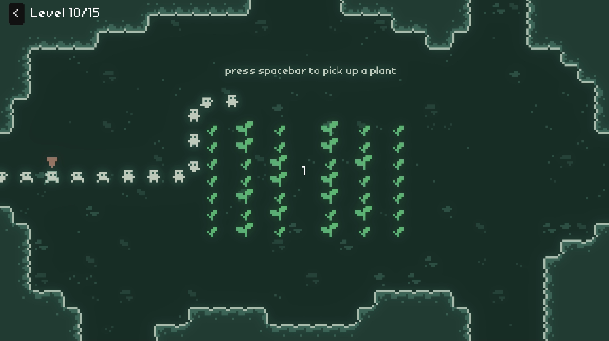

[A Gnormal Journey by jess::codes](https://jess-hammer.itch.io/a-gnormal-journey) – a small [Gnorp Apologue](<../53>) inspired game about fitting in. It looks neat, but the main reason I'm sharing it is the showcase video itself.

By Jove! This is one of the best walkthroughs/examples illustrating the process of building a small indie game I've seen. It's super comprehensive, dense and fun. I'm looking forward to seeing more of her work.

[Tauri](https://tauri.app) – Tauri is a lightweight hybrid-app development platform. I'm using it with the current version of Ensō and I'm planning to migrate to v2 of Tauri with Enso v2. 

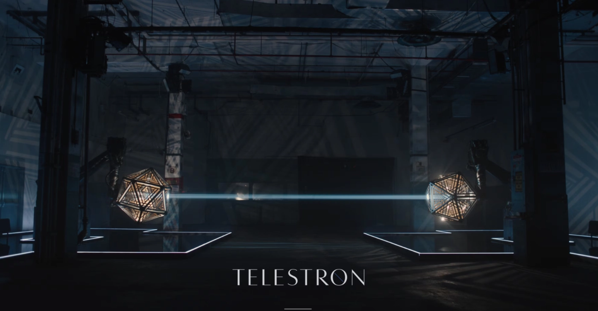

[The Munky King](https://gmunk.com/The-Munky-King) and  [Telestron](https://gmunk.com/Telestron)by GMUNK – I spotted these two demos when reading about the Windows 10 wallpaper being done using [traditional photography](https://gmunk.com/Windows-10-Desktop/) rather than CGI. 

The Munky King reminded of me [Façade](https://medium.com/werework-thinks/hello-this-is-façade-c20f7087b08d) – a small DIY photo studio project I made almost a decade ago (ingredients: a bunch of screens + an old wardrobe salvaged from an antique store on Brick Lane). 

*Taken using Façade. Check out the [gallery](https://500px.com/p/rafalpast/galleries/facade) and the [post-launch post](https://medium.com/@rafal/hello-this-is-façade-c20f7087b08d) here.*

Telestron just looks like a very difficult shrine level from Zelda BotW. (or, like the future where humanity is ruled by an oligarchy of expensive, but beautiful D20s.)

## Favourite site

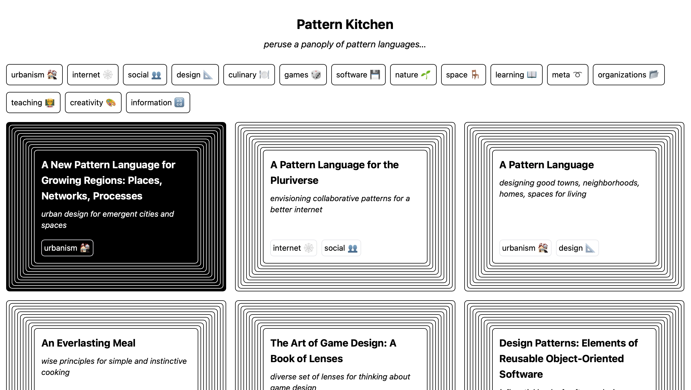

[Pattern Kitchen](https://pattern.kitchen)– a collection of patterns or pattern languages across different disciplines. In the past, a large part of my work involved translating between people working in different domains (think: designers, engineers, publishers, writers). This looks like a project I would've loved to have seen/played with then.

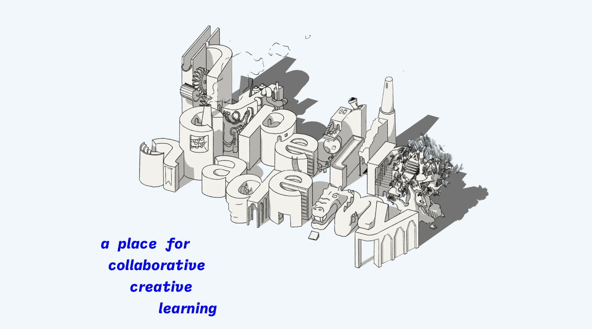

[Hyperlink Academy](https://hyperlink.academy)– a modern internet club and a platform to discuss and share your projects. I'm still messing with it and trying to decide if it's a good replacement for Discord or Slack based communities. The main reason I'm sharing it is the simplicity, subject matter and its design.

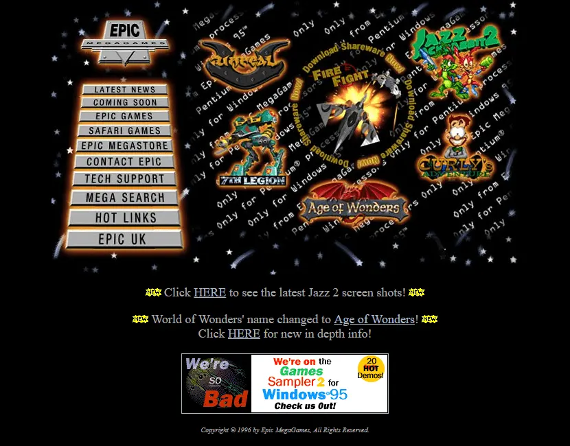

[Epic MegaGames in 1996 - Web Design Museum](https://www.webdesignmuseum.org/gallery/epic-megagames-1996)– have you ever played Jazz Jackrabbit? Play Jazz Jackrabbit.

Finally, the [Iron Triangle illustrated](https://trizuliak.com/experiments/good-fast-cheap). 

## Favourite piece of tech

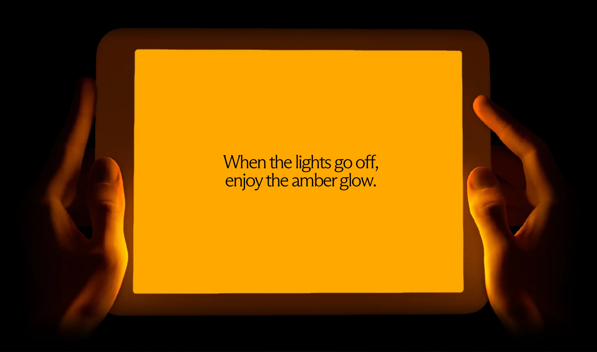

[Daylight](https://daylightcomputer.com) – a tablet-like computer with a paper-like display. I try to avoid posting things from the top of HN, and this is an exception. I would love to try using Ensō on that.

*Psst, psst,* I also made an app that makes reading in the dark more comfortable. It's called [Midnight](https://midnight.sonnet.io). 

Check out these notes to learn how to make one yourself, plus a basic intro to colour vision science: [Midnight Ramen](<../../../Midnight Ramen>), [Obsidian for Vampires](<../../../Obsidian for Vampires>), [Night Rider](<../../../Night Rider>), [Midnight Shader](<../../../Midnight Shader>).

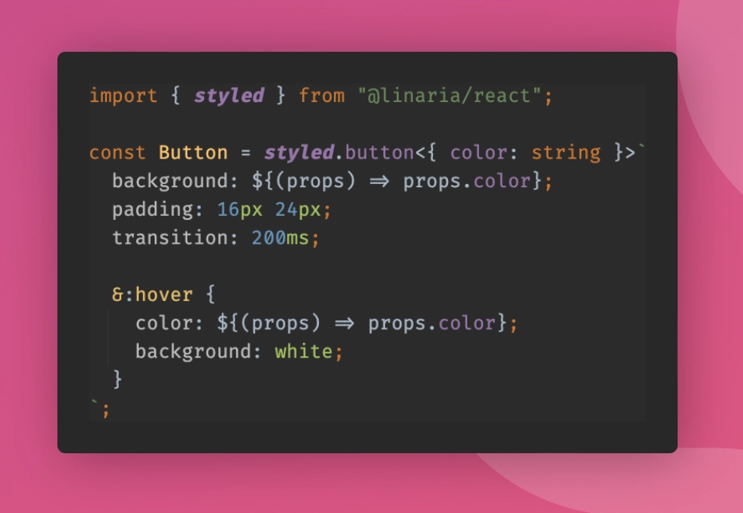

[Linaria – zero-runtime CSS in JS library](https://linaria.dev)– a CSS-in-JS alternative with almost zero runtime cost. Normally, I'd be hesitant to share yet another CSS library™, reasons:

1) My black turtlenecks are not nearly as good as the ones worn by tailwind CSS conference speakers. 
2) I've spent 20 years working with or building CSS tooling and in 99% of cases I'm just happy with vanilla, especially given how amazing it is in 2024.

**But**, if you have to use styled-components at work, consider giving it a go as a drop-in replacement. It might not work, but if it does, this might be a cheap improvement for your users (and your sanity.)

I spotted it reading [Rethinking Text Resizing on Web](https://medium.com/airbnb-engineering/rethinking-text-resizing-on-web-1047b12d2881) which reminded me of [Le Bat!](http://paprikka.github.io/le-bat/#/preview) – a tool for measuring visual contrast I built in 2013, (the year when every button needed a mandatory text-shadow.)
## Interesting articles (and videos)

[UI Density](https://matthewstrom.com/writing/ui-density/) – a dense (not a pun) intro to visual density including theory and some historical examples.

[Sal Khan is pioneering innovation in education... again](https://www.gatesnotes.com/Brave-New-Words) – on Sal Khan's new book and the potential use of LLMs as tutors. I recommend pairing it with [this](https://www.wheresyoured.at/sam-altman-is-full-of-shit/). Because we need more people like Khan, and fewer ~~demagogues~~ creeps like Altman.

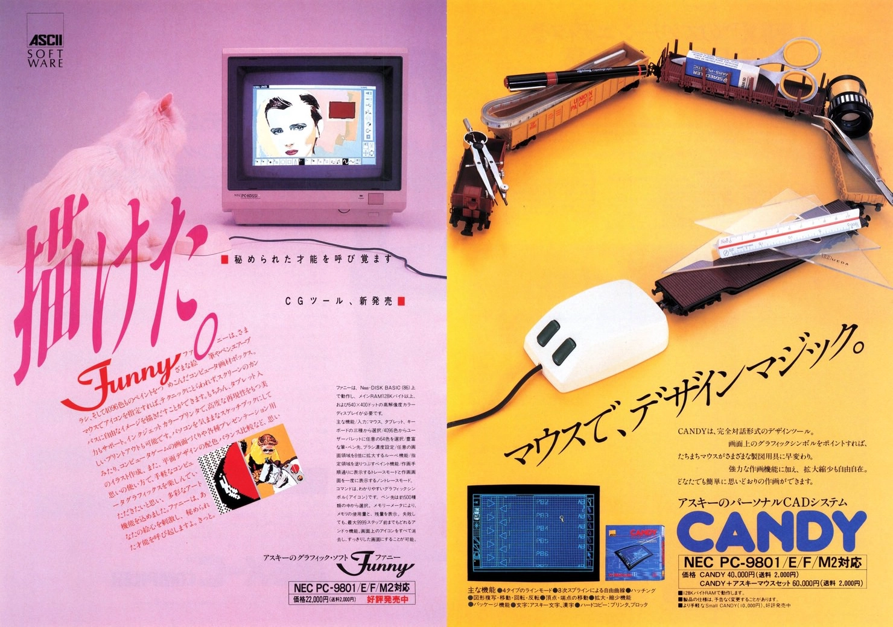

[List of vintage Japanese pixel/dot art software  ⌘](https://blog.gingerbeardman.com/2023/10/21/list-of-vintage-japanese-pixel-dot-art-software/) – the title speaks for itself. I shared Matt Sephton's work more than once here. And I probably mention his article about 1-bit woodblocks at least once a month during my [Say Hi](https://sonnet.io/posts/hi) calls.

Finally, [This demo that turns desktop into an Everything Canvas using tldraw](https://x.com/OrionReedOne/status/1793937287039910202) – I love this, I want my computer to be one spicy infinite canvas.

*Alternative title: if Mozilla [chromeless](http://www.mozillalabs.com/en-US/chromeless/), hypercard, and tldraw had a baby.*

## Things I wrote last week that people liked

- [Defaults Matter, Don't Assume Consent](<../../../Defaults Matter, Don't Assume Consent>)

Thanks for reading! See you next week!

P.S. Missing question mark update! As I was publishing this note, ZSA support got back to me, with a long, thoughtful, and patient reply to my support query. 

**TL;DR to type `?` I just need to hit `shift + /` like on every other keyboard I've ever had.** 

The keyboard looked so cyberpunk and cool that using it like everyone else didn't cross my mind. I am not embarrassed. You're embarrassed.

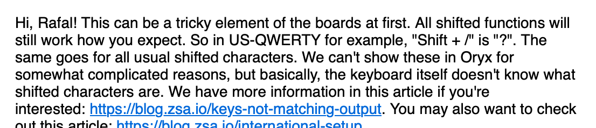

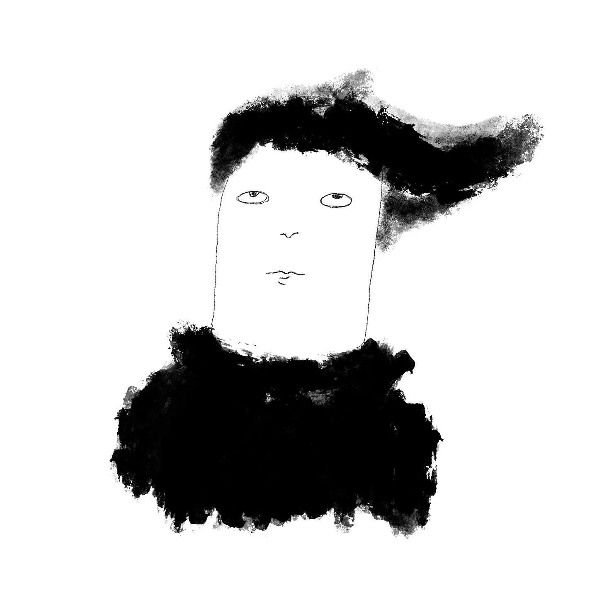

¿ ⸮ ¿ ⸮ ¿ ⸮ ¿ ⸮ ¿ ⸮ ¿ ⸮ ¿ ⸮ ¿ ⸮ ¿ ⸮ ¿ ⸮ ¿ ⸮ ¿ ⸮ ¿ ⸮ ¿ ⸮ ¿ ⸮ ¿ ⸮ ¿ ⸮ ¿ ⸮ ¿ ⸮ ¿ ⸮ ¿ ⸮ ¿ ⸮ ¿ ⸮ ¿ ⸮ ¿ ⸮ ¿ ⸮ ¿ ⸮ ¿ ⸮ ¿ ⸮ ¿ ⸮ ¿ ⸮ ¿ ⸮ ¿ ⸮ ¿ ⸮ ¿ ⸮ ¿ ⸮ 
