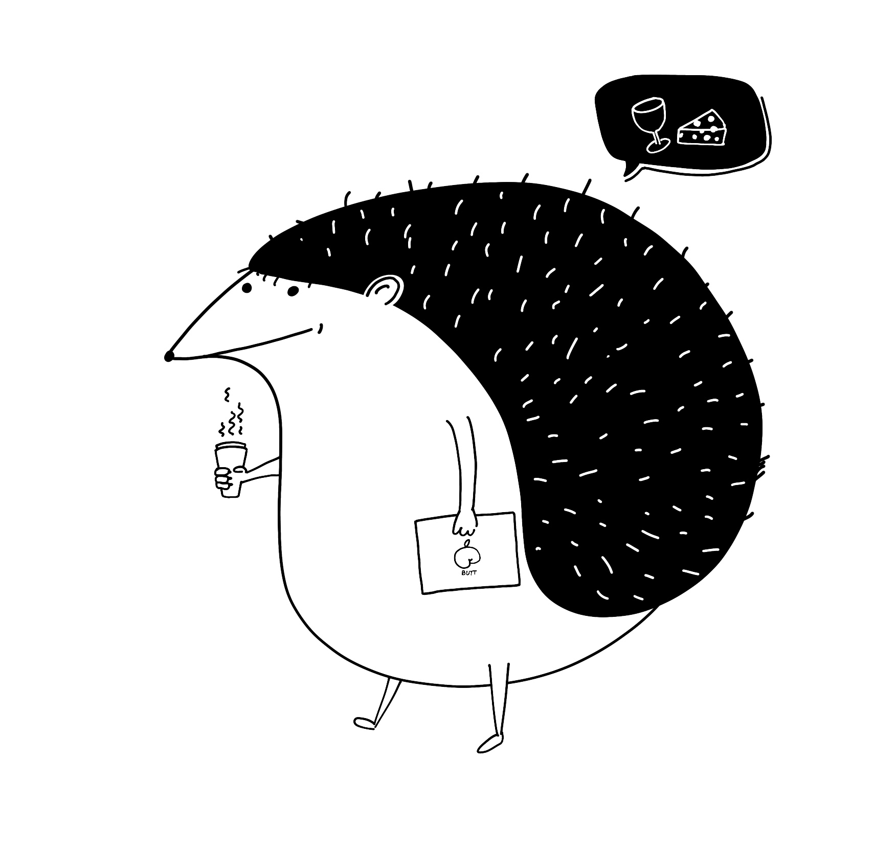
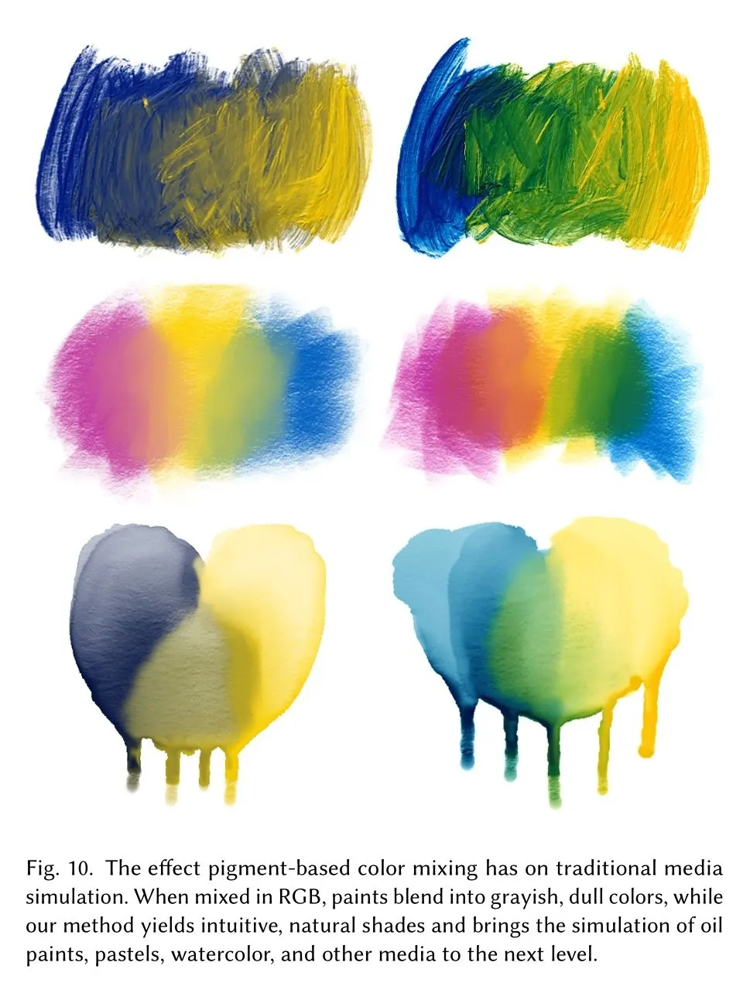
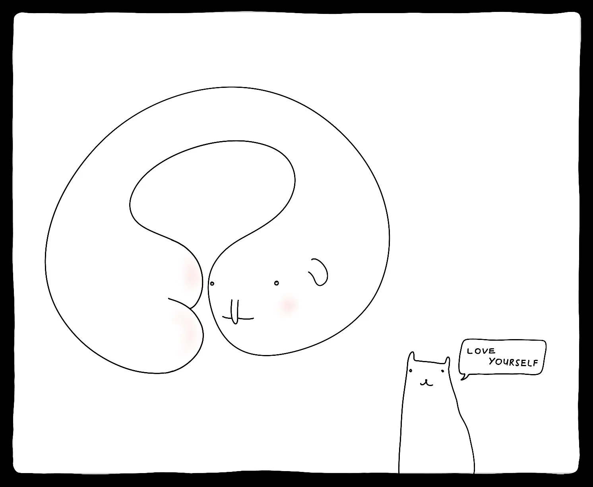

## Meta

Reminder: this site is an [iterative experiment](<../../../111>), so ~~let's put on the janitor hat~~ this one will be short and sweet, let's [half-ass](https://everythingchanges.us/blog/half-ass-it/) it(\*):

*Don't worry, my fairy goth mother is with us.*

\* Polish doesn't distinguish between long (ee /iː/) and short (i /ɪ/) sound so in my world, this phrase ✨ rhymes 🎶. See, I'm half-assing it already!

## This week's summary

### ❤️ Heartbeats for [Fig](https://fig.sonnet.io)

Small update, still WIP: start drawing without knowing how much time you have before the pixels disappear. Just focus on the process and the pleasure of drawing itself.

Enabling Heartbeats mode in [Fig](https://fig.sonnet.io) will do two things:

- hide the lifespan
- set it to a random value

This is just a super quick spike I did between meetings, so things will break, but I'm excited to play with it more. I like the frame of mind it puts me in. Cheesy as it may sound, it makes me think of my own mortality, but with the flavour of [wild strawberries and milk](https://youtu.be/8Tz9vEZNxqA?t=25). Learn more about how and why I made Fig [here](<../../../Fig>).

### Toys, toys, toys!

I'm still waiting for the Playdate to arrive. And, I'm a *very* impatient person (*a VIP, thanks Ms Editor*), so I sketched out a new game idea in the meantime. It's a roguelike game called *Walk my Dog*. More on that later next week. 

For now, feel free to check out my previous game: [How to Run an All-hands Meeting](https://rafsters.itch.io/all-hands). 'tis the OKR season after all. Also, remember to leave [some cocaine for David Bowie](https://x.com/hausofdecline/status/1798360762890752358/photo/1).

by [Haus of Decline](https://x.com/hausofdecline/status/1798360762890752358/photo/1)

### King Gizzard Francis Ford Coppola mode

King Gizzard and the Lizard Wizard had an acoustic gig in Brighton last week (spoiler: [Grace Cummings stole the show, ave maria](https://www.youtube.com/watch?v=WnJxakaDJ40)). I lost my old sunglasses and the only ones I could find to replace them look like this:

So, I watched the thing with my [Midnight Ramen](<../../../Midnight Ramen>) filter on. It reminded me this scene from Coppola's Dracula: 

It also made me reflect on how often and how I use [Midnight](https://midnight.sonnet.io). The answer is: 1-2 times per week, and not because of the reduced light exposure, but because of the non-distracting reading experience itself. JS + cookies are stripped from Midnight, so it seems to work as a better adblocker than my regular browser.

### Next week

- Fig heartbeats mode — either pull out into a separate drawing app or update the existing UX
- *Involuntary Music Playlist* — a quick post about a psychological music experiment I conducted on myself

## Favourite project

[Tristram by bippinbits](https://bippinbits.itch.io/tristram) — Diablo 1 told from the perspective of its main location.

Diablo 1 is one of my favourite games of all time. For a moment forget that Blizzard/Activision exists, that the game is dated and the character animations were motion captured from a paraplegic on ice.

When I was 10 our nanny had to drive us 1.5h to pick a perfectly legal copy of if from a (now non-existing) bazaar in Kraków.

Later that nanny left and another one came, then abruptly disappeared (with some of our belongings). In the aftermath, as we waited for our parents to come back home, my brothers and I played the entire game in 23 hours, taking turns, developing a complex economic system based on exchanging *main computer chair time*™ for tea or snacks, figuring out little hacks like using the broken game clock to duplicate items. Anyway, we're half-assing this weekly update, and I have so much more to say. STOP! two things: 

- don't get a nanny for your kids, if you have any.
- [get Diablo 1 from GoG](https://www.gog.com/en/game/diablo) and play it you filthy animal

## Favourite site

[anh version noir](https://anhvn.com) — just a lovely personal site I giggle at every time I see it. I don't completely understand why, but I keep reading its lines with the voice of Jeff Goldblum. The omission of a screenshot above is intentional.

## Favourite piece of tech

[Mixbox](https://scrtwpns.com/mixbox.pdf) – a physically-accurate colour mixing algorithm. Read the paper here, and the [tweet](https://x.com/cirkelnio/status/1793970960196055141) I stole this link from here.

[uxn/Varvara](https://100r.co/site/uxn.html) – a tiny, personal computing stack you can run on a variety of platforms. Project created by 100 rabbits. If you're into more niche, esoteric approaches to what we consider OSs/ways of interacting with computers, check it out!

## Interesting articles

[Half-ass it | everything changes](https://everythingchanges.us/blog/half-ass-it/)– I mentioned this article earlier in the intro, but I'm posting it again for visibility. **If you only follow one link from my notes today, it should be this one. This entire site is an exercise in what Mandy Brown was able to express in a single paragraph.**

Related: [Share your unfinished, scrappy work](<../../../Share your unfinished, scrappy work>).

[Yingzi](https://zompist.com/yingzi/yingzi.htm) – if English was written like Chinese. Incidentally, a decent intro to Hanzi, plus some brain food about the interplay between the language, writing systems and our thinking process.

[Answer.AI - SB-1047 will stifle open-source AI and decrease safety](http://www.answer.ai/posts/2024-04-29-sb1047.html)– by Jeremy Howard, including the potential ways forward.

Also:  [ongoing by Tim Bray · Parable of the Sofa](https://www.tbray.org/ongoing/When/202x/2024/06/01/Parable-of-the-Sofa), and  [Just Live - DRB](https://drb.ie/articles/just-live/)

## Things I wrote last week that people liked

- [Disclaimer!](<../../../Disclaimer>) 
- [LLM-powered Tools I'm Actually Using](<../../../LLM-powered Tools I'm Actually Using>)

Thanks for reading! See you on Monday!

P.S. 

See you next week!

