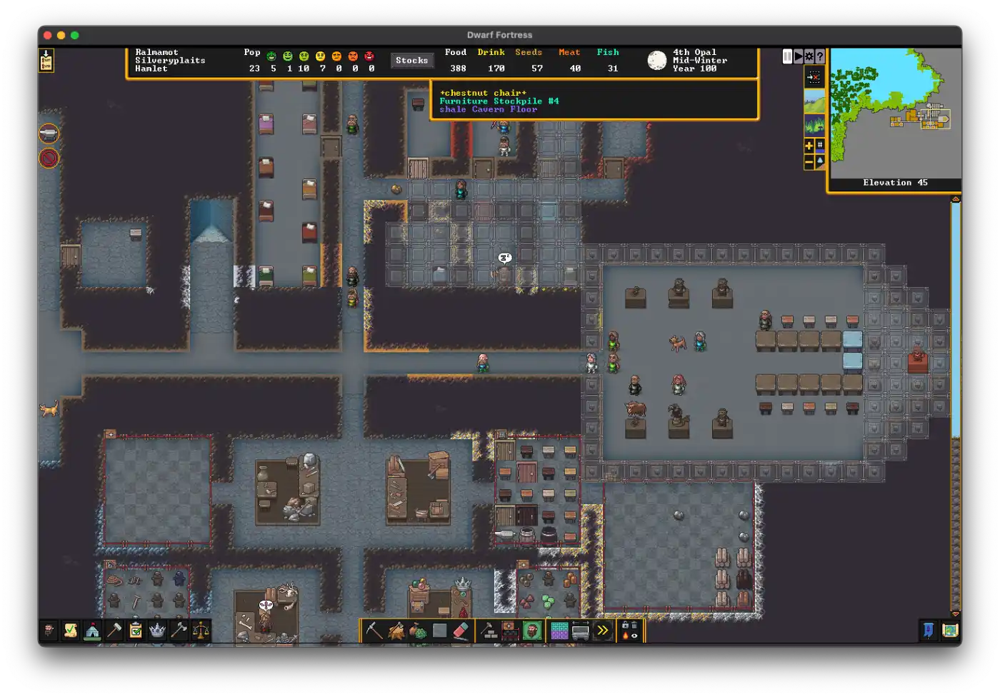
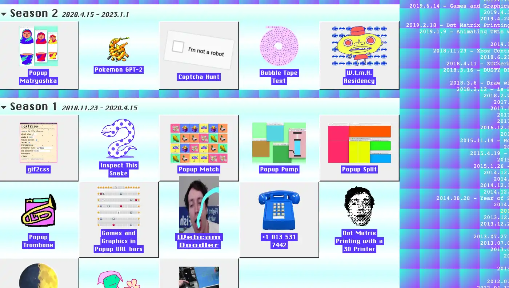
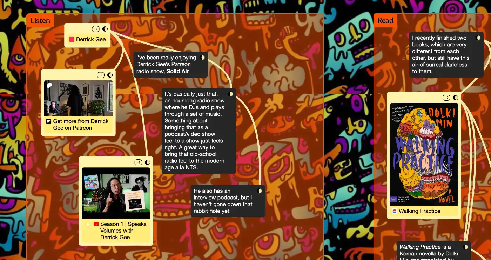
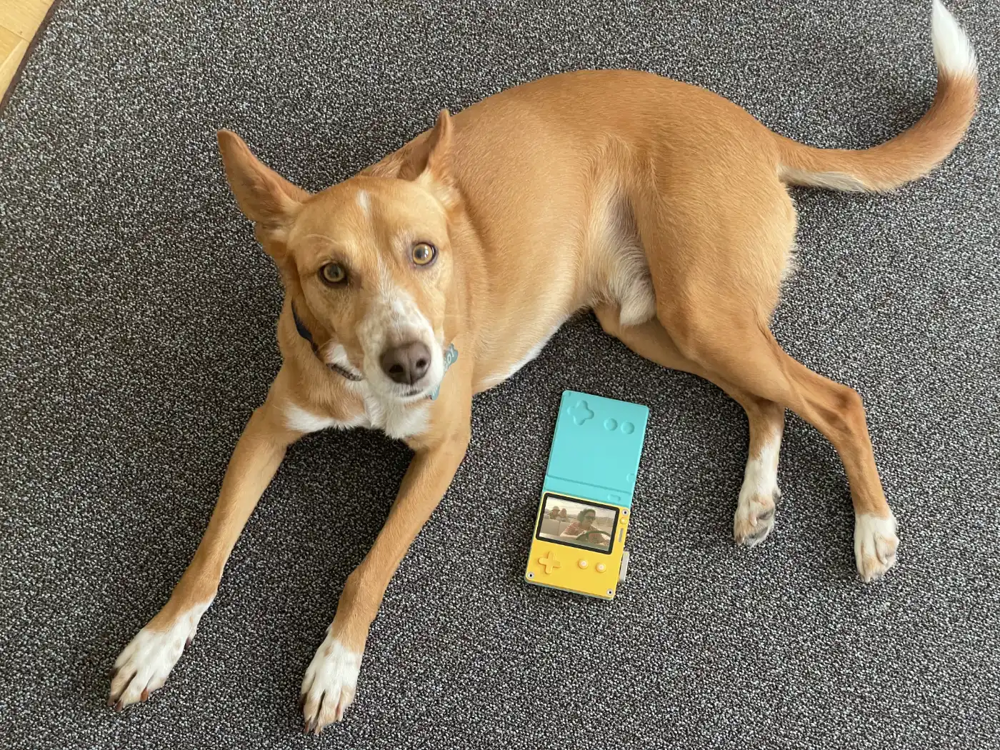

## Meta

Reminder: this site is an [iterative experiment](<../../../111>), so let's ~~put on the janitor hat~~ **welcome this festive sock because we reached 111 posts you handsome beast**!

## ~~This week's~~ summary

### 111!

> <iframe src=111#^032fa8 lazy>
> – yours truly, some time last year

A few days back I read a post by someone who said that what prompted them to write was a thing I wrote/shared here. This wasn't the first time it happened. And every time it does, I feel a burst of happiness. _(thank you, mr vice-president, you know who you are)_

I don't have a habit of celebrating milestones. I tend to just move on to the next thing. I don't think it's very healthy, and I'm trying to get better at this! But holy shit, we got there, and you're here with me! What the hell!

I am so grateful that people read this thing, follow my work and sometimes even message me with the (oftentimes) [beautifully weird](<../../../beautifully weird>) stuff they found. I'm so grateful you came over and spent your time reading this. Let the cycle of playing, learning, breaking and half-assing things continue!

#### Graaaaaains

Earlier this week I published [Just Some Innocent Gradient Fun](<../../../Just Some Innocent Gradient Fun>). It's a simple visual editor showing how to shade an image using noise, gradient maps and posterisation. It was inspired by this [YT tutorial by Texture Labs](https://www.youtube.com/watch?v=1poWgZWpsiY).

### Next week

In the next few weeks, I might write a more detailed note on what I've learned through running this experiment. For now, things will continue in their current shape.

This, whatever this is, works for me. I have feeling I'll be doing it for another few years, so I'm considering dropping Obsidian Publish and merging untested with my [blog](https://sonnet.io) .

## Favourite project

_Recommended soundrack for this section_

[Dwarf Fortress](https://www.bay12games.com/dwarves/) — I don't know how to describe it concisely. It's an **insanely** complex strategy/simulation/roguelike game where you manage a colony of dwarves.

> _Remember: losing is fun!_  
> – literally the first thing you'll see after starting the game

DF is notoriously difficult to start, has a terrible UX. But all of the self-inflicted torture can be a small price for one of the best examples of emergent narrative in gaming. Don't get me wrong, I'm terrible at DF, but that's kind of the point -- to me playing it feels like reading and writing a book at the same time, something I know mainly from running TTRPG sessions.

_My current fortress is a small, sustainable, polyamorous (not religious but dare I say spiritual?) community. Think: Amishes on a rave. Our contact with the outside world comes from selling little wooden trinkets. We also have a 1-year old child who works at the stonemason's workshop. She's suffering from a little bout of demonic possession at the moment. Just as our ancestors in the mountainhome, we brew our ale from mushrooms._

## Favourite site

[matthew rayfield world](https://matthewrayfield.com/?hidden=true) — internet playthings and experiments like this [Popup Trombone](https://matthewrayfield.com/goodies/popup-trombone/) or [console.log snake](https://matthew.rayfield.world/goodies/inspect-this-snake/).

Matthew Rayfield (the current intern at matthewrayfield.com) also dabbles in accessibility, like this [snort'n'paste](https://matthewrayfield.com/projects/snort-n-paste/), targeted at Square Mile traders _(@editor: would you say it is a bit... on the nose?)_.

[occasionally, humdrum](https://kinopio.club/yUa1agMD1UF1TFCHDoVgO) — a semi-regularly updated assortment of media hosted in a kinopio board. In another world, untested is a giant kinopio canvas.

[European Alternatives](https://european-alternatives.eu/)— EU based SaaS products _tend to_ be less creepy from a privacy standpoint. I stumbled upon it when looking for a CDN alternative for my sites (including this one).

[Damaged Earth Catalog](https://damaged.bleu255.com)— notes on the future of computing, ways of framing the relationship between humans, technology and our environment (e.g. [Benign Computing](https://damaged.bleu255.com/Benign_Computing/)). I'm still digging through it.

> We are humans and might as well get used to it. So far, remotely done power and glory—as via government, big business, formal education, church—has succeeded to the point where gross profits obscure actual loss. In response to this dilemma and to these losses a realm of intimate, community power is developing—power of communities to conduct their own education, find their own inspiration, shape their own environment, and share their knowledge with others. Practices that aid this process are sought and promoted by the DAMAGED EARTH CATALOG.

## Favourite piece of tech

~~6 years, 1000s of doodles, dozen of t-shirts, and a couple of games later, I'm retiring my iPad. May it rest in peace (or in the living room as a Spotify GUI).~~

Nah, it's the [Playdate](https://play.date)! It arrived 20 minutes ago, after a 2-month long eurotrip with a stop in Las Vegas(?).

## Interesting articles

[Inline conditionals in CSS?](https://lea.verou.me/blog/2024/css-conditionals/) — Lea Verou discusses a proposal to introduce ternary operator-like conditional logic in CSS.

OK, it'll take another 2-3 years for it to be accepted and implemented in major browsers. The reason I'm sharing this: the article does a great job at explaining the _already existing_ and stable ways of solving this problem.

I like to think my CSS knowledge is solid, but I was today years old when I learned about `style()` media queries!

[About – webcurios](https://webcurios.co.uk/about/) — Q&A with the author of webcurios, explaining their process and their attitude towards writing and sharing. Cheesy at it may sound, it feels honest and it truly embraces the beautiful art of [half-assing](<../../../Half-ass it>) and [sharing unfinished, scrappy work](<../../../Share your unfinished, scrappy work>).

[Building community](https://www.todepond.com/wikiblogarden/blending/goals/community/)— _Is your work about “influencing people” or is it about “solving hard problems”?_

## Things I wrote last week that people liked

- [Just Some Innocent Gradient Fun](<../../../Just Some Innocent Gradient Fun>)

Thanks for reading! See you next week!

Ps. [sshh...](https://www.youtube.com/watch?v=lr_vl62JblQ)

