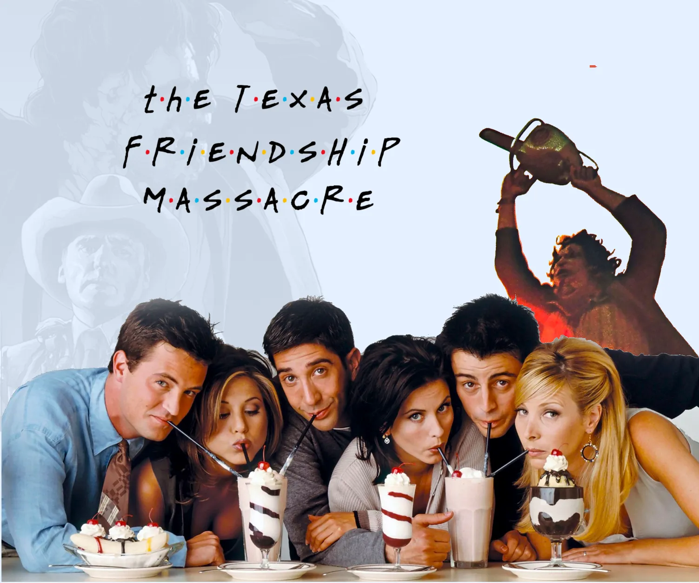

I thought I'd share another piece of linguistic trivia, but this time shorter and stolen from the [HN comments](https://news.ycombinator.com/item?id=38451130) on [Portuguese Orange, Persian Portugal](<../Portuguese Orange, Persian Portugal>).

## Short version

The Romanian word for *chainsaw* is a borrowing of a Russian (or, more broadly, Slavic) word for *friend*. Therefore:

## Slightly longer version:

🇷🇺 друг /drug/ *friend*

👇🏼

🇷🇺 дружба /druzhba/ *friendship*

👇🏼

🇷🇴 drujba /druzhba/ *chainsaw*

What happened here? Druzhba (Дружба) is a Soviet chainsaw brand.  During the USSR times it became adopted in Romanian to mean a, *any* chainsaw. 
We call words or phrases like this generic trademarks (or [proprietary eponyms](https://en.wikipedia.org/wiki/Generic_trademark) if you want to sound less... generic). Compare this with *Kleenex*, or *Jet Ski*. Iranians call eye mascara rimel (ریمل), Polish speakers call sneakers adidasy (plural or Adidas).

**Interlude:** a video of someone restoring an old Soviet friendship:

End of the interlude.

### Friendship is a lie

The word drug/druh still exists in many Slavic languages, e.g. in Polish:

|  word  |  meaning |
| --- | --- |
| druh | boyscout, (archaic) *friend* |
| drużyna /druzhina/ | team|
| drużba /druzhba/ | best man |

*druhowie* (friends), [source](https://pl.wiktionary.org/wiki/druh#/media/Plik:AffectionateCouple-1850s-Dagguerotypie-US.jpg)

We can trace the roots of *druh* back to the Proto-Balto-Slavic and even Proto-Indo-European language families. I'll use Polish as an example because I'm more familiar with it than with Russian, but this graph will look similar for most Slavic languages:

Proto-Indo-European ***\*dʰrewgʰ-***

👇🏼

Proto-Balto-Slavic ***\*draugás***

👇🏼

Proto-Slavic ***\*drugъ***

👇🏼

Old Czech ***druh***

👇🏼

Polish ***druh***

The Proto-Indo-European *\*dʰrewgʰ-* is interesting because there are two etymologies associated with:

>\*dʰrewgʰ — *to serve one's tribe* or *loyal*

and

> \*dʰrewgʰ — *to deceive*, *to mislead* (!)

*\*dʰrewgʰ — to deceive, to mislead* is also the root of the words like the English *dream* or German *Traum*. It still exists in a very similar form in modern Persian, where دروغ 
/doruq/ means *a lie*. 

Zoroastrianism, a highly dualistic religion with purity, honesty and truthfulness among its core tenets uses *druj* (an older [Avestan](https://en.wikipedia.org/wiki/Avestan) form of the same word) to refer to: 

- the opposite of *Asha* (the force of good, order)
- a category of female demons (e.g. druj nasu, Demon of Decay)

 The `*` at the beginning of the word signals that it is a reconstruction. We don't know for sure how these words sounded, but we have a rough idea thanks to the [comparative method](https://en.wikipedia.org/wiki/Comparative_method). I find it funny that *deception* and *friendship* sound so similar, but I'm aware that this not a [pharmakon](https://en.wikipedia.org/wiki/Pharmakon) , but just a linguistic pitfall.

## Summary

Studying etymology is a bit like talking to a LLM — there's a big change you might fall for some plausible sounding, truth-shaped bullshit. For instance \*dʰrewgʰ — *loyal* is often associated with *troop*. And, that *intuitively* makes sense. I want to believe that it is correct, but after checking the sources I learned that I tricked myself into believing that.

That's all for now, see you tomorrow!

P.S. [Dakh Daughters - Druzhba (Live on KEXP) - YouTube](https://www.youtube.com/watch?v=PMOjQqbfolo)

[Etymology](<../Etymology>)
