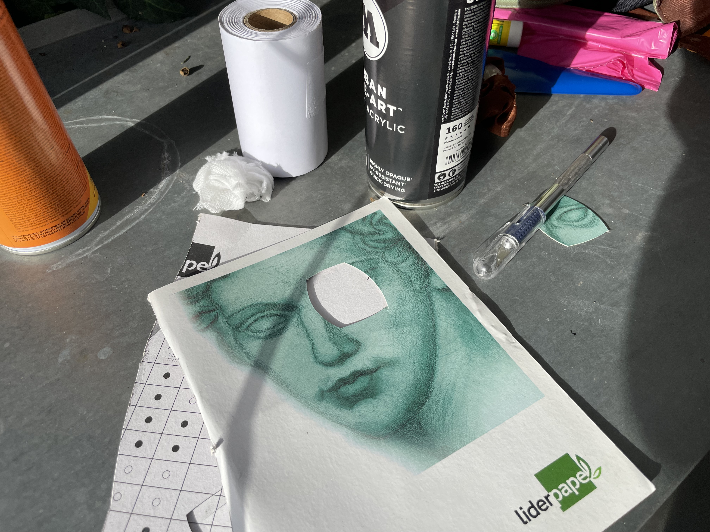

In just the past 3 days my projects made it to the front page of Hacker News, *twice*. Frankly, it felt good to see people using and enjoying my work. I needed that. I needed to feel useful.

So here's a quick and messy tutorial on how to turn a humble hollow styrofoam sphere  into a hyperrealistic depiction of Janusz. 

(We will get back to our usual content tomorrow.)

## To become Janusz one must live like Janusz

We start with a sphere of course:

Fun fact: without any ears or eyes, I couldn't gauge the direction of sound, but I was able to ***hear*** through my neck.

My initial idea was to create a papier-mâché head, similar to [Frank Sidebottom](https://collectionimages.npg.org.uk/large/mw214663/Christopher-Mark-Sievey-as-Frank-Sidebottom.jpg). However, drying it takes up to several days, which is an amount of time I did not have. 

Instead I used a styrofoam sphere  45 cm in radius, with 2 cm thick walls. This meant that I needed to carve space for my chin and nose, which I did using a torch and heated metal. The end result doesn't look pretty, but since it's inside the sphere, I will be the only one to suffer the cost of my own ineptitude.

The next step was carving out the eyes and sketching the details, like the nose and mouth. 

Here we are adding a mesh to cover the eyes. Notice the tiny ring around the right eye: seems like the glue interacted with styrofoam and melted it.

This is a tradeoff between clarity and field of view:

I spray-painted both hemispheres. I have little experience with this spray paint, but its comforting smell reminded me of growing up above a carpentry workshop and the long, long naps we all enjoyed.

We had to move under a roof as it started raining. The main upside of using spray paint is that it dries very quickly.

I was trying to use stencils for the eyes, however I quickly realised that stencils make almost no sense here as I needed to carve out both the shape of the eye and the pupils.

So, I painted them using a regular acrylic paint. I'm OK with this looking uneven, messy, [shoddy](<../Medieval Content Farm and Procedural Cheese>). 

We finished the eyes and moved on to the hairline. Have you ever seen the back of Janusz's head? Me neither.

OK, a rat tail it is then:

Time for the ears. Fun fact: Victorians considered lobed ears superior, as ears without earlobes were considered more primitive, animal-like. I want my Janusz-child to be better than his hopeless, lobeless father.

Front of the mask, without the lips: 

The proportions of the 2d version of Janusz would translate poorly into a 3d version, so I sketched a few options in Procreate. Also, seems that Procreate dropped their 3d projection tools, which is a shame because this is the first time I would've found them useful.

Adding those classic rosy cheeks. Janusz is blushing because of all that hackernews karma.

Missing embed: janusz cheeks.mp4

## Final result

Missing embed: janusz catwalk.mp4

See you tomorrow!
