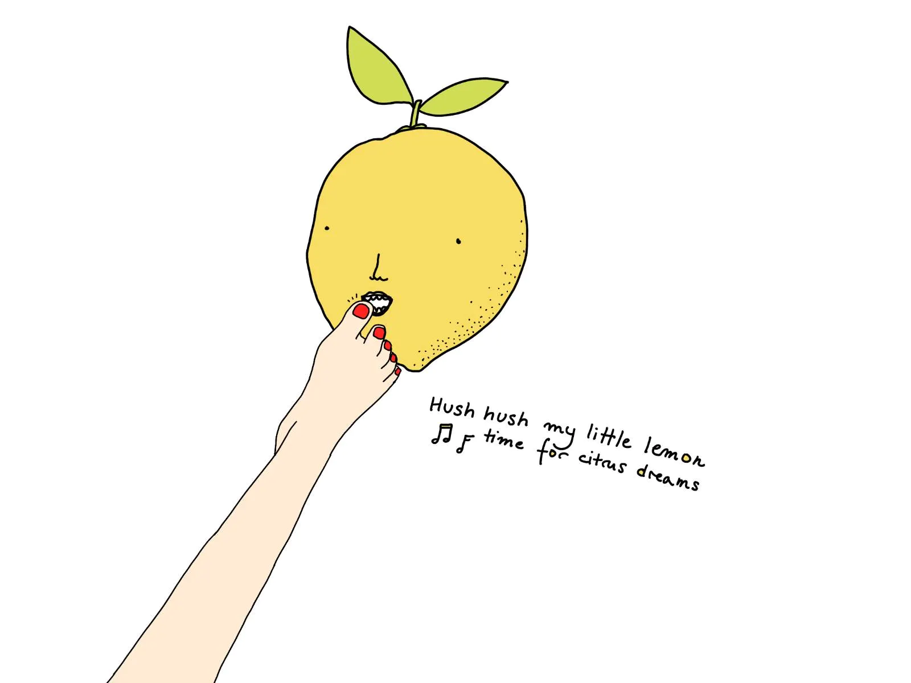

> A user agent is a computer program representing a person, for example, a [browser](https://developer.mozilla.org/en-US/docs/Glossary/Browser) in a [Web](https://developer.mozilla.org/en-US/docs/Glossary/World_Wide_Web) context.
> — [MDN](https://developer.mozilla.org/en-US/docs/Glossary/User_agent)

Web browsers are user agents, i.e. _acting on the behalf of the user_, allowing them to customise the experience of browsing the web. In practice this could take the form of:

- applying custom styles
- switching the default fonts
- running user scripts
- customising the interface of the browser itself
- removing or adding content (e.g. ad blockers)

Nowadays most browsers maintain the _pretence_ of being a User Agent, but in fact most _Web Browsers are storefronts_ where the _User Agent_ is becoming a _User Identifier_ (e.g. [WEI](https://en.wikipedia.org/wiki/Web_Environment_Integrity) and previously [FLOC](https://www.eff.org/deeplinks/2021/03/googles-floc-terrible-idea)). It's scary and, frankly, plainly sad to see that most of the information we consume is controlled by advertising companies.

It's not all doom and gloom though. A few months back, during one of my Say Hi calls I met an engineer who decided to build a [Freeflow](https://github.com/jmthackett/freeflow) new "web 1.0" browser, completely from scratch, with Lua! His idea was to browse the web in "reader mode", to focus purely on the content, to let the user decide how they want to consume it. There's also [Ladybird](https://ladybird.dev), another relatively niche, but more general-purpose browser, built by the creators of [SerenityOS](https://serenityos.org). Check them out!
